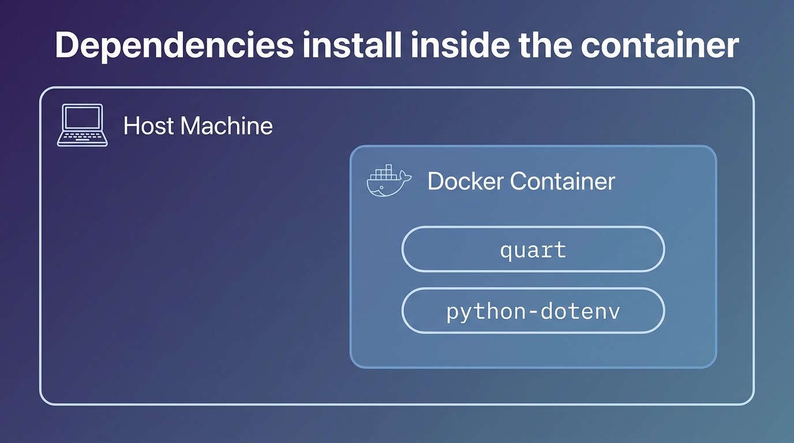

# A Quart Database Counter <!-- 4 -->

## ORMs and Async <!-- 4.1 -->

In the next few lessons, we’ll build a counter app that will be a good boilerplate application for your Postgres-based Quart projects.

But before we start writing the application, we need to understand one of the many quirks we’ll see when working with asynchronous applications, and this one is related to database ORMs.

For our original Flask database boilerplate application, we used SQLAlchemy ORM, the Python Database Object Relational Mapper. However, for async projects we can’t use the same library the same way without some form of penalization.

Flask-SQLAlchemy does work with Quart using the `flask_patch` function we discussed earlier, but it doesn't yield to the event loop when it reads or writes. This will mean it cannot handle much concurrent load, only a couple of concurrent requests.

However, we don’t need to go back to using raw SQL queries in our codebase. SQLAlchemy 2.0 ships with native `asyncio` support, so we can use the SQLAlchemy Core package to express our queries in a nice way and run them against an asynchronous engine, without sacrificing performance.

To talk to Postgres asynchronously, we’ll pair that async engine with `asyncpg`, a fast async Postgres driver. No third-party wrappers needed. It’s all first-party SQLAlchemy now.

So let’s go ahead and start coding our Quart Postgres counter application.

## Our Development Environment <!-- 4.2 -->

We now need two services to be running for our application: the Quart web server and a Postgres database server to store our data.

For this and all of my other courses, I will be focusing on developing with Docker, as this is the preferred development environment used by professional teams. The whole point is repeatability: everything runs inside containers, so you don't have to install Python, `uv`, or Postgres on your own machine. If you haven't used Docker before, don't worry.

So let's go ahead and set up our Docker development environment.

First, you need to download the Docker desktop client for Windows or Mac, which you can find in the [Docker website](https://www.docker.com/products/docker-desktop). Just follow the instructions.

Once you have Docker client running, you can check if it's properly installed, by typing the following on your terminal:

{lang=bash,line-numbers=off}
```
$ docker run hello-world
```

If you see a welcome message, everything is good to go.

Let's start by creating our `Dockerfile`.

First, create the directory where the application will live. You can create this directory inside your user's home directory.

If you plan to use a directory outside of your personal folder and you are a Mac user, you will need to add it to the Docker client file sharing resources on preferences.
 
So I'll call mine `counter_app`. so I will do `mkdir counter_app`.

Now `cd` into your application folder and open a code editor to create the `Dockerfile`. It looks like this:

{lang=yml,line-numbers=on,starting-line-number=1}
```
FROM python:3.12-slim

RUN pip install --no-cache-dir uv

WORKDIR /counter_app
ENV UV_PROJECT_ENVIRONMENT=/opt/venv

COPY pyproject.toml uv.lock /counter_app/
RUN uv sync --no-install-project

COPY . .

EXPOSE 5000
CMD uv run quart run --host 0.0.0.0
```

First we define the base image as the official `python:3.12-slim` image. This gives us a small, modern Python 3.12 environment without us having to install Python ourselves.

Next, we install `uv`, our package manager, using `pip`.

We then create the `counter_app` directory in the Docker instance and set it as the default location for the code.

Right after that, we point `uv`'s virtual environment to a location outside our project directory, so it doesn't get overwritten when Docker mounts our local code as a volume.

We then copy the `pyproject.toml` and `uv.lock` files and run `uv sync` to install all the packages inside the image. Copying the lock file first means the install is reproducible and Docker can cache this layer.

Right after that, we copy the contents of the local directory into the `counter_app` directory using the `COPY` command.

Once all the code is in place, we open the `5000` port and invoke the `uv run` command to start Quart.

[Save the file](https://fmze.co/fftq-4.2.1).

Now we need to create a `docker-compose` file that will build up both our application instance as well as the Postgres instance.

We will create the services using the following `docker-compose.yml` file:

{lang=yml,line-numbers=on,starting-line-number=1}
```
services:
  web:
    build: .
    container_name: app_web_1
    ports:
      - "5000:5000"
    volumes:
      - ./:/counter_app
    depends_on:
      - db
    stdin_open: true
    tty: true
    environment:
      QUART_APP: manage.py
      QUART_ENV: development
      PORT: 5000
      SECRET_KEY: "you-will-never-guess"
      DEBUG: 1
      DB_USERNAME: app_user
      DB_PASSWORD: app_password
      DB_HOST: db
      DATABASE_NAME: app
```

Modern Docker Compose doesn't need a `version` key anymore, so we go straight to defining the services, which are essentially the containers that will be running at the same time.

The first service is the web application which we are calling `web`. We instruct Docker Compose to build the container using the `Dockerfile` in the same directory using the `build .` statement, and we name the container `app_web_1`.

Next we open up port 5000 both in the host as well as in the container, as this will be the port that Quart is assigned to listen on.

Then we mount the current host's (Windows or Mac computer) directory as a volume inside the container, which will be mounted as `counter_app`. This will allow us to code on the host machine and propagate those changes in the container instantly.

We instruct Docker Compose that the web service depends on the `db` service to be up. On the default Compose network, services can reach each other by name, so our app will connect to the database simply at the host `db`. That's why you'll see `DB_HOST: db` below.

The next two statements, `stdin_open` and `tty` are added so that we can execute the Python debugger and examine it from outside the container.

The rest of the web service definition is the environment variables. As you can see they are similar to the ones we'll define on the `.quartenv` file in our next lesson, with some extra ones for the database user and password.

Next we'll define the Postgres database docker instance:

{lang=yml,line-numbers=on,starting-line-number=22}
```
  db:
    image: postgres:16-alpine
    restart: always
    container_name: app_db_1
    ports:
      - "5432:5432"
    environment:
      POSTGRES_USER: app_user
      POSTGRES_PASSWORD: app_password
      POSTGRES_DB: app
```

This file is pretty much self-explanatory. We will use the Postgres 16 alpine image, instruct the container to always restart, put a name for it and open port 5432 to the host, which is the standard Postgres port.

[Save the file](https://fmze.co/fftq-4.2.2).

We won't start the Docker containers yet, as we need a couple of more things in place.

## Initial Setup <!-- 4.3 -->

So let’s go ahead and start setting up our Quart counter application. Like I’ve done in other courses, we’re going to build a web application that stores a counter in the database and increases it by one every time you reload the page. This will allow us to see how a typical Quart database application is laid out.

One new thing we’ll use here is Alembic for database migrations. Alembic is what powers Flask-Migrations under the hood. Even though it’s a bit more complicated to set it up the first time, we will be using this application as a boilerplate when we create other database-driven Quart applications down the road, so we won’t have to repeat the setup from scratch again.

Let's initialize the uv project with Quart and python-dot-env. You should have uv installed from the previous module, but if you haven't go ahead and install it by following the instructions [on this page](https://docs.astral.sh/uv/getting-started/installation/).

So type the following commands: 

{lang=bash,line-numbers=off}
```
$ uv init --bare --name counter_app --python 3.12
$ uv add --no-sync quart python-dotenv
```

[This will write](https://fmze.co/fftq-4.3.1) the `pyproject.toml` but won't install the packages, thanks to the `--no-sync` flag. We use it because this application is going to run inside Docker, so the packages will be installed inside the container when we build it. There's no need to install them on our local machine. The flag just records them in `pyproject.toml`.



Now let's create the Quart environment variables that will be loaded to our environment by `python-dotenv`.

So create the `.quartenv` file and type the following code:

{lang=python,line-numbers=on}
```
QUART_APP='manage.py'
QUART_ENV=development
SECRET_KEY='my_secret_key'
DB_USERNAME=app_user
DB_PASSWORD=app_password
DB_HOST=db
DATABASE_NAME=app
```

First, the `QUART_APP` will be the kickstarter `manage.py` file that creates an instance of our application using the Factory pattern, just like I’ve done previously on my Flask course.

Next we’ll define the `QUART_ENV` environment as `development` so that we have meaningful error pages. We’ll also add a `SECRET_KEY`; even though it’s not essentially needed, it’s a good practice to have it.

The next four variables, `DB_USERNAME`, `DB_PASSWORD`, `DB_HOST`, and `DATABASE_NAME` will allow us to connect to the database. Notice `DB_HOST` is `db`, the name of our Postgres service in Docker Compose, since everything runs inside the container network. We'll use a generic `app` prefix for the user, password and database so that we don't have to worry when we use the same code for other applications.

[Save the file](https://fmze.co/fftq-4.3.2).

We’ll now need to create a `settings.py` file, so we’ll use very similar variables from the `.quartenv` with the following format:

{lang=python,line-numbers=on}
```
import os

QUART_APP = os.environ["QUART_APP"]
QUART_ENV = os.environ["QUART_ENV"]
SECRET_KEY = os.environ["SECRET_KEY"]
DB_USERNAME = os.environ["DB_USERNAME"]
DB_PASSWORD = os.environ["DB_PASSWORD"]
DB_HOST = os.environ["DB_HOST"]
DATABASE_NAME = os.environ["DATABASE_NAME"]
```

As we saw earlier, `python-dotenv` will load the variables in `.quartenv` as environment variables, so then `settings.py` can access them using `os.environ`. We do this so that we can then deploy to a production environment easily with the proper environment variables set in the production hosts. [Save the file](https://fmze.co/fftq-4.3.3).

## Application Setup <!-- 4.4 -->

At this point we’re ready to start building our Quart counter application.

So start the Docker client if you haven't already, and let's bring up just the database for now. Make sure you're on the counter application folder and type:

{lang=bash,line-numbers=off}
```
$ docker compose up -d db
```

Docker will start downloading the Postgres image and start the database container in the background. Be patient, this might take a few minutes on the first run, but should be faster after that. We only need the database up while we write our code. We'll build and run the web container a bit later, once the application is in place.

We’ll now add the database packages we will need. The first is `sqlalchemy` with its `asyncio` extra, which gives us SQLAlchemy 2.0's native asynchronous support. The second is `asyncpg`, the async driver that actually talks to Postgres.

As we mentioned earlier, we’ll be using SQLAlchemy's Core module, not the full ORM, for our application.

Add them with `uv add`. The `--no-sync` flag just declares them in `pyproject.toml`; they get installed when Docker builds the container.

{lang=bash,line-numbers=off}
```
$ uv add --no-sync "sqlalchemy[asyncio]" asyncpg
```

Now we’ll go ahead and create our database driver file, so create a new file we’ll call `db.py`.

{lang=python,line-numbers=on}
```
from sqlalchemy import MetaData
from sqlalchemy.ext.asyncio import create_async_engine
from quart import current_app

metadata = MetaData()


def get_engine():
    c = current_app.config
    url = (
        f"postgresql+asyncpg://{c['DB_USERNAME']}:{c['DB_PASSWORD']}"
        f"@{c['DB_HOST']}:5432/{c['DATABASE_NAME']}"
    )
    return create_async_engine(url, pool_size=5, max_overflow=15)
```

First we import `MetaData` and `create_async_engine` from SQLAlchemy. The `create_async_engine` function is the async counterpart to the regular engine: it's what lets us run queries without blocking the event loop.

We’ll also import the `current_app` from `quart`. Think of the `current_app` as the currently running instance of the Quart application. We’ll need it to read the settings that we’ve set for the database connection.

We define an application-wide `metadata` object that will track all the models in our application, which will allow us to manage migrations when we start using `alembic`.

Then, in `get_engine`, we build the connection URL from the settings. Notice the `postgresql+asyncpg` prefix: that tells SQLAlchemy to use the async `asyncpg` driver. We return an async engine with a small connection pool, which we'll reuse across requests.

[Save the file](https://fmze.co/fftq-4.4.3).

Now let’s go ahead and create our first and only blueprint of the application, the `counter` module.

First, create the `counter` folder and inside create the empty `__init__.py` to declare it a module.

Then create the `models.py` file with the following contents:

{lang=python,line-numbers=on}
```
from sqlalchemy import Table, Column, Integer

from db import metadata

counter_table = Table(
    "counter",
    metadata,
    Column("id", Integer, primary_key=True),
    Column("count", Integer),
)
```

We’ll begin by importing some modules from `sqlalchemy`. The names might sound familiar: `Table` allows us to setup a table in the database, `Column` allows us to create the table columns and `Integer` which is the only column type we use.

We also import our `metadata` object which will allow us to do introspection about the table schema when we use migrations. You need this object in any model you create.

Then, we define our `counter_table` as a table consisting of two columns: our `id` which will be the primary key and `count` which will hold the current counter of the application. Notice we define the table name as `counter` and add the `metadata` object as part of the definition.

[Save the file](https://fmze.co/fftq-4.4.4).

Now let’s go ahead and build the `views.py` file which will be our main controller and blueprint.

{lang=python,line-numbers=on}
```
from quart import Blueprint, current_app
from sqlalchemy import select, insert, update

from counter.models import counter_table

counter_app = Blueprint("counter_app", __name__)


@counter_app.route("/")
async def init() -> str:
    engine = current_app.dbc  # type: ignore
    async with engine.begin() as conn:
        rows = (await conn.execute(select(counter_table))).fetchall()
        if not rows:
            await conn.execute(insert(counter_table).values(count=1))
            count = 1
        else:
            row = rows[0]
            count = row.count + 1
            await conn.execute(
                update(counter_table)
                .where(counter_table.c.id == row.id)
                .values(count=count)
            )
    return "<h1>Counter: " + str(count) + "</h1>"
```

We’ll import `Blueprint` to create the `counter_app` blueprint as well as the `current_app` which we'll need to get the database engine. We also import the `select`, `insert` and `update` constructs from `sqlalchemy`, and our `counter_table` from the model file.

The only route this controller has is the root slash, which will call the `init` function.

We begin by grabbing our database engine from `current_app.dbc`. Then we open a connection with `async with engine.begin()`. Using `begin()` gives us a transaction that automatically commits when the block ends successfully, so we don't have to issue manual commits.

Inside the block, we run a `select` on the `counter_table` and fetch all the rows. In this application it will always be just one record. Notice the `await` keyword: the query execution is an asynchronous operation that yields to the event loop while it waits on the database.

We then get to the main forking point of the script. If we don’t get any rows back, it means it’s the first time we’re running the application, so we build an `insert` statement, setting the value of the `count` column to `1`, and await it. Since this is the first time we run the application, we can safely say that the `count` variable is `1`.

Now, on the `else` branch, if we do get a result from the select query, we fetch the first row. We then add `1` to the value of its `count` column and store it in the local `count` variable.

We then build an `update` statement that targets the row by its `id`, sets the new count, and await it. Because we're inside the `engine.begin()` block, the change is committed automatically when the block exits.

Finally we return the value of the `count` variable to the request as HTML content.

As you can already notice, any database operation must be awaited, since they are I/O operations that can yield to the event loop.

[Save the file](https://fmze.co/fftq-4.4.5).

Next we’ll create the application factory, as we’ve done in the past in my Flask course. Call this file `application.py`.

{lang=python,line-numbers=on}
```
from quart import Quart

from db import get_engine


def create_app(**config_overrides):
    app = Quart(__name__)
    app.config.from_pyfile("settings.py")

    # apply overrides for tests
    app.config.update(config_overrides)

    from counter.views import counter_app

    app.register_blueprint(counter_app)

    @app.before_serving
    async def create_db_conn():
        app.dbc = get_engine()

    @app.after_serving
    async def close_db_conn():
        await app.dbc.dispose()

    return app
```

We begin by importing `Quart` and the `get_engine` function from the `db` file we created earlier.

Next, we define the factory function as `create_app` with a `config_overrides` parameter that will allow our tests to change the settings environment variables when running them.

We then create an `app` instance of Quart and configure it from the `settings.py` file contents. After that we update the app with any changes passed on the `config_overrides` parameter.

Then we import the `counter_app` blueprint from the `views.py` file and register it.

We now need a way for the application to set up a reusable database engine. For that we’ll use a couple of special decorators called `before_serving` and `after_serving`. These decorators set up functions to be executed the first time the application starts and right before it shuts down, which lets us create the engine once and keep it around for all requests.

For the `before_serving` function, we create the engine with `get_engine()` and store it in a context variable called `dbc` that will be available anywhere you call the `current_app` in any view or model.

Finally, with the `after_serving` function, we call the engine's `dispose()` method, which cleanly closes the connection pool when the app shuts down.

[Save the file](https://fmze.co/fftq-4.4.6).

We’re almost done with the core application. We just need to create the bootstrap file that will spawn an instance of the application factory. We’ll call this file `manage.py`.

This is a simple file. We just need to import the `create_app` function and then execute it and store it in a variable called `app`.

{lang=python,line-numbers=on}
```
from application import create_app

app = create_app()
```

[Save the file](https://fmze.co/fftq-4.4.7) and let’s go ahead and start with the database migration configuration.

## Configuring Alembic Migrations <!-- 4.5 -->

We’re now going to install Alembic to be able to do database migrations. If you’re not familiar with migrations, it’s just a way to track model changes in your codebase, so that other team members and the different environments can keep up to date as you change your database schema.

So we’ll add Alembic with `uv add`:

{lang=bash,line-numbers=off}
```
$ uv add --no-sync alembic
```

This adds Alembic to our [`pyproject.toml`](https://fmze.co/fftq-4.5.1).

Since we've added new packages (SQLAlchemy, asyncpg and now Alembic), we need to build the web container image so they're installed inside it. Everything from here runs in Docker, so let's build:

{lang=bash,line-numbers=off}
```
$ docker compose build web
```

This downloads the Python image and installs all our packages inside the container. The first build may take a few minutes.

Now we're ready to initialize the migration setup, which will create both an `alembic.ini` file and a `migrations` folder. Because our application is asynchronous, we'll use Alembic's async template by passing the `-t async` flag. And since everything runs in Docker, we use `docker compose run` to spin up a temporary container from our `web` service just for this one command. We add the `--rm` flag so Docker deletes that container the moment the command finishes — the files it generates are written into our project folder, not the container, so once the job's done there's nothing worth keeping around:

{lang=bash,line-numbers=off}
```
$ docker compose run --rm web uv run alembic init -t async migrations
```

You’ll notice there's a new `migrations` folder with an `env.py` file inside, and a new `alembic.ini` file in the root folder. The async template already wires up the async machinery for us, so we don't have to touch any of that.

We just need to tell Alembic two things: how to connect to the database, and what models our application uses.

Let's start with the connection. Open `migrations/env.py` and, right after the `config = context.config` line, add the following:

{lang=python,line-numbers=on,starting-line-number=13}
```
import os, sys
sys.path.insert(0, os.getcwd())
config.set_main_option(
    "sqlalchemy.url",
    f"postgresql+asyncpg://{os.environ['DB_USERNAME']}:{os.environ['DB_PASSWORD']}"
    f"@{os.environ['DB_HOST']}:5432/{os.environ['DATABASE_NAME']}",
)
```

We add the project folder to the `sys.path` so Alembic can import our application modules. Then we build the database URL from the environment variables, the same ones Docker Compose passes into the container, and set it with `config.set_main_option`. Notice we use the `postgresql+asyncpg` prefix again, since Alembic will connect asynchronously too.

This replaces the need to hand-edit the `sqlalchemy.url` inside `alembic.ini`. That file keeps its default placeholder, because we're overriding the value here in `env.py`.

[Save the file](https://fmze.co/fftq-4.5.2).

Now for the second part: telling Alembic what models we have. Still in `migrations/env.py`, add these two imports right after the `sys.path.insert` line:

{lang=python,line-numbers=on,starting-line-number=15}
```
from db import metadata
from counter.models import counter_table  # noqa: F401
```

And then find the `target_metadata = None` line and change it to point at our metadata object:

{lang=python,line-numbers=off}
```
target_metadata = metadata
```

This is very important to remember: any new models you add subsequently, you need to import them here too, so Alembic can see them when it generates migrations.

[Save the file](https://fmze.co/fftq-4.5.3).

And with this, we’re ready to run our first migration.

## Our First Migration <!-- 4.6 -->

We’re now ready to create the tables in the database using the Alembic migration workflow. You will notice that the commands look a bit like Git commands. Initially you’ll need to write these down, but once you do it a couple of times, you’ll remember them.

But first, make sure your Docker database container is up and running. If it isn't, just type `docker compose up -d db`.

So now we're ready to create our first “migration commit”. Since everything runs in Docker, we run Alembic inside the web container:

{lang=bash,line-numbers=off}
```
$ docker compose run --rm web uv run alembic revision --autogenerate -m "create counter table"
INFO  [alembic.runtime.migration] Context impl PostgresqlImpl.
INFO  [alembic.runtime.migration] Will assume transactional DDL.
INFO  [alembic.autogenerate.compare] Detected added table 'counter'
  Generating /counter_app/migrations/versions/xxxxxxxxxxxx_create_counter_table.py ...  done
```

Thanks to the `target_metadata` setting we added earlier, Alembic can view the status of the database and compare against the table metadata in the application, generating the "obvious" migrations based on a comparison. This is achieved using the `--autogenerate` option to the alembic revision command, which places so-called candidate migrations into our new migrations file.

Check that a new file was created inside `migrations/versions` and take a look:

{lang=python,line-numbers=on}
```
"""create counter table

Revision ID: xxxxxxxxxxxx
Revises:
Create Date: 2026-06-28 19:23:48.578003

"""
from typing import Sequence, Union

from alembic import op
import sqlalchemy as sa


# revision identifiers, used by Alembic.
revision: str = 'xxxxxxxxxxxx'
down_revision: Union[str, Sequence[str], None] = None
branch_labels: Union[str, Sequence[str], None] = None
depends_on: Union[str, Sequence[str], None] = None


def upgrade() -> None:
    """Upgrade schema."""
    # ### commands auto generated by Alembic - please adjust! ###
    op.create_table('counter',
    sa.Column('id', sa.Integer(), nullable=False),
    sa.Column('count', sa.Integer(), nullable=True),
    sa.PrimaryKeyConstraint('id')
    )
    # ### end Alembic commands ###


def downgrade() -> None:
    """Downgrade schema."""
    # ### commands auto generated by Alembic - please adjust! ###
    op.drop_table('counter')
    # ### end Alembic commands ###
```

The `Revision ID` (the `xxxxxxxxxxxx` placeholder above) is a random hash, so yours will be different. As you can see, there are a few sections: one that holds what revision this is and how to get to the previous one, an `upgrade` function with the commands to apply, and a `downgrade` function to roll them back. Always take a look at the newest revision file so that you can spot any inconsistencies or issues.

This looks good to me, so let’s apply these changes on the database by doing the following:

{lang=bash,line-numbers=off}
```
$ docker compose run --rm web uv run alembic upgrade head
INFO  [alembic.runtime.migration] Context impl PostgresqlImpl.
INFO  [alembic.runtime.migration] Will assume transactional DDL.
INFO  [alembic.runtime.migration] Running upgrade  -> xxxxxxxxxxxx, create counter table
```

Great, it went smoothly which means the tables were created. We can log into Postgres and check the tables.

For that, let's connect to Postgres running in our Docker container by doing:

{lang=bash,line-numbers=off}
```
$ docker exec -it app_db_1 psql -U app_user -d app
```

And from there, you can check that the tables were created:

{lang=mysql,line-numbers=off}
```
app=# \dt
              List of relations
 Schema |      Name       | Type  |  Owner
--------+-----------------+-------+----------
 public | alembic_version | table | app_user
 public | counter         | table | app_user
(2 rows)
```

We can see the counter table was created, but notice there’s an `alembic_version` table. This table holds the current migration version.

{lang=mysql,line-numbers=off}
```
app=# select * from alembic_version;
 version_num
--------------
 xxxxxxxxxxxx
(1 row)
```

That hash matches the `revision` value in the migration file we just generated.

Exit the Postgres server with `\q`, and we’re ready to run our application. Let's bring up the whole stack:

{lang=bash,line-numbers=off}
```
$ docker compose up
```

This builds and starts both the web and database containers. If you open `localhost:5000` you will see the first number of our counter:


Refreshing the page will increase the counter value. And there you have it, your first Quart database-driven application, running entirely in Docker.

One thing to keep in mind: if you add any packages to the application later, you’ll need to rebuild the web container so they get installed in the image:

{lang=bash,line-numbers=off}
```
$ docker compose up --build
```

That will re-run the Dockerfile script and install any new packages you have added.

## Testing our Counter Application <!-- 4.7 -->

It’s great that we have a running application, but we know that any application needs good tests to ensure it won’t break with new development.

In our synchronous applications we had used `unittest`, but for asynchronous applications, I’ve found that `pytest` is a better fit. `pytest` also has an `asyncio` plugin that will allow us to test our async code.

So let’s begin by adding those libraries to the application. We declare them with `uv add --no-sync` and also configure pytest in our `pyproject.toml`:

{lang=bash,line-numbers=off}
```
$ uv add --no-sync pytest pytest-asyncio
```

Then add the following pytest configuration to your `pyproject.toml` so pytest runs async tests automatically and knows where the tests live:

{lang=toml,line-numbers=off}
```
[tool.pytest.ini_options]
asyncio_mode = "auto"
testpaths = ["tests"]
```

Since we added new packages, rebuild the web container so they're installed:

{lang=bash,line-numbers=off}
```
$ docker compose build web
```

Ok, with that out of the way let’s see how `pytest` works.

The `pytest` library works in a modular fashion using reusable functions called _fixtures_. Fixtures allow you to put the repetitive stuff in one function and then add them to the tests that need them.

The cool thing about these fixtures is that they can be used in a layered format, allowing you to build very complex foundations. Unfortunately this is also `pytest`’s Achilles’ heel, as some teams make such complex “fixture onions” that any newcomer will spend lots of time to learn them. My recommendation is to always make tests as readable as possible, so avoid doing more than three layers of fixtures and keep them as single-purpose as possible with very descriptive names.

These fixtures can live in the same test files that use them or you can put them in a special file called `conftest`. Any `conftest` fixtures on a parent directory are available to the tests in the child directories. You’ll get the hang of it as you start building your tests.

The other difference with `unittest` is that `pytest` doesn’t require classes, although they can still be used.

To follow the standard Python directory structure, we'll create a `tests` folder on the root level where the `conftest` and all the tests will live.

Then create an `__init__.py` empty file inside the `tests` folder to make sure it's recognized as a Python module.

Create the `conftest.py` file inside the `tests` folder and let's start working on it.

First, we’ll add the necessary imports and load our environment variables:

{lang=python,line-numbers=on}
```
import os

import pytest_asyncio
from dotenv import load_dotenv
from sqlalchemy import text
from sqlalchemy.ext.asyncio import create_async_engine

load_dotenv(".quartenv")

from application import create_app
from db import metadata
```

Make sure to place the `load_dotenv` command before the `create_app` import so that the environment variables are set when the application configuration is read.

We will now create the database instantiation fixture for all our tests, so let’s write that:

{lang=python,line-numbers=on,starting-line-number=13}
```
@pytest_asyncio.fixture
async def create_db():
    print("Creating db")
    db_name = os.environ["DATABASE_NAME"]
    db_host = os.environ["DB_HOST"]
    db_username = os.environ["DB_USERNAME"]
    db_password = os.environ["DB_PASSWORD"]

    base_uri = f"postgresql+asyncpg://{db_username}:{db_password}@{db_host}:5432/"
    test_db_name = db_name + "_test"

    # CREATE/DROP DATABASE must run outside a transaction (AUTOCOMMIT)
    admin = create_async_engine(base_uri + db_name, isolation_level="AUTOCOMMIT")
    async with admin.connect() as conn:
        await conn.execute(text(f"DROP DATABASE IF EXISTS {test_db_name} WITH (FORCE)"))
        await conn.execute(text(f"CREATE DATABASE {test_db_name}"))
    await admin.dispose()

    print("Creating test tables")
    engine = create_async_engine(base_uri + test_db_name)
    async with engine.begin() as conn:
        await conn.run_sync(metadata.create_all)
    await engine.dispose()
```

By default all `pytest` fixtures are function-level, which means `pytest` creates the database from scratch at the start of each test function and destroys it at the end. Each test runs in complete isolation.

First, we read the database credentials from the environment and build our connection string, along with the name of our test database — our app's database name with a test suffix added.

Next, we open a connection to our main database using an autocommit engine. We need autocommit here because you can't create or drop a database from inside a transaction.

With that connection open, we drop the test database if a previous run left one behind, then create a fresh, empty one.

Finally, we connect to that new test database and create all our tables from the models, using `run_sync` to call SQLAlchemy's synchronous schema-creation method from our async connection.

Now here’s something you will see often with `pytest` fixtures, and that’s the use of the `yield` statement:

{lang=python,line-numbers=on,starting-line-number=37}
```
    yield {
        "DB_USERNAME": db_username,
        "DB_PASSWORD": db_password,
        "DB_HOST": db_host,
        "DATABASE_NAME": test_db_name,
        "TESTING": True,
    }

    print("Destroying db")
    admin = create_async_engine(base_uri + db_name, isolation_level="AUTOCOMMIT")
    async with admin.connect() as conn:
        await conn.execute(text(f"DROP DATABASE IF EXISTS {test_db_name} WITH (FORCE)"))
    await admin.dispose()
```

The dictionary we `yield` becomes the settings for the next test or fixture that uses this one. Notice it overrides the database name with our test database, so the app under test points at that isolated copy.

Essentially, `yield` hands control back to the calling test and pauses here — the data you list is what you share with it. When the test finishes, execution resumes right after the `yield`, running everything below it. That's why the cleanup lives here: once the test is done, we destroy the test database.

Next, let’s create the Quart application fixture itself:

{lang=python,line-numbers=on,starting-line-number=51}
```
@pytest_asyncio.fixture
async def create_test_app(create_db):
    app = create_app(**create_db)
    await app.startup()
    yield app
    await app.shutdown()
```

This is also a function-scoped fixture and we inject the `create_db` fixture into it as a dependency. That’s right: you can inject fixtures into other fixtures, but again, remember to limit the number of fixture layers to keep your tests manageable. By including `create_db` as a parent fixture, we won't need to call it directly in our tests; including `create_test_app` guarantees `create_db` runs first.

Inside the fixture, we create an instance of the factory `create_app` function, passing it the settings dict from `create_db` with the double asterisk, and then call the Quart app's `startup` method, which runs the `before_serving` function that creates our database engine. We yield the app to the test, and once the test is done, we call `shutdown`, which runs the `after_serving` function and disposes the engine.

The double asterisk in front of `create_db` passes the dictionary it returned as keyword arguments, which line up with our settings variables. Remember how `create_app` takes overrides as a parameter? This is exactly why: so we can instantiate test apps pointed at the test database.

We’re almost there. We’ll create our last fixture, which will allow us to create a test client that we can use to hit the endpoints:

{lang=python,line-numbers=on,starting-line-number=59}
```
@pytest_asyncio.fixture
async def create_test_client(create_test_app):
    print("Creating test client")
    return create_test_app.test_client()
```

We inject the `create_test_app` fixture from above. Yes, that means we’re already at two fixture levels, but this is the only fixture we’ll need in our tests, so we’re good.

I just want to highlight how cool fixtures are. We can now just include `create_test_client` in each test, and that will automatically create the database using `create_db` and create the test application using `create_test_app`.

[Save the file](https://fmze.co/fftq-4.7.1).

Now let’s create our actual test. Create a file called `test_counter.py` inside the `tests` folder. Any file that starts with the word `test_` will be automatically discovered by `pytest`.

For our first test, we want to see that the counter is started when we first hit the page.

{lang=python,line-numbers=on,starting-line-number=1}
```
import pytest


@pytest.mark.asyncio
async def test_initial_response(create_test_client):
    response = await create_test_client.get("/")
    body = await response.get_data()
    assert "Counter: 1" in str(body)
```

We decorate it as an `asyncio` test, since we’ll be doing I/O operations. We’ll also need the `create_test_client` fixture which sets up the test client and its dependencies.

We then hit the test client with a request and await the response. The data we get back is stored in the `body` variable, and then we check that the string “Counter: 1” is in the body.

[Save the file](https://fmze.co/fftq-4.7.2) and run the test inside the web container with `docker compose run`.

Make sure your Docker Postgres container is running first.

{lang=bash,line-numbers=off}
```
$ docker compose up -d db
$ docker compose run --rm web uv run pytest
================================== test session starts ==================================
collected 1 item

tests/test_counter.py F                                                           [100%]

======================================= FAILURES ========================================
_________________________________ test_initial_response _________________________________
```

It fails!

What’s the problem? The issue here is that we don't reference the `counter` model anywhere in the test, so when `metadata.create_all` runs in the `conftest.py` fixture, there are no models registered to be created: the `counter` table never gets built in the test database.

So on line 3 of the `test_counter.py` file, add the import for our model:

{lang=python,line-numbers=on,starting-line-number=1}
```
import pytest

from counter.models import counter_table
```

Importing the model is enough: it registers the `counter_table` with our `metadata` object, so `create_all` now knows to build it.

[Save the file](https://fmze.co/fftq-4.7.3) and run the test again.

{lang=bash,line-numbers=off}
```
$ docker compose run --rm web uv run pytest
============================= test session starts ==============================
collected 1 item

tests/test_counter.py .                                                  [100%]

=========================== 1 passed in 0.19s ===============================
```

## Completing our tests <!-- 4.8 -->

We now get a green line and the "passed" label. If you look closer, you'll notice that the print statements we added in our fixtures aren’t being shown. For those to be printed, you need to add a `-s` flag to the command, like so:

{lang=bash,line-numbers=off}
```
$ docker compose run --rm web uv run pytest -s
================================== test session starts ==================================
collected 1 item

tests/test_counter.py Creating db
Creating test tables
Creating test client
.Destroying db

=========================== 1 passed in 0.11s ===============================
```

This gives us a good insight into when things are called and the order of operations of our fixtures.

We’ll add just one more test to mark this part complete. I want to verify that if I hit the page a second time, I get the number two in the counter. We'll also check the value directly in the database to be thorough.

First, update the imports at the top of `test_counter.py` so we can read from the model directly:

{lang=python,line-numbers=on,starting-line-number=1}
```
import pytest
from quart import current_app
from sqlalchemy import select

from counter.models import counter_table
```

Then add the second test below the first one:

{lang=python,line-numbers=on,starting-line-number=13}
```
@pytest.mark.asyncio
async def test_second_response(create_test_client, create_test_app):
    # First hit sets the counter to 1
    await create_test_client.get("/")

    # Second hit should bump it to 2
    response = await create_test_client.get("/")
    body = await response.get_data()
    assert "Counter: 2" in str(body)

    # Verify directly against the model/database
    async with create_test_app.app_context():
        async with current_app.dbc.begin() as conn:
            result = (await conn.execute(select(counter_table))).fetchall()
            assert result[0].count == 2
```

We mark the test as async and inject both the `create_test_client` and `create_test_app` fixtures.

First, we hit the homepage once, which sets the counter's value to "1", because the database is created fresh for each test function. Since the previous test already checks the value on the first run, there's no need to assert it again here.

Then we hit the page a second time and assert that the response now says "Counter: 2".

Finally, to be really sure, we check the value directly in the database. We open an application context so we can reach `current_app.dbc`, open a connection with `begin()`, run a `select` on the `counter_table`, and assert that the first row's `count` column equals 2.

[Save the file](https://fmze.co/fftq-4.7.4) and run the tests.

{lang=bash,line-numbers=off}
```
$ docker compose run --rm web uv run pytest -s
================================== test session starts ==================================
collected 2 items

tests/test_counter.py Creating db
Creating test tables
Creating test client
.Destroying db
Creating db
Creating test tables
Creating test client
.Destroying db

=================================== 2 passed in 1.25s ===================================
```

As you can see from the output, the database was created and destroyed twice, once per test function.

And with that we have a working database-powered Quart application with tests, all running in Docker. We can use this as a boilerplate for any project that uses Quart and Postgres.

If you want to grab the updated boilerplate at any time, just visit [this Github repo](https://github.com/fromzeroedu/quart-postgres-boilerplate).
