# QuartFeed, an SSE Application using PostgreSQL <!-- 5 -->

<!-- PRODUCTION NOTE (2026-08-22): the finished app's browser-side JS helpers
are not taught anywhere yet: the window.linkify port, timeago.js, and
interactions.js. 5.11's live card deliberately ships without them (escapeHtml
plus a formatted date, matching the server card at that stage). Introduce them
in a later module, 5.12 or beyond, and upgrade static/js/broadcast.js to use
them, so the step branches converge to finished_apps/. Do NOT introduce them
in 5.11. -->

## Introduction to Server Sent Events <!-- 5.1 -->
Server Sent Events, or SSEs, or EventSource in JavaScript, are an extension to HTTP that allow a client to keep a connection open to a server, thereby allowing the server to send events to the client as it chooses.

By default, the server sends updates with a `data` payload. You can also have an `event` type, which by default is `message`, but could be things like `add` or `remove`. Additionally it has an `id` parameter that allows the client to continue where it left off if the connection was lost.

We are going to build a lightweight version of the popular FriendFeed website, one of the pioneers in the social media space. using Quart and SSE.

For our FriendFeed clone we’ll have the event type to be either `post`, which is a new post, `like` if some one liked the post and `comment` if it’s a comment to a `post`.

For a more complex version or exercise to students, we could also have `groups`, which could be distinct `/sse` endpoints and `like` events for comments.

## From Boilerplate to QuartFeed <!-- 5.2 -->

Now that we understand what Server Sent Events are, let's start building QuartFeed. Before we get to the live feed, though, we need the pieces underneath it: users who can register and log in, follow each other, and write posts. So the plan for this chapter is to build those layers one at a time, and only wire up the real-time feed once the data is there to push.

The great news is that we don't start from a blank folder. In the previous chapter we built a Quart Postgres counter, and I told you it would double as a boilerplate for any database-driven Quart project. This is where that pays off: QuartFeed begins as a copy of that counter app.

So make a copy of your counter application folder and rename the copy to `quartfeed_app`. Everything we need is already there: the `Dockerfile`, the `docker-compose.yml`, the async `db.py`, the application factory, and the Alembic migration setup.

If any cache folders came along for the ride, like a `__pycache__` or a stray `migrations/versions` file, go ahead and delete them so we start clean.

The first thing we'll do is rename the project. Open `pyproject.toml` and change the project name to `quartfeed-app`:

{lang=toml,line-numbers=on,starting-line-number=1}
```
[project]
name = "quartfeed-app"
version = "0.1.0"
```

[Save the file](https://fmze.co/fftq-5.2.1).

Our counter had a single blueprint called `counter`. QuartFeed's first module is the user, so let's rename the `counter` folder to `user`. This is where registration, login, and profiles will live.

Now open the `models.py` file inside that new `user` folder. The counter table doesn't make sense anymore, so we'll replace it with our first real model, the `user` table:

{lang=python,line-numbers=on}
```
from sqlalchemy import Column, Integer, String, Table

from db import metadata

user_table = Table(
    "user",
    metadata,
    Column("id", Integer, primary_key=True),
    Column("username", String(15), index=True, unique=True),
    Column("password", String(128)),
)
```

Just like our counter model, we import `Table`, `Column`, and our application-wide `metadata` object. This time we also import `String`, since our columns hold text instead of numbers.

We define a table named `user` with the usual auto-incrementing `id` as the primary key. Then comes the `username`, a string capped at fifteen characters.

Notice the two extra properties on `username`: we set `index` to `True` because we'll constantly look users up by their username, and an index makes those lookups fast. We also set `unique` to `True`, because no two people can share a username.

The last column is `password`, a string of length one hundred and twenty eight. That length isn't arbitrary: we're going to store a hashed password, never the real one, and the hashing algorithm we'll use always produces a hash exactly that long.

[Save the file](https://fmze.co/fftq-5.2.2).

Next let's give this module a minimal controller so the app boots. Open `user/views.py` and replace the counter view with a placeholder registration route:

{lang=python,line-numbers=on}
```
from quart import Blueprint

user_app = Blueprint("user_app", __name__)


@user_app.route("/register")
async def register() -> str:
    return "<h1>User Registration</h1>"
```

We create a blueprint called `user_app`, and a single `/register` route that, for now, just returns a bit of HTML. We're only proving the wiring works. We'll build the real form in the next lesson.

[Save the file](https://fmze.co/fftq-5.2.3).

Now we point the application factory at the new blueprint. Open `application.py` and update the import and the registration to use `user_app`:

{lang=python,line-numbers=on,starting-line-number=8}
```
    from user.views import user_app

    app.register_blueprint(user_app)
```

[Save the file](https://fmze.co/fftq-5.2.4).

There's one more rename to do, this time in our container config, since we renamed the project folder. Open the `Dockerfile` and change every `counter_app` reference to `quartfeed_app`:

{lang=yml,line-numbers=on,starting-line-number=4}
```
WORKDIR /quartfeed_app
ENV UV_PROJECT_ENVIRONMENT=/opt/venv

COPY pyproject.toml uv.lock /quartfeed_app/
```

[Save the file](https://fmze.co/fftq-5.2.5) and do the same in `docker-compose.yml`, where the volume mounts our code into the container:

{lang=yml,line-numbers=on,starting-line-number=7}
```
    volumes:
      - ./:/quartfeed_app
```

[Save the file](https://fmze.co/fftq-5.2.6).

Now let's deal with migrations. Because this is a brand new application with a brand new database, open `migrations/env.py` and update the model import so Alembic tracks the `user` table instead of the old `counter` table:

{lang=python,line-numbers=on,starting-line-number=16}
```
from user.models import user_table  # noqa: F401
```

Remember the rule from the counter app: every time we add a new model, we import it here so Alembic can see it when it generates migrations. We'll be back in this file a few times this chapter.

[Save the file](https://fmze.co/fftq-5.2.7).

We're ready to create the database. First, bring up just the Postgres container so we have something to migrate against:

{lang=bash,line-numbers=off}
```
$ docker compose up -d db
```

Then build the web image so our renamed project and its packages are installed inside it:

{lang=bash,line-numbers=off}
```
$ docker compose build web
```

Now we generate our first migration. Just like the counter app, we run Alembic inside the web container:

{lang=bash,line-numbers=off}
```
$ docker compose run --rm web uv run alembic revision --autogenerate -m "create user table"
INFO  [alembic.autogenerate.compare] Detected added table 'user'
INFO  [alembic.autogenerate.compare] Detected added index 'ix_user_username' on '['username']'
```

Alembic compared our metadata against the empty database and generated a migration that creates the `user` table and the index on `username`. Take a quick look at the new file in `migrations/versions` to confirm it looks right, then apply it:

{lang=bash,line-numbers=off}
```
$ docker compose run --rm web uv run alembic upgrade head
```

Our database now has a `user` table, ready to hold accounts. In the next lesson we'll let people actually create one.

## Registering Users with quart-wtforms <!-- 5.3 -->

We have a `user` table, so now we need a registration form that writes into it. Building forms by hand — reading each field off the request, validating it, and guarding against cross site request forgery — is tedious and easy to get wrong, so we want a library to handle it for us.

In the Flask world, that library is Flask-WTF: it takes care of form fields, validation, and CSRF protection. But there's a catch, and it's the important lesson of this section. Flask-WTF is built around Flask's **synchronous** request object, so it simply does not work inside an async Quart app. And that's the takeaway to hold onto: in an async application, you can't reach for a synchronous library and expect it to work. If a package wasn't written for async — if there's no Quart-flavored version of it — that's usually a sign you shouldn't be using it in a Quart app at all.

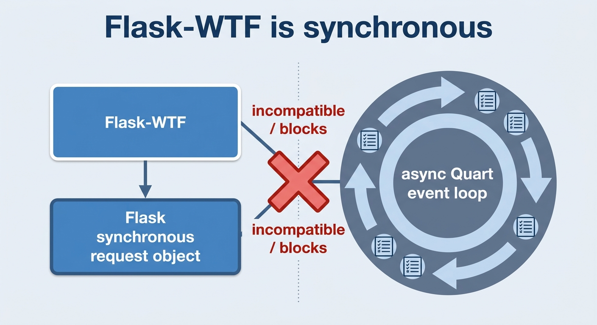

Happily, there is a Quart-flavored version here. It's called `quart-wtforms`, and it brings WTForms to Quart the async way, giving us validation and CSRF protection for free. So we'll use it and let it do the heavy lifting.

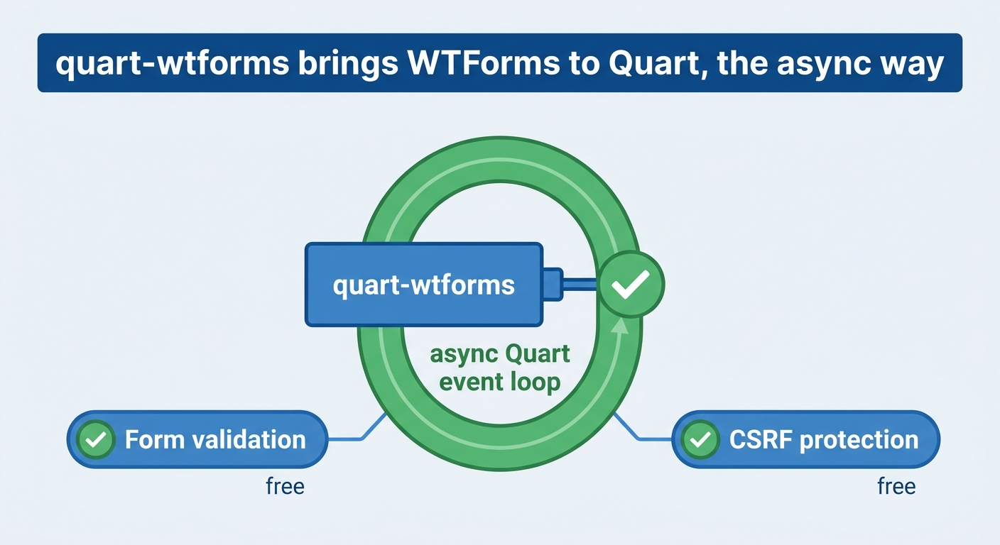

Let's add it. Just like every package, we declare it with `uv add --no-sync` so it gets installed when Docker rebuilds the image:

{lang=bash,line-numbers=off}
```
$ uv add --no-sync quart-wtforms
```

We're storing passwords, so we also need a way to hash them. We'll use `passlib`, a well tested password hashing library. Add it the same way:

{lang=bash,line-numbers=off}
```
$ uv add --no-sync passlib
```

Since we added packages, rebuild the web image so they land inside the container:

{lang=bash,line-numbers=off}
```
$ docker compose build web
```

WTForms and its CSRF protection need a secret key to sign tokens, and we already have a `SECRET_KEY` from the counter boilerplate. We just need to switch CSRF on. Open `.quartenv` and add a flag for it:

{lang=python,line-numbers=on,starting-line-number=8}
```
WTF_CSRF_ENABLED=1
```

[Save the file](https://fmze.co/fftq-5.3.1) and read it into your settings. Open `settings.py` and add:

{lang=python,line-numbers=on,starting-line-number=9}
```
WTF_CSRF_ENABLED = os.environ.get("WTF_CSRF_ENABLED", "1") == "1"
```

We read it as a string and compare it to `"1"`, so the value ends up as a real boolean. We default it to on, and later, in our tests, we'll flip it off so we don't have to deal with tokens there.

[Save the file](https://fmze.co/fftq-5.3.2).

Now the form itself. Create a `forms.py` file inside the `user` folder:

{lang=python,line-numbers=on}
```
from wtforms import PasswordField, StringField
from wtforms.validators import DataRequired, Length

from quart_wtf import QuartForm


class UserForm(QuartForm):
    """Used for both registration and login."""

    username = StringField(
        "Username",
        validators=[DataRequired(), Length(max=15)],
        render_kw={"autocomplete": "off"},
    )
    password = PasswordField("Password", validators=[DataRequired()])
```

We import two field types, a `StringField` for the username and a `PasswordField` for the password, plus two validators. Then we import `QuartForm`, the async base class our form inherits from.

Our `UserForm` defines just two fields. The `username` is required and limited to fifteen characters, matching our database column, and we ask the browser not to autocomplete it. The `password` is also required.

Notice how declarative this is. We describe the fields and their rules once, and the library handles rendering, reading the values, and validating them. That same `UserForm` will drive both registration here and login in the next lesson.

[Save the file](https://fmze.co/fftq-5.3.3).

Before we write the view, we need templates to render. We'll start with a base layout that every page extends. Create a `templates` folder at the project root and add `base.html`. It's a longer file, so we'll build it in two parts, starting with the document head:

{lang=html,line-numbers=on}
```
<!DOCTYPE html>
<html lang="en">

<head>
    <meta charset="utf-8">
    <meta name="viewport" content="width=device-width, initial-scale=1">

    <!-- Bootstrap CSS (CDN) -->
    <link href="https://cdn.jsdelivr.net/npm/bootstrap@5.1.3/dist/css/bootstrap.min.css" rel="stylesheet"
        integrity="sha384-1BmE4kWBq78iYhFldvKuhfTAU6auU8tT94WrHftjDbrCEXSU1oBoqyl2QvZ6jIW3" crossorigin="anonymous">

    <title> - QuartFeed</title>
</head>
```

This is a standard HTML shell. In the head we pull in Bootstrap's CSS from their CDN so our pages look decent without us writing much styling, and we define a `title` block each page can fill in. Now the body:

{lang=html,line-numbers=on,starting-line-number=15}
```
<body>
    <div class="container py-3">
        
    </div>

    <!-- Bootstrap JS -->
    <script src="https://cdn.jsdelivr.net/npm/bootstrap@5.1.3/dist/js/bootstrap.bundle.min.js"
        integrity="sha384-ka7Sk0Gln4gmtz2MlQnikT1wXgYsOg+OMhuP+IlRH9sENBO0LRn5q+8nbTov4+1p"
        crossorigin="anonymous"></script>
    
</body>

</html>
```

In the body we have a container with a `content` block, which is where each page's real content will go. At the bottom we load Bootstrap's JavaScript, and leave a scripts block for pages that need their own JavaScript later, like our live feed.

[Save the file](https://fmze.co/fftq-5.3.4).

Every page needs a navigation bar, so let's create `navbar.html` in the same `templates` folder. For now it just links to Login and Register:

{lang=html,line-numbers=on}
```
<nav class="navbar navbar-expand-lg navbar-light bg-light mb-3">
    <div class="container-fluid">
        <a class="navbar-brand" href="#">QuartFeed</a>
        <div class="navbar-nav ms-auto">
            <a class="nav-link" href="{{ url_for('user_app.login') }}">Login</a>
            <a class="nav-link" href="{{ url_for('user_app.register') }}">Register</a>
        </div>
    </div>
</nav>
```

This is Bootstrap's navbar component with our brand name and two links. Notice we build the link targets with `url_for` rather than hardcoding paths. That's a best practice: if a route ever changes, the links follow automatically.

[Save the file](https://fmze.co/fftq-5.3.5).

WTForms can render fields for us, but we want each one wrapped in Bootstrap markup with its validation errors shown. Rather than repeat that markup for every field, we'll write a small Jinja macro. Create `_formhelpers.html` in the `templates` folder:

{lang=html,line-numbers=on}
```

<div class="mb-3">
    {{ field.label(class="form-label") }}
    {{ field(class="form-control")|safe }}
    
    <ul class="text-danger">
        
        <li>{{ error }}</li>
        
    </ul>
    
</div>

```

A Jinja macro is like a reusable function for templates. This one takes a form field and renders its label, the input itself, and, if the field failed validation, a red list of the error messages. We'll call `render_field` for every field so our forms stay consistent and short.

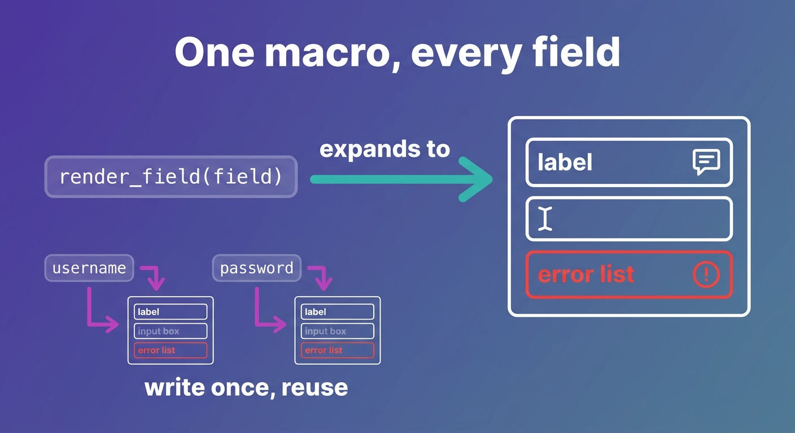

[Save the file](https://fmze.co/fftq-5.3.6).

Now the registration page. Create a user folder inside `templates` and add `register.html`:

{lang=html,line-numbers=on}
```


Registration





<div class="row">
    <div class="col-md-6 offset-md-3">

        <h3>Registration</h3>

        
        <div class="alert alert-danger">{{ error }}</div>
        

        

        <form method="POST" action="{{ url_for('.register') }}" role="form">
            {{ render_field(form.username) }}
            {{ render_field(form.password) }}
            {{ form.csrf_token }}
            <button type="submit" class="btn btn-primary">Register</button>
        </form>

    </div>
</div>


```

We extend `base.html`, set the title, and drop the navbar at the top of the content block. Then we center a column on the page and show an error alert if the view passed one in.

We import our `render_field` macro and use it for the username and password, so both come out as nicely styled Bootstrap fields. Then we submit the form with a button.

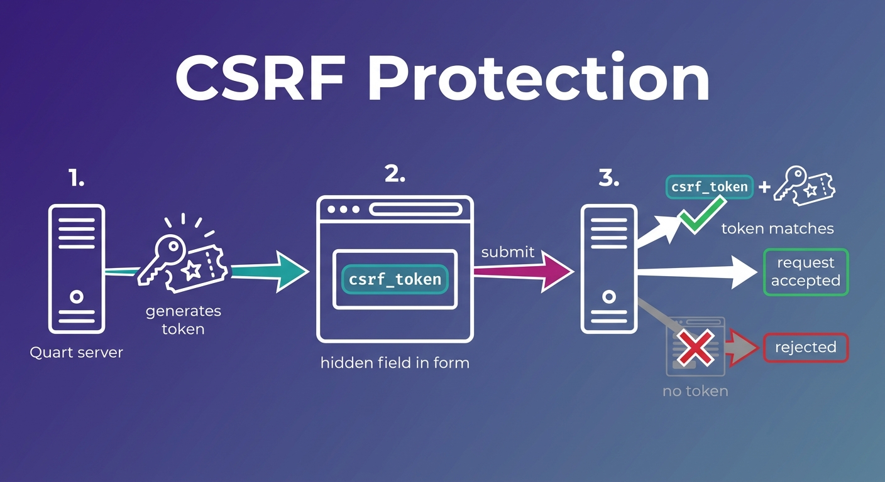

The one line worth pausing on is `{{ form.csrf_token }}`. That renders a hidden field holding the CSRF token, and this single line is our entire cross site request forgery protection. The library generated the token, put it in the form, and will verify it when the form comes back. Done by hand, CSRF protection is fiddly and easy to get subtly wrong — here it's one line.

[Save the file](https://fmze.co/fftq-5.3.7).

Now we can write the real registration view. Open `user/views.py` and rebuild it:

{lang=python,line-numbers=on}
```
from typing import Optional, Union

from passlib.hash import pbkdf2_sha256
from quart import (
    Blueprint,
    Response,
    current_app,
    flash,
    redirect,
    render_template,
    url_for,
)
from sqlalchemy import insert, select

from user.forms import UserForm
from user.models import user_table

user_app = Blueprint("user_app", __name__)
```

We import quite a few things. From `passlib` we bring in `pbkdf2_sha256`, the hashing scheme we'll use. From `quart` we import the usual helpers plus `flash`, which lets us stash a one time message for the next page. And we pull in `insert` and `select` from SQLAlchemy, our form, and our model.

Now the register function itself:

{lang=python,line-numbers=on,starting-line-number=20}
```
@user_app.route("/register", methods=["GET", "POST"])
async def register() -> Union[str, Response]:
    form = await UserForm.create_form()
    error: Optional[str] = None

    if await form.validate_on_submit():
        engine = current_app.dbc  # type: ignore
        async with engine.begin() as conn:
            existing = (
                await conn.execute(
                    select(user_table).where(
                        user_table.c.username == form.username.data
                    )
                )
            ).fetchone()

            if existing is not None:
                error = "User already exists"
            else:
                password_hash = pbkdf2_sha256.hash(form.password.data)
                await conn.execute(
                    insert(user_table).values(
                        username=form.username.data, password=password_hash
                    )
                )

        if not error:
            await flash("User registered successfully, please login")
            return redirect(url_for(".login"))

    return await render_template("user/register.html", form=form, error=error)
```

Our route accepts both `GET` and `POST`. We start by creating the form with `await UserForm.create_form()`. Because reading the incoming request is asynchronous in Quart, building the form is an awaitable, so we `await` it.

The heart of it is `await form.validate_on_submit()`. On a `GET` this is false, so we skip straight to rendering the empty form. On a `POST` it checks the CSRF token and runs our validators, and only returns true if everything passed. That one call replaces all the manual request-method checks and field validation we'd otherwise have to write ourselves.

Inside, we grab our database engine from `current_app.dbc`, exactly as we did in the counter app, and open a transaction. First we select any user with the same username. If we find one, we set an error, because usernames must be unique.

If the name is free, we hash the password with `pbkdf2_sha256.hash`. This turns the plain password into a long, scrambled string that we store instead of the real thing. Even we can't reverse it, which is the whole point: if our database ever leaks, the passwords are useless.

Then we insert the new user with the hashed password. If there were no errors, we flash a success message and redirect to the login page, which we'll build next. Otherwise we fall through and re-render the form with the error shown.

[Save the file](https://fmze.co/fftq-5.3.8).

Before we try this out, there's one loose end. Our register view redirects to `login` when a signup succeeds, and our navbar links to it too, but we haven't built that route yet, so the page would crash if we loaded it now. So, exactly like we did with `register` earlier, let's add a placeholder `login` route just below it for now. We'll build the real login page in the next lesson.

{lang=python,line-numbers=on,starting-line-number=51}
```
@user_app.route("/login")
async def login() -> str:
    return "<h1>Login</h1>"
```

[Save the file](https://fmze.co/fftq-5.3.9).

Let's try it. Bring up the stack and rebuild so the new packages are in place:

{lang=bash,line-numbers=off}
```
$ docker compose up --build
```

Head to `localhost:5000/register`. Submit the form empty and you'll see the required-field errors, courtesy of our validators. Now register a real username and password. The app hashes the password, saves the user, and redirects you to the login page. Try registering that same username again and you'll get our "User already exists" message. And just like that, QuartFeed has its first real users, passwords hashed and accounts saved. But signing up is only half the story—those users still can't get back in. That's next: we'll log them in, give them a session, and let them log out.

## Logging In, Sessions, and Logout <!-- 5.4 -->

We can create users, but they can't come back and prove who they are. In this lesson we'll add login and logout, and along the way meet the session, which is how a web app remembers you from one request to the next.

Logging in is the mirror image of registering. We look up the user by their username, then check that the password they typed matches the hash we stored. Both register and login need that "find a user by username" lookup, so this is a good moment to pull it into a shared helper instead of writing the query twice.

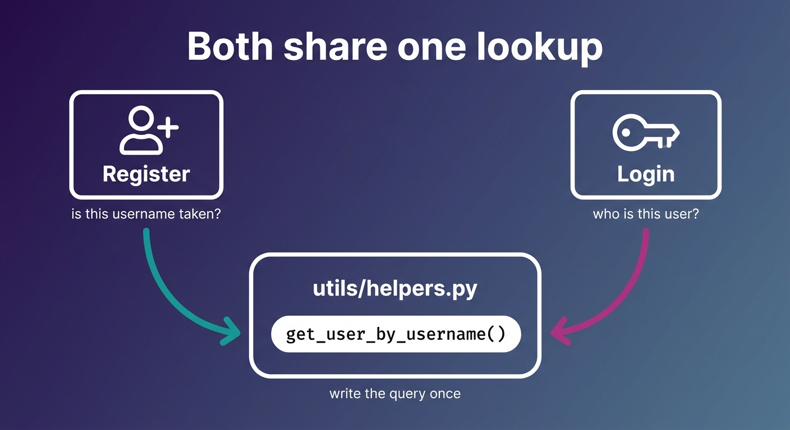

Let's create a `utils` folder at the project root, with an empty `__init__.py` so it's a package, and a `helpers.py` file inside it:

{lang=python,line-numbers=on}
```
from typing import Any, Optional

from sqlalchemy import select
from sqlalchemy.engine import Row

from user.models import user_table


async def get_user_by_username(conn: Any, username: str) -> Optional[Row]:
    result = await conn.execute(
        select(user_table).where(user_table.c.username == username)
    )
    return result.fetchone()
```

This is just the username lookup we wrote inline in the register view, moved into a function. It takes an open connection and a username, runs the select, and returns the row or `None`. We'll keep adding small helpers like this to `utils/helpers.py` as the app grows.

[Save the file](https://fmze.co/fftq-5.4.1).

Let's use it back in `user/views.py`. First update the imports to bring in `session` from Quart and our new helper `get_user_by_username`:

{lang=python,line-numbers=on,starting-line-number=4}
```
from quart import (
    Blueprint,
    Response,
    current_app,
    flash,
    redirect,
    render_template,
    session,
    url_for,
)
from sqlalchemy import insert, select

from utils.helpers import get_user_by_username
from user.forms import UserForm
from user.models import user_table
```

Now that we have the helper, simplify the duplicate check in `register` to use it: replace the inline select with a call to `get_user_by_username(conn, form.username.data)`.

{lang=python,line-numbers=on,starting-line-number=28}
```
    if await form.validate_on_submit():
        engine = current_app.dbc  # type: ignore
        async with engine.begin() as conn:
            existing = await get_user_by_username(conn, form.username.data)

            if existing is not None:
                error = "User already exists"
```

[Save the file](https://fmze.co/fftq-5.4.2) and let's write the login view below `register`:

{lang=python,line-numbers=on,starting-line-number=40}
```
@user_app.route("/login", methods=["GET", "POST"])
async def login() -> Union[str, Response]:
    form = await UserForm.create_form()
    error: Optional[str] = None

    if await form.validate_on_submit():
        engine = current_app.dbc  # type: ignore
        async with engine.begin() as conn:
            user = await get_user_by_username(conn, form.username.data)

        if user is None or not pbkdf2_sha256.verify(
            form.password.data, user.password
        ):
            error = "Invalid username or password"
        else:
            session["user_id"] = user.id
            session["username"] = user.username
            return redirect(url_for("post_app.home"))

    return await render_template("user/login.html", form=form, error=error)
```

The top mirrors registration: same form, same `validate_on_submit`. We look up the user by their username using our helper.

Then comes the check. We reject the login if there's no such user, or if `pbkdf2_sha256.verify` says the typed password doesn't match the stored hash. `verify` hashes the incoming password and compares, so we never have to un-hash anything.

Here's a subtle but important security choice: whether the username was wrong or the password was wrong, we return the exact same message, "Invalid username or password". If we said "no such user" versus "wrong password", we'd be telling an attacker which usernames exist. So we stay vague on purpose.

If the credentials are good, we log the person in by storing their id and username in the `session`. The session is a small, signed cookie Quart manages for us. On every later request we can read `session["user_id"]` to know who's making it. Then we redirect to `post_app.home` — but that endpoint doesn't exist yet, so login has nowhere to land. Let's build a minimal home page for it.

Create a `post` package with a `views.py`. Later this chapter it'll grow into the friend feed; for now it just needs a home route:

{lang=python,line-numbers=on}
```
from quart import Blueprint, redirect, render_template, session, url_for

post_app = Blueprint("post_app", __name__)


@post_app.route("/")
async def home():
    if session.get("username") is None:
        return redirect(url_for("user_app.login"))

    return await render_template("post/home.html")
```

The route is guarded: if there's no `username` in the session, a logged-out visitor is bounced back to login. Otherwise we render the home template.

Register the blueprint in `application.py`, right alongside `user_app`:

{lang=python,line-numbers=on,starting-line-number=13}
```
    from user.views import user_app
    from post.views import post_app

    app.register_blueprint(user_app)
    app.register_blueprint(post_app)
```

Now the template. Create `templates/post/home.html`:

{lang=html,line-numbers=on}
```


Home





<div class="row">
    <div class="col-md-6 offset-md-3">

        
        <div class="alert alert-success">{{ message }}</div>
        

        <h1>Welcome, {{ session.username }}!</h1>
        <p>You're logged in. The friend feed lands here in the next section.</p>

    </div>
</div>


```

It reads `session.username` straight from the session to greet the user by name — visible proof the login stuck. Now login has a real page to land on.

[Save the file](https://fmze.co/fftq-5.4.3).

Login renders its own template, very similar to register. Create `templates/user/login.html`:

{lang=html,line-numbers=on}
```


Login





<div class="row">
    <div class="col-md-6 offset-md-3">

        
        <div class="alert alert-success">{{ message }}</div>
        

        <h3>Login</h3>

        
        <div class="alert alert-danger">{{ error }}</div>
        

        

        <form method="POST" action="{{ url_for('.login') }}" role="form">
            {{ render_field(form.username) }}
            {{ render_field(form.password) }}
            {{ form.csrf_token }}
            <button type="submit" class="btn btn-primary">Login</button>
        </form>

    </div>
</div>


```

It's the register template with the labels changed. The one new piece is the loop over `get_flashed_messages`. That's where the "please login" message we flashed after registration shows up, in a green success alert. Flash messages appear exactly once, on the very next page, and then they're gone.

[Save the file](https://fmze.co/fftq-5.4.4).

Now logout, which is the simplest view we'll write. Add it below `login`:

{lang=python,line-numbers=on,starting-line-number=60}
```
@user_app.route("/logout")
async def logout() -> Response:
    session.pop("user_id", None)
    session.pop("username", None)
    await flash("You have been logged out")
    return redirect(url_for(".login"))
```

Logging out just means forgetting who the user is, so we pop their id and username out of the session. We flash a goodbye message and send them back to the login page. No password, no database, just clearing the cookie.

[Save the file](https://fmze.co/fftq-5.4.5).

The last thing is to make the navbar aware of whether someone is logged in. Open `navbar.html` and make the right side depend on the session:

{lang=html,line-numbers=on,starting-line-number=4}
```
        <div class="navbar-nav ms-auto">
            
            <a class="nav-link" href="{{ url_for('user_app.logout') }}">Logout</a>
            
            <a class="nav-link" href="{{ url_for('user_app.login') }}">Login</a>
            <a class="nav-link" href="{{ url_for('user_app.register') }}">Register</a>
            
        </div>
```

Templates can read the `session` directly, so we check `session.username`. If someone is logged in we show a Logout link, otherwise we show Login and Register. It doesn't make sense to offer Logout to a visitor who was never logged in.

[Save the file](https://fmze.co/fftq-5.4.6).

Let's test the whole loop. Restart the app, register if you haven't, then log in. The navbar switches to Logout, proving the session is set. Click Logout and it flips back. We now have real accounts with real sessions, which is exactly what we need before users can start following each other in the next lesson.

## The Social Graph: Following Users <!-- 5.5 -->

A feed is only interesting if it's a feed of people you follow, so before we can build one, users need to be able to follow each other. In this lesson we'll model that relationship, and we'll also write our first custom decorator to protect the routes that change it.

Let's start with the decorator, because we're about to need it. Following someone should only be possible when you're logged in. We could check the session at the top of every protected view, but that gets repetitive fast. Instead we'll write a login_required decorator once and apply it wherever we need it.

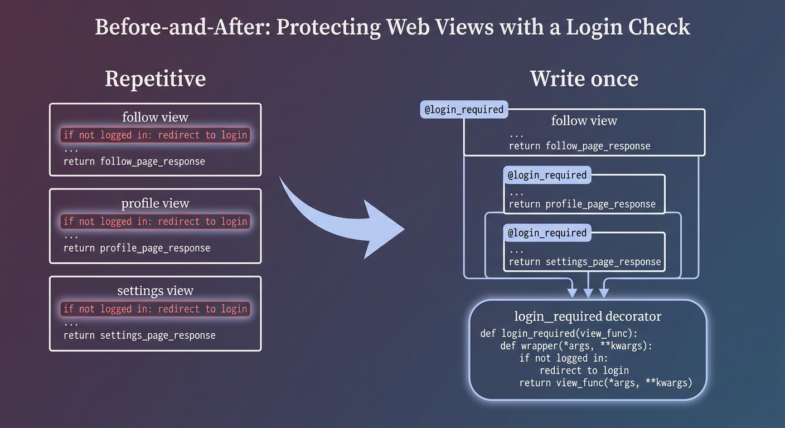

Open the `helpers.py` file in `utils` and extend the imports at the top. We need `wraps` from `functools`, which keeps the wrapped view's name and docstring intact; `Callable` from `typing` for the annotations; and from Quart, `redirect`, `request`, `session` and `url_for`, which together are everything the decorator needs to inspect who is logged in and send everybody else to the login page:

{lang=python,line-numbers=on,starting-line-number=1}
```
from functools import wraps
from typing import Any, Callable, Optional

from quart import redirect, request, session, url_for
from sqlalchemy import select
from sqlalchemy.engine import Row

from user.models import user_table
```

Then add the decorator below `get_user_by_username`:

{lang=python,line-numbers=on,starting-line-number=18}
```
def login_required(f: Callable) -> Callable:
    @wraps(f)
    async def decorated_function(*args: Any, **kwargs: Any) -> Any:
        if session.get("username") is None:
            return redirect(url_for("user_app.login", next=request.url))
        return await f(*args, **kwargs)

    return decorated_function
```

A decorator is a function that wraps another function to add behavior around it. Ours wraps a view: before the view runs, it checks the session, and if nobody's logged in, it redirects to the login page instead of running the view.

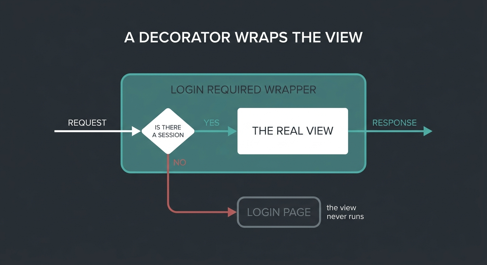

There's one detail that's easy to get wrong in an async app. The wrapper, `decorated_function`, is itself declared `async`, and it awaits the real view. If we wrote a plain function that returned a coroutine, Quart wouldn't recognize it as a coroutine function and wouldn't await it properly. So the wrapper must be async too.

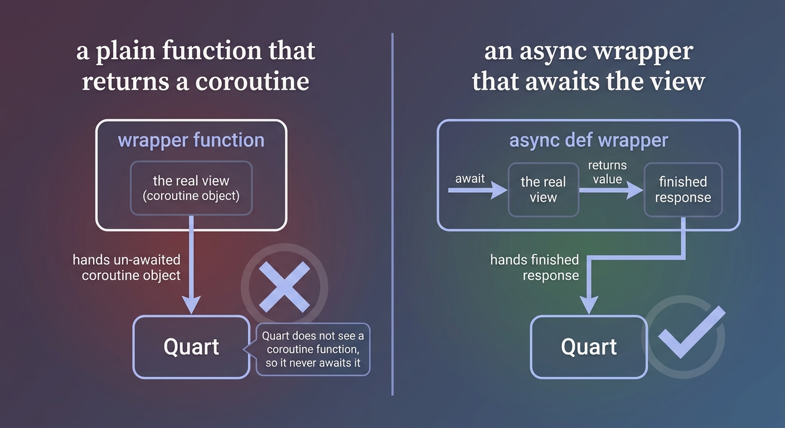

[Save the file](https://fmze.co/fftq-5.5.1).

Now the model. We need to decide what a "follow" actually is. On Facebook, friendship is mutual: if we're friends, we both see each other. On Twitter, following is one directional: I can follow you without you following me back. We'll go with the Twitter style, because it's simpler and it's what a feed really needs.

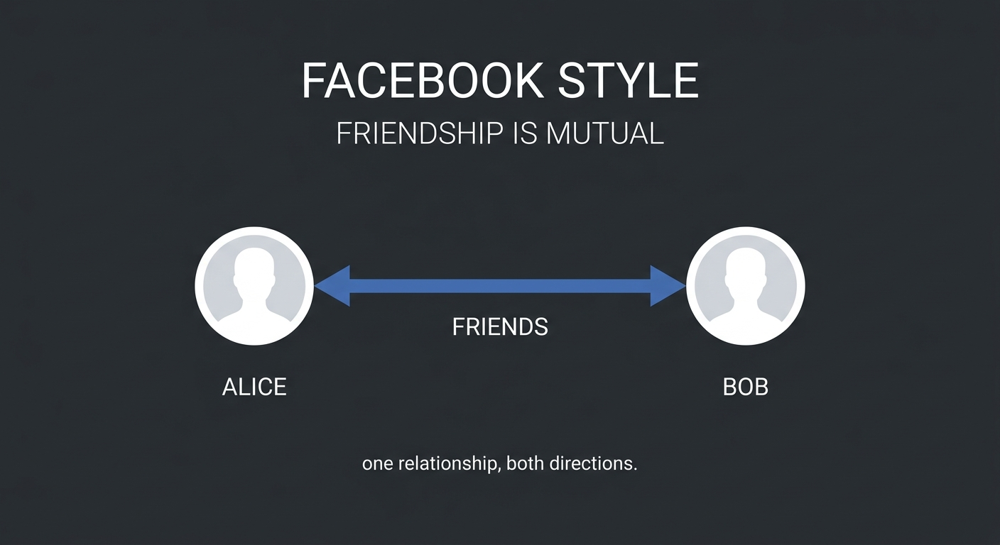

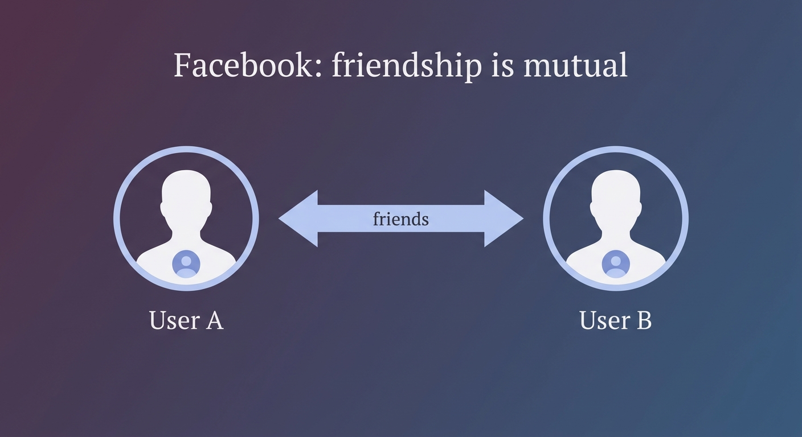

Create a `relationship` folder with an empty `__init__.py`, and a `models.py` inside it:

{lang=python,line-numbers=on}
```
from sqlalchemy import Column, ForeignKey, Integer, Table

from db import metadata

# Unidirectional follow (Twitter-style): fm_user_id follows to_user_id.
relationship_table = Table(
    "relationship",
    metadata,
    Column("id", Integer, primary_key=True),
    Column("fm_user_id", Integer, ForeignKey("user.id"), nullable=False),
    Column("to_user_id", Integer, ForeignKey("user.id"), nullable=False),
)
```

This table is interesting because it points back at the `user` table twice. Each row is one follow: `fm_user_id` is the user doing the following (the "from" user), and `to_user_id` is the user being followed (the "to" user).

Both columns are foreign keys to `user.id`. A foreign key tells the database these values must be real user ids, so we can never have a follow that points at a user who doesn't exist. A single table referencing another table from two different columns like this is how you model a graph of connections between rows of the same kind.

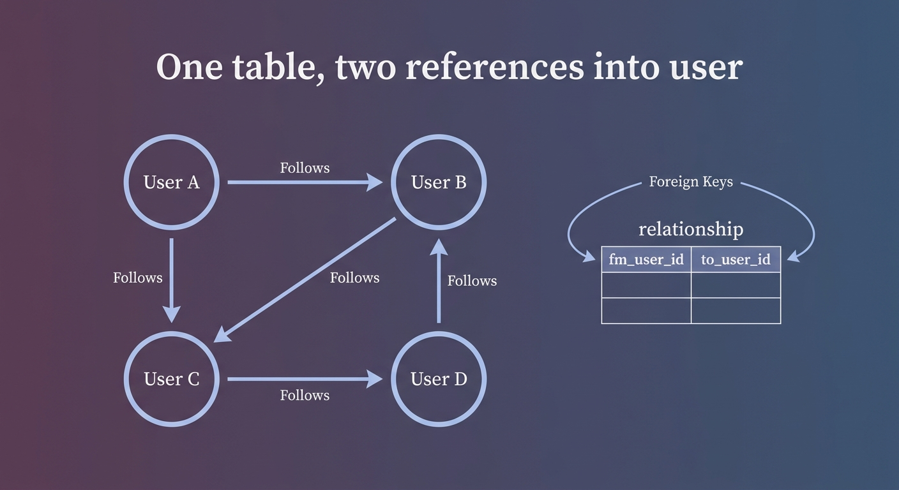

[Save the file](https://fmze.co/fftq-5.5.2).

Now the views. Create `relationship/views.py`:

{lang=python,line-numbers=on}
```
from typing import List

from quart import Blueprint, abort, current_app, redirect, session, url_for
from quart_wtf import QuartForm
from sqlalchemy import delete, insert, select

from utils.helpers import get_user_by_username, login_required
from relationship.models import relationship_table

relationship_app = Blueprint("relationship_app", __name__)


class EmptyForm(QuartForm):
    """CSRF-only form used for the follow/unfollow POSTs (no visible fields)."""
```

We set up the blueprint and, right away, a form with no fields. Why a form for a follow button? Because following changes data, so it must be a `POST`, and every `POST` in our app is CSRF protected. `EmptyForm` has no visible inputs, but it still carries a CSRF token we can validate. It's the smallest possible protected form.

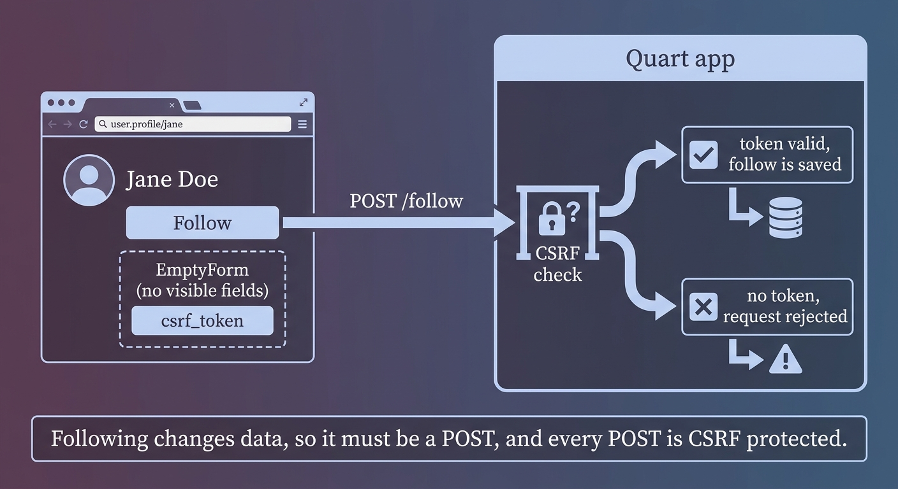

Next, two small query helpers in the same file:

{lang=python,line-numbers=on,starting-line-number=17}
```
async def is_following(conn, fm_user_id: int, to_user_id: int) -> bool:
    result = await conn.execute(
        select(relationship_table).where(
            (relationship_table.c.fm_user_id == fm_user_id)
            & (relationship_table.c.to_user_id == to_user_id)
        )
    )
    return result.fetchone() is not None


async def followers(conn, user_id: int) -> List[int]:
    """Return the list of user_ids following ``user_id`` (needed for post fan-out)."""
    result = await conn.execute(
        select(relationship_table.c.fm_user_id).where(
            relationship_table.c.to_user_id == user_id
        )
    )
    return [row.fm_user_id for row in result.fetchall()]
```

`is_following` answers a yes or no question: is there a row where this "from" user follows this "to" user? We use it to decide whether a profile shows a Follow or an Unfollow button.

`followers` returns the ids of everyone following a given user. We don't need it on screen yet, but keep it in mind: when someone posts, this is the exact list of people whose feeds that post should land in. It's the seed of the whole feed system.

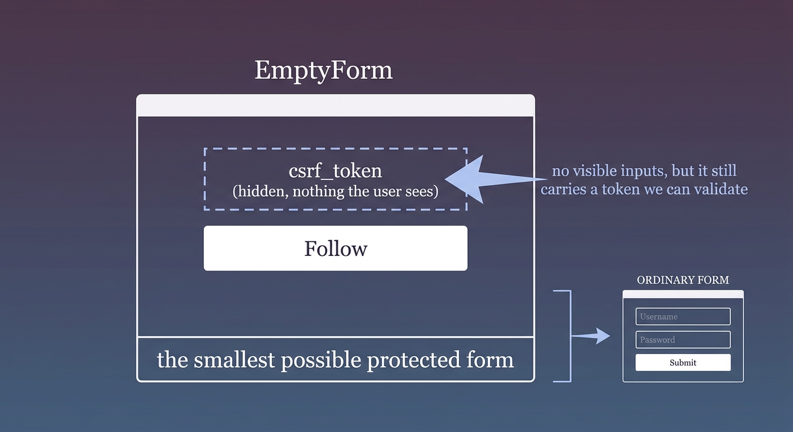

Now the actions themselves, follow and unfollow:

{lang=python,line-numbers=on,starting-line-number=37}
```
@relationship_app.route("/follow/<username>", methods=["POST"])
@login_required
async def follow(username: str):
    form = await EmptyForm.create_form()
    if await form.validate_on_submit():
        engine = current_app.dbc  # type: ignore
        async with engine.begin() as conn:
            target = await get_user_by_username(conn, username)
            if target is None:
                abort(404)

            my_id = session["user_id"]
            if target.id != my_id and not await is_following(conn, my_id, target.id):
                await conn.execute(
                    insert(relationship_table).values(
                        fm_user_id=my_id, to_user_id=target.id
                    )
                )

    return redirect(url_for("user_app.profile", username=username))
```

Here's the decorator paying off. We stack `@login_required` right under the route, and now this view simply can't run for a logged out visitor. Inside, we validate the CSRF token through `EmptyForm`, look up the target user, and 404 if there's no such person.

Then we insert the follow, but only if two things hold: you're not trying to follow yourself, and you're not already following them. That guard keeps the table clean and avoids duplicate rows. When we're done, we send you back to the profile you were looking at.

Unfollow is the reverse, a `delete` instead of an `insert`:

{lang=python,line-numbers=on,starting-line-number=59}
```
@relationship_app.route("/unfollow/<username>", methods=["POST"])
@login_required
async def unfollow(username: str):
    form = await EmptyForm.create_form()
    if await form.validate_on_submit():
        engine = current_app.dbc  # type: ignore
        async with engine.begin() as conn:
            target = await get_user_by_username(conn, username)
            if target is None:
                abort(404)

            await conn.execute(
                delete(relationship_table).where(
                    (relationship_table.c.fm_user_id == session["user_id"])
                    & (relationship_table.c.to_user_id == target.id)
                )
            )

    return redirect(url_for("user_app.profile", username=username))
```

Same shape, same protection. We find the target user and delete the row where you follow them. If the row isn't there, the delete simply affects nothing, which is fine.

[Save the file](https://fmze.co/fftq-5.5.3).

Now register the blueprint. Open `application.py`, import `relationship_app`, and register it alongside `user_app`:

{lang=python,line-numbers=on,starting-line-number=13}
```
    from user.views import user_app
    from relationship.views import relationship_app

    app.register_blueprint(user_app)
    app.register_blueprint(relationship_app)
```

[Save the file](https://fmze.co/fftq-5.5.4).

Now tell Alembic about the new model. Open `migrations/env.py` and add the import next to the user one:

{lang=python,line-numbers=on,starting-line-number=17}
```
from relationship.models import relationship_table  # noqa: F401
```

[Save the file](https://fmze.co/fftq-5.5.5).

Now run the migration for the new table. Autogenerate compares our models against the database, sees that the relationship table is missing, and writes a new revision file for us. Then upgrade head applies that revision and creates the relationship table, with its two foreign keys pointing back to the user table:

{lang=bash,line-numbers=off}
```
$ docker compose build web
$ docker compose run --rm web uv run alembic revision --autogenerate -m "create relationship table"
$ docker compose run --rm web uv run alembic upgrade head
```

The follow buttons live on a user's profile, and we don't have a profile page yet, so let's add a simple one. Open `user/views.py`. We'll need a few more imports here, plus our helpers and the relationship functions:

{lang=python,line-numbers=on,starting-line-number=17}
```
from utils.helpers import get_user_by_username, login_required
from relationship.models import relationship_table
from relationship.views import EmptyForm, is_following
```

Then add the profile view:

{lang=python,line-numbers=on,starting-line-number=83}
```
@user_app.route("/user/<username>")
async def profile(username: str) -> str:
    engine = current_app.dbc  # type: ignore
    async with engine.begin() as conn:
        profile_user = await get_user_by_username(conn, username)
        if profile_user is None:
            abort(404)

        my_user_id = session.get("user_id")
        if profile_user.id == my_user_id:
            relationship = "self"
        elif my_user_id is not None and await is_following(
            conn, my_user_id, profile_user.id
        ):
            relationship = "following"
        else:
            relationship = "not_following"

        followers_result = await conn.execute(
            select(relationship_table).where(
                relationship_table.c.to_user_id == profile_user.id
            )
        )
        follower_count = len(followers_result.fetchall())

    follow_form = await EmptyForm.create_form()

    return await render_template(
        "user/profile.html",
        profile_user=profile_user,
        relationship=relationship,
        follower_count=follower_count,
        follow_form=follow_form,
    )
```

We look up the user whose profile this is and 404 if they don't exist. Then we work out our relationship to them: is this my own profile, am I already following them, or not? That drives which button we show. We also count their followers with a quick query.

The one new-looking thing is `follow_form`. We create an `EmptyForm` and hand it to the template purely so the follow and unfollow buttons have a CSRF token to submit. We'll reuse this pattern every time a page has an action button.

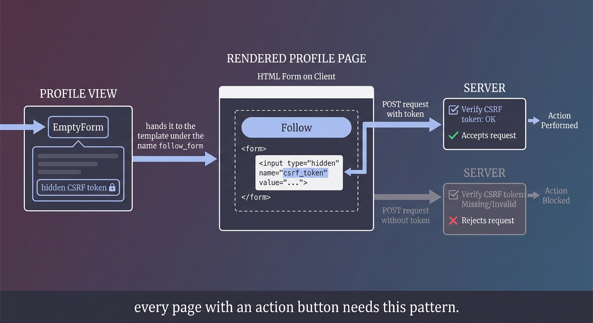

[Save the file](https://fmze.co/fftq-5.5.6).

Finally the profile template. Create `templates/user/profile.html`:

{lang=html,line-numbers=on}
```


{{ profile_user.username }}





<div class="row">
    <div class="col-md-8 offset-md-2">

        <h3>@{{ profile_user.username }}</h3>
        <p class="text-muted">{{ follower_count }} followers</p>

        
        <form method="POST" action="{{
            url_for('relationship_app.unfollow',
                    username=profile_user.username) }}">
            {{ follow_form.csrf_token }}
            <button type="submit"
                class="btn btn-outline-secondary">Unfollow</button>
        </form>
        
        <form method="POST" action="{{
            url_for('relationship_app.follow',
                    username=profile_user.username) }}">
            {{ follow_form.csrf_token }}
            <button type="submit"
                class="btn btn-primary">Follow</button>
        </form>
        

    </div>
</div>


```

We show the username and follower count, then choose a button based on the relationship the view computed. If we're already following, we render an Unfollow form; if not, a Follow form; and if it's our own profile, we render neither. Each form carries the CSRF token from `follow_form`.

[Save the file](https://fmze.co/fftq-5.5.7).

Time to try it. Bring the app up and head to the registration page.

Register a first account, jorge, then a second one, maria, so we have two users to connect.

Now log in with your first user.

Then visit maria's profile at `/user/maria`.

There's the Follow button our new route is wired to. Click it, and the page comes back with the button flipped to Unfollow and the follower count at one.

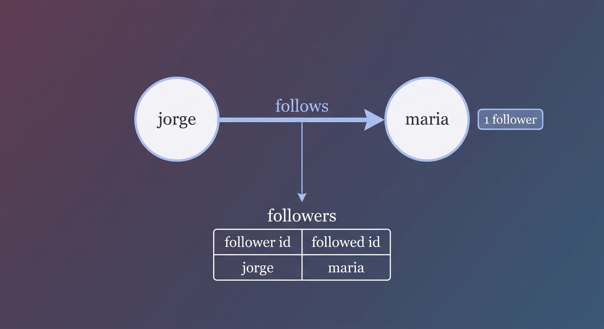

You've just built a social graph. Next we'll make profiles worth visiting by adding avatars.

## Profiles and Avatar Uploads <!-- 5.6 -->

Our profiles work, but they're bare. In this lesson we'll let users edit their profile and upload an avatar, which means handling a real file upload and processing an image. This is the first time we're accepting a file instead of just text, so there's a bit to set up.

Processing images means resizing and cropping them, and for that we'll use Wand, a Python binding for ImageMagick. ImageMagick is a system library, so it has to be installed in the container, not just as a Python package. Let's handle both.

Open the `Dockerfile` and install ImageMagick right after the base image, before we install our Python packages:

{lang=docker,line-numbers=on,starting-line-number=1}
```
FROM python:3.12-slim

RUN apt-get update && apt-get install -y --no-install-recommends \
    imagemagick libmagickwand-dev \
    && rm -rf /var/lib/apt/lists/*
```

We update the package list, install ImageMagick and its development headers, then clean up the list to keep the image small. This is a common pattern: when a Python library wraps a system tool, you install the system tool in the Dockerfile.

[Save the file](https://fmze.co/fftq-5.6.1).

That covers the system library. Now the Python binding, which we add with `uv`:

{lang=bash,line-numbers=off}
```
$ uv add --no-sync Wand
```

The `--no-sync` flag records Wand in `pyproject.toml` and `uv.lock` without installing it on your machine, which is what we want since the app only ever runs in the container.

These two values are plain settings, not code, so they live in `.quartenv` rather than in the app: a different machine might keep its uploads somewhere else entirely. `UPLOADS_FOLDER` is where uploaded files land on disk, and `IMAGE_URL` is the public path the browser uses to fetch them back.

{lang=ini,line-numbers=on,starting-line-number=9}
```
UPLOADS_FOLDER=static/uploads
IMAGE_URL=/static/uploads
```

[Save the file](https://fmze.co/fftq-5.6.2), which also carries the `pyproject.toml` and `uv.lock` changes `uv add` just made.

Now read those two settings into `settings.py`, the same `os.environ.get` pattern as the rest, each with a sensible default:

{lang=python,line-numbers=on,starting-line-number=10}
```
UPLOADS_FOLDER = os.environ.get("UPLOADS_FOLDER", "static/uploads")
IMAGE_URL = os.environ.get("IMAGE_URL", "/static/uploads")
```

Both point at the same `static/uploads` folder, which Quart already serves for us.

[Save the file](https://fmze.co/fftq-5.6.3).

An avatar is square, so when someone uploads a rectangular photo we need to crop it to a square and produce a few sizes: a small one for the feed, a larger one for the profile. Let's write that image logic in its own file. Create `utils/imaging.py`:

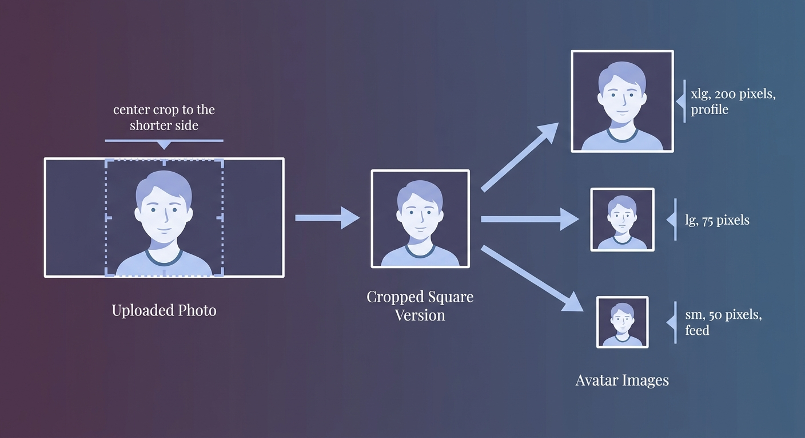

{lang=python,line-numbers=on}
```
import time
from pathlib import Path
from typing import List, Tuple, Union

from wand.image import Image

AVATAR_SIZES: List[Tuple[str, int]] = [("sm", 50), ("lg", 75), ("xlg", 200)]


def crop_center(image: Image) -> None:
    """Center-crop ``image`` to a square sized to its narrower dimension."""
    dst_landscape = 1 > image.width / image.height
    wh = image.width if dst_landscape else image.height
    image.crop(
        left=int((image.width - wh) / 2),
        top=int((image.height - wh) / 2),
        width=int(wh),
        height=int(wh),
    )
```

We define our three avatar sizes up front, each with a short name and a pixel dimension. Then `crop_center` takes a Wand image and crops it to a centered square, using the shorter side as the length so we never crop past the edges. This is what keeps faces roughly centered instead of chopped off.

Now the function that actually saves the avatar:

{lang=python,line-numbers=on,starting-line-number=22}
```
def thumbnail_process(
    blob: bytes,
    dest_dir: Union[str, Path],
    content_id: Union[str, int],
    sizes: List[Tuple[str, int]] = AVATAR_SIZES,
) -> int:
    """Square-crop ``blob`` and save one PNG per size. Returns the image_id."""
    image_id = int(time.time())
    dest = Path(dest_dir)
    dest.mkdir(parents=True, exist_ok=True)
    for name, size in sizes:
        with Image(blob=blob) as img:
            crop_center(img)
            img.sample(size, size)
            img.format = "png"
            img.save(filename=str(dest / f"{content_id}.{image_id}.{name}.png"))
    return image_id
```

This takes the raw uploaded bytes, the folder to write to, and the user's id. It picks an `image_id`, which is simply the current unix timestamp. For each size, it crops to a square, scales it down, and saves a PNG named with the user id, the timestamp, and the size, like `3.1783289480.lg.png`.

Why put a timestamp in the filename? Because it doubles as a cache buster. When someone uploads a new avatar, they get a new timestamp and therefore new filenames, so browsers can't show a stale cached image. The function returns that `image_id`, and we'll store it on the user row. A user with no avatar has no image id, and we'll show a default picture instead.

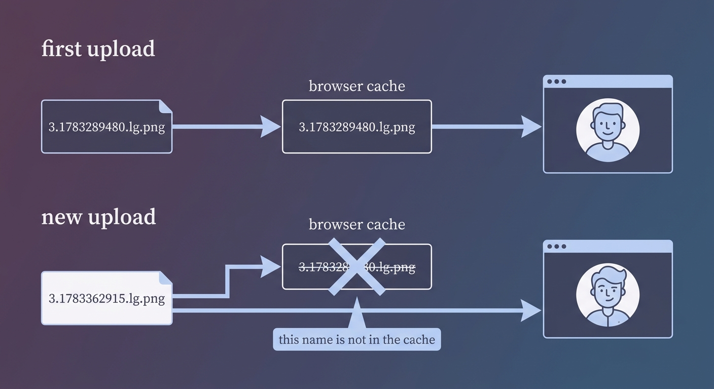

[Save the file](https://fmze.co/fftq-5.6.4).

For that to work, the `user` table needs a column to remember the avatar's image id. Open `user/models.py` and add an `image` column:

{lang=python,line-numbers=on,starting-line-number=10}
```
    Column("password", String(128)),
    # unix timestamp of the last uploaded avatar; NULL = default avatar
    Column("image", Integer, nullable=True),
)
```

It's a nullable integer holding that timestamp. Null means the user hasn't uploaded anything, so we fall back to the default avatar.

[Save the file](https://fmze.co/fftq-5.6.5) and migrate. Since we changed an existing table, Alembic will generate an `ALTER TABLE` that adds the column:

{lang=bash,line-numbers=off}
```
$ docker compose build web
$ docker compose run --rm web uv run alembic revision --autogenerate -m "add image to user"
$ docker compose run --rm web uv run alembic upgrade head
```

Now let's build the URL helper that turns a user's image id into a path the browser can load. Open `utils/helpers.py` and add:

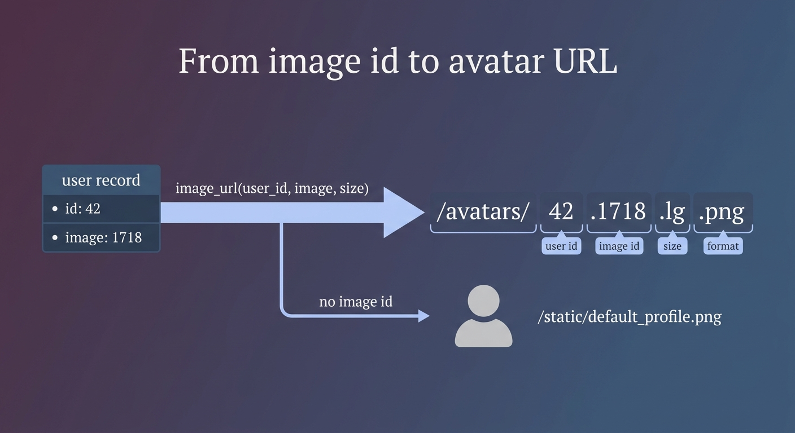

{lang=python,line-numbers=on,starting-line-number=28}
```
async def get_user_by_id(conn: Any, user_id: int) -> Optional[Row]:
    result = await conn.execute(select(user_table).where(user_table.c.id == user_id))
    return result.fetchone()


def image_url(user_id: int, image: Optional[int], size: str = "lg") -> str:
    if image:
        return f"{current_app.config['IMAGE_URL']}/avatars/{user_id}.{image}.{size}.png"
    return "/static/default_profile.png"
```

We add `get_user_by_id`, the companion to our username lookup, because editing a profile means loading the current user by their session id. Then `image_url` builds the avatar path: if the user has an image id, it points at their uploaded file at the requested size; if not, it returns a default picture. Add `current_app` to the imports at the top of the file for this to work.

[Save the file](https://fmze.co/fftq-5.6.6).

A user with no avatar still needs something to show, so drop a placeholder `default_profile.png` into the `static` folder. This is the picture `image_url` returns when a user has no image id of their own.

One housekeeping detail while we're here. Uploaded avatars are runtime data, not source code, so they shouldn't end up in git. Add a `.gitignore` next to the app:

{lang=text,line-numbers=on}
```
# User-uploaded images (runtime data), written by thumbnail_process
static/uploads/
```

[Save the file](https://fmze.co/fftq-5.6.6b).

Editing a profile is a form with a file field, so we need a new form. Open `user/forms.py` and add it below `UserForm`:

{lang=python,line-numbers=on,starting-line-number=17}
```
class ProfileEditForm(QuartForm):
    username = StringField("Username", validators=[DataRequired(), Length(max=15)])
    image = FileField(
        "Profile image",
        validators=[FileAllowed(["png", "jpg", "jpeg"], "Images only!")],
    )
```

This form has the username again, plus an `image` field. `FileField` is WTForms' file upload field, and `FileAllowed` is a validator that rejects anything that isn't a PNG or JPEG, with a friendly message. Add `FileAllowed` and `FileField` to the `quart_wtf` import at the top of the file.

[Save the file](https://fmze.co/fftq-5.6.7).

Now the profile edit view. This one is longer, so let's build it in pieces. Open `user/views.py`. The imports at the top of the file grow a fair bit, so here is the whole header with the new pieces in place:

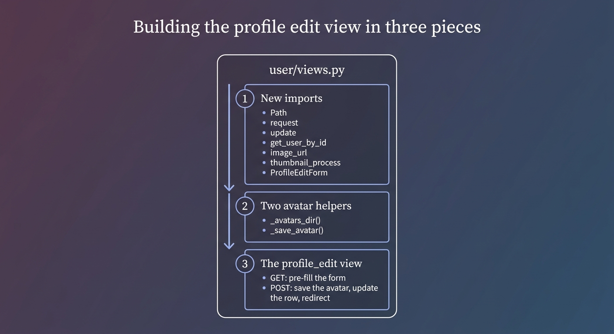

{lang=python,line-numbers=on,starting-line-number=1}
```
from pathlib import Path
from typing import Optional, Union

from passlib.hash import pbkdf2_sha256
from quart import (
    Blueprint,
    Response,
    abort,
    current_app,
    flash,
    redirect,
    render_template,
    request,
    session,
    url_for,
)
from sqlalchemy import insert, select, update

from utils.helpers import (
    get_user_by_id,
    get_user_by_username,
    image_url,
    login_required,
)
from utils.imaging import thumbnail_process
from relationship.models import relationship_table
from relationship.views import EmptyForm, is_following
from user.forms import ProfileEditForm, UserForm
from user.models import user_table
```

Four things are new. `Path` for building the upload folder, `request` so we can tell a `GET` from a `POST`, `update` for changing the user row, and our new helpers `get_user_by_id`, `image_url`, and `thumbnail_process`, plus the `ProfileEditForm` we just wrote.

Now a tiny helper to keep the avatars in their own subfolder, and one to run the image processing:

{lang=python,line-numbers=on,starting-line-number=127}
```
def _avatars_dir() -> Path:
    return Path(current_app.config["UPLOADS_FOLDER"]) / "avatars"


def _save_avatar(file_storage, user_id: int) -> int:
    data = file_storage.read()
    return thumbnail_process(data, _avatars_dir(), user_id)
```

`_avatars_dir` points at `static/uploads/avatars`, and `_save_avatar` reads the uploaded file's bytes and hands them to `thumbnail_process`, returning the new image id. Now the edit view itself:

{lang=python,line-numbers=on,starting-line-number=136}
```
@user_app.route("/profile/edit", methods=["GET", "POST"])
@login_required
async def profile_edit() -> Union[str, Response]:
    form = await ProfileEditForm.create_form()
    engine = current_app.dbc  # type: ignore

    async with engine.begin() as conn:
        current_user = await get_user_by_id(conn, session["user_id"])

    if request.method == "GET":
        form.username.data = current_user.username

    if await form.validate_on_submit():
        new_username = form.username.data
        ts: Optional[int] = None
        if form.image.data:
            ts = _save_avatar(form.image.data, session["user_id"])

        async with engine.begin() as conn:
            values = {"username": new_username}
            if ts is not None:
                values["image"] = ts
            await conn.execute(
                update(user_table)
                .where(user_table.c.id == session["user_id"])
                .values(**values)
            )

        session["username"] = new_username
        await flash("Profile updated")
        return redirect(url_for(".profile", username=new_username))

    return await render_template(
        "user/profile_edit.html",
        form=form,
        avatar_url=image_url(current_user.id, current_user.image, "xlg"),
    )
```

The view is `login_required`, since you can only edit your own profile. We load the current user by their session id. On a `GET`, we pre-fill the username field so the form shows the existing name.

On a valid `POST`, we only process an image if one was actually uploaded, checking `form.image.data`. If there is one, `_save_avatar` crops and saves it and gives us a new timestamp. Then we build the update: always the username, and the new image id only if a file came in. We update the row, refresh the session username in case it changed, and redirect back to the profile.

[Save the file](https://fmze.co/fftq-5.6.8).

The edit page needs a template. Create `templates/user/profile_edit.html`:

{lang=html,line-numbers=on}
```


Edit profile





<div class="row">
    <div class="col-md-6 offset-md-3">

        <h3>Edit profile</h3>

        

        

        <form method="POST" enctype="multipart/form-data">
            {{ render_field(form.username) }}
            {{ render_field(form.image) }}
            {{ form.csrf_token }}
            <button type="submit" class="btn btn-primary">Save</button>
        </form>

    </div>
</div>


```

We show the current avatar at the top, then the form. The one detail that matters for uploads is `enctype="multipart/form-data"` on the form tag. Without it, the browser sends only the text fields and drops the file. Any form with a file upload needs that attribute.

[Save the file](https://fmze.co/fftq-5.6.9).

The avatar is saved, but the profile page still doesn't show it. Back in `user/views.py`, the `profile` view needs to pass the avatar down to its template:

{lang=python,line-numbers=on,starting-line-number=118}
```
    return await render_template(
        "user/profile.html",
        profile_user=profile_user,
        relationship=relationship,
        follower_count=follower_count,
        avatar_url=image_url(profile_user.id, profile_user.image),
        follow_form=follow_form,
    )
```

We call the same `image_url` helper, this time with the profile owner's id and image. No size argument, so it hands back the `lg` version, which is the 75 pixel one.

[Save the file](https://fmze.co/fftq-5.6.10a).

Now show it. Open `templates/user/profile.html` and put the avatar next to the username:

{lang=html,line-numbers=on,starting-line-number=12}
```
        <div class="d-flex align-items-center mb-3">
            
            <div>
                <h3 class="mb-0">@{{ profile_user.username }}</h3>
                <p class="text-muted mb-0">{{ follower_count }} followers</p>
            </div>
        </div>
```

A flex row puts the picture and the name side by side, and `rounded-circle` is the Bootstrap class that crops it into a circle. Our square avatar is what makes that circle look right.

[Save the file](https://fmze.co/fftq-5.6.10b).

Last touch: nobody can reach the edit page yet. Open `templates/navbar.html` and add the link for logged-in users:

{lang=html,line-numbers=on,starting-line-number=6}
```
            <a class="nav-link"
                href="{{ url_for('user_app.profile_edit') }}">Edit profile</a>
```

It goes inside the `` branch, right above Logout, so it only shows when someone is actually logged in.

[Save the file](https://fmze.co/fftq-5.6.10).

Restart the app and try it. Register, log in, hit Edit profile, and upload a photo. It comes back cropped to a neat circle next to your username, and anyone who hasn't uploaded one still gets the default picture. Our users have faces now. Next we give them something to say.

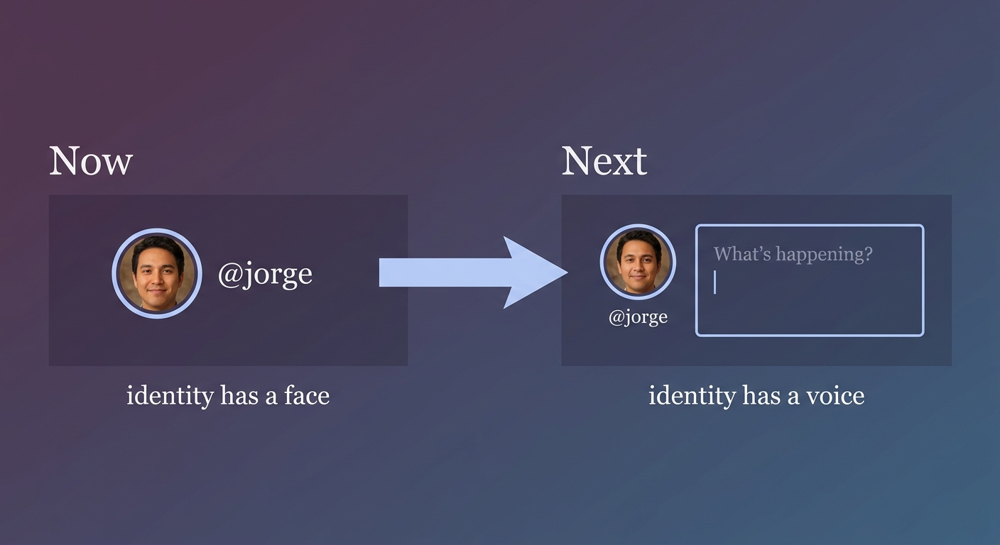

## User Tests <!-- 5.7 -->

Here's a nice payoff of having built QuartFeed on top of the counter app: we didn't just inherit its structure, we inherited its tests. Look in the `tests` folder and you'll still find the counter's `conftest.py` and a `test_counter.py`. That `conftest.py`, with its fresh-database fixtures, is exactly the harness we want; we just have to point it at QuartFeed instead of the counter. So rather than write testing from scratch, this lesson adapts what we already have to cover registration, login, profiles, and following.

Start with `conftest.py`. The fixtures that spin up a throwaway database and hand us a test client need no changes at all. We make just two adjustments. First, QuartFeed's forms carry a CSRF token, and we don't want to fetch and echo tokens in every test, so we add `WTF_CSRF_ENABLED: False` to the config the fixture yields. Second, our fixture builds the tables with `metadata.create_all`, which only builds tables it knows about, so we import the models we're about to test to register them.

{lang=python,line-numbers=on,starting-line-number=1}
```
import os

import pytest_asyncio
from dotenv import load_dotenv
from sqlalchemy import text
from sqlalchemy.ext.asyncio import create_async_engine

load_dotenv(".quartenv")

from application import create_app
from db import metadata

# Register the tables we're testing so metadata.create_all builds them.
from user.models import user_table  # noqa: F401
from relationship.models import relationship_table  # noqa: F401


@pytest_asyncio.fixture
async def create_db():
    db_name = os.environ["DATABASE_NAME"]
    db_host = os.environ["DB_HOST"]
    db_username = os.environ["DB_USERNAME"]
    db_password = os.environ["DB_PASSWORD"]

    base_uri = f"postgresql+asyncpg://{db_username}:{db_password}@{db_host}:5432/"
    test_db_name = db_name + "_test"

    # CREATE/DROP DATABASE must run outside a transaction (AUTOCOMMIT).
    admin = create_async_engine(base_uri + db_name, isolation_level="AUTOCOMMIT")
    async with admin.connect() as conn:
        await conn.execute(text(f"DROP DATABASE IF EXISTS {test_db_name} WITH (FORCE)"))
        await conn.execute(text(f"CREATE DATABASE {test_db_name}"))
    await admin.dispose()

    engine = create_async_engine(base_uri + test_db_name)
    async with engine.begin() as conn:
        await conn.run_sync(metadata.create_all)
    await engine.dispose()

    yield {
        "DB_USERNAME": db_username,
        "DB_PASSWORD": db_password,
        "DB_HOST": db_host,
        "DATABASE_NAME": test_db_name,
        "TESTING": True,
        "WTF_CSRF_ENABLED": False,
    }

    admin = create_async_engine(base_uri + db_name, isolation_level="AUTOCOMMIT")
    async with admin.connect() as conn:
        await conn.execute(text(f"DROP DATABASE IF EXISTS {test_db_name} WITH (FORCE)"))
    await admin.dispose()


@pytest_asyncio.fixture
async def create_test_app(create_db):
    app = create_app(**create_db)
    await app.startup()
    yield app
    await app.shutdown()


@pytest_asyncio.fixture
async def create_test_client(create_test_app):
    return create_test_app.test_client()
```

The three fixtures are the same ones the counter app gave us. `create_db` drops and recreates a `_test` database, builds every registered table, and yields a config dictionary, to which we've now added `TESTING` and the CSRF flag. `create_test_app` feeds that config into `create_app`, and `create_test_client` hands us a Quart test client. The one detail worth remembering is that the client keeps cookies between requests, which is the whole reason we can test logged-in behavior at all. While we're in the `tests` folder, delete the counter's old `test_counter.py`: it hit `/` and checked for "Counter: 1", but QuartFeed's home page is a feed now, so that test is obsolete.

[Save the file](https://fmze.co/fftq-5.7.1).

That obsolete counter test taught us a useful shape, though, and we'll reuse it for the real features: make a request, assert on the response, and verify against the database. Create `tests/test_user.py`, starting with registration. The first test is the smoke test: ask for the registration page and check that the word Registration comes back in the body.

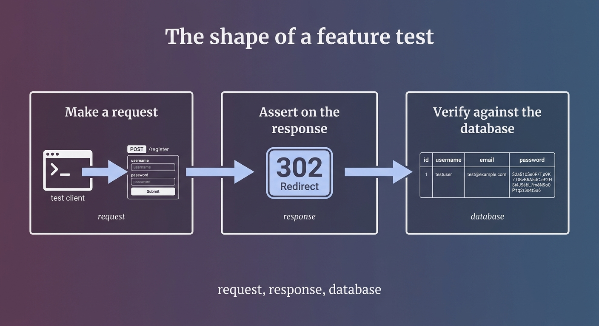

{lang=python,line-numbers=on,starting-line-number=1}
```
import pytest
from quart import current_app
from sqlalchemy import select

from user.models import user_table


@pytest.mark.asyncio
async def test_register_page_loads(create_test_client):
    response = await create_test_client.get("/register")
    body = await response.get_data()
    assert "Registration" in str(body)


@pytest.mark.asyncio
async def test_register_creates_user(create_test_client, create_test_app):
    response = await create_test_client.post(
        "/register", form={"username": "alice", "password": "secret123"}
    )
    assert response.status_code == 302

    async with create_test_app.app_context():
        async with current_app.dbc.begin() as conn:
            row = (
                await conn.execute(
                    select(user_table).where(user_table.c.username == "alice")
                )
            ).fetchone()
            assert row is not None
            assert row.password != "secret123"  # stored hashed, not plaintext


@pytest.mark.asyncio
async def test_register_duplicate_username(create_test_client):
    await create_test_client.post(
        "/register", form={"username": "bob", "password": "secret123"}
    )
    response = await create_test_client.post(
        "/register", form={"username": "bob", "password": "secret123"}
    )
    body = await response.get_data()
    assert "User already exists" in str(body)


@pytest.mark.asyncio
async def test_register_missing_fields(create_test_client):
    response = await create_test_client.post(
        "/register", form={"username": "", "password": ""}
    )
    body = await response.get_data()
    assert "This field is required." in str(body)
```

The counter test asserted the count went up; our equivalent asserts a user was created. A successful registration answers with a `302` redirect, so that status is our first signal. But a redirect alone proves little, so `test_register_creates_user` opens the database directly, just like the counter test read the counter row, and confirms alice exists with a password that is not the plaintext we sent, which quietly guarantees we hash passwords. The last two tests push the unhappy paths: registering the same username twice surfaces "User already exists", and an empty form comes back with "This field is required.", proving validation runs before we ever touch the database.

[Save the file](https://fmze.co/fftq-5.7.2).

Next, add the login and logout tests to the same file. This is where the test client's cookie jar earns its keep: we register, then log in, and the session cookie set at login rides into the next request automatically.

{lang=python,line-numbers=on,starting-line-number=54}
```
@pytest.mark.asyncio
async def test_login_success(create_test_client):
    await create_test_client.post(
        "/register", form={"username": "carol", "password": "secret123"}
    )
    response = await create_test_client.post(
        "/login", form={"username": "carol", "password": "secret123"}
    )
    assert response.status_code == 302

    home_response = await create_test_client.get("/")
    body = await home_response.get_data()
    assert "QuartFeed" in str(body)


@pytest.mark.asyncio
async def test_login_unknown_user(create_test_client):
    response = await create_test_client.post(
        "/login", form={"username": "nobody", "password": "whatever"}
    )
    body = await response.get_data()
    assert "Invalid username or password" in str(body)


@pytest.mark.asyncio
async def test_login_wrong_password(create_test_client):
    await create_test_client.post(
        "/register", form={"username": "dave", "password": "secret123"}
    )
    response = await create_test_client.post(
        "/login", form={"username": "dave", "password": "wrongpassword"}
    )
    body = await response.get_data()
    assert "Invalid username or password" in str(body)


@pytest.mark.asyncio
async def test_logout(create_test_client):
    await create_test_client.post(
        "/register", form={"username": "erin", "password": "secret123"}
    )
    await create_test_client.post(
        "/login", form={"username": "erin", "password": "secret123"}
    )

    response = await create_test_client.get("/logout")
    assert response.status_code == 302

    # No longer logged in -> home redirects to login.
    home_response = await create_test_client.get("/")
    assert home_response.status_code == 302
```

After carol logs in, we request the home page and check we land on the real feed, the page that says "QuartFeed", instead of being bounced to login, which proves the session stuck. The two failure tests confirm a wrong username and a wrong password both return the same "Invalid username or password" message, which is deliberate: we never tell an attacker which half they got right. And `test_logout` runs the round trip in reverse, so once erin logs out, asking for the home page redirects her away, exactly what we want for a page that requires a login.

[Save the file](https://fmze.co/fftq-5.7.3).

The last piece of the single-user story is editing a profile. Add these tests, still in `test_user.py`. Renaming yourself is trickier than it looks, because the username lives in the session too, so we check both the database and the session.

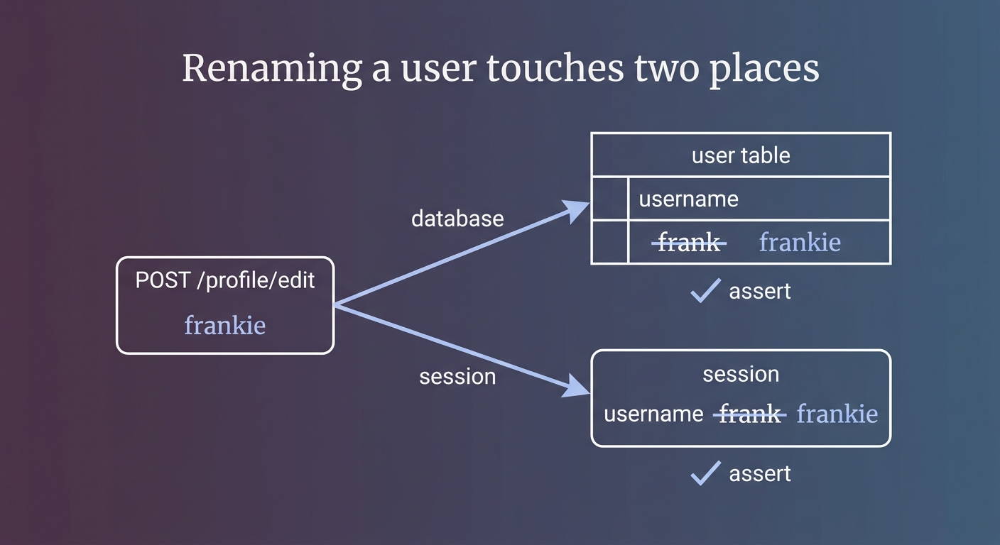

{lang=python,line-numbers=on,starting-line-number=107}
```
@pytest.mark.asyncio
async def test_profile_edit_requires_login(create_test_client):
    response = await create_test_client.get("/profile/edit")
    assert response.status_code == 302
    assert "/login" in response.headers.get("Location", "")


@pytest.mark.asyncio
async def test_profile_edit_username(create_test_client, create_test_app):
    await create_test_client.post(
        "/register", form={"username": "frank", "password": "secret123"}
    )
    await create_test_client.post(
        "/login", form={"username": "frank", "password": "secret123"}
    )

    response = await create_test_client.post(
        "/profile/edit", form={"username": "frankie"}, follow_redirects=True
    )
    body = await response.get_data()
    assert "@frankie" in str(body)

    async with create_test_app.app_context():
        async with current_app.dbc.begin() as conn:
            row = (
                await conn.execute(
                    select(user_table).where(user_table.c.username == "frankie")
                )
            ).fetchone()
            assert row is not None

            old_row = (
                await conn.execute(
                    select(user_table).where(user_table.c.username == "frank")
                )
            ).fetchone()
            assert old_row is None

    async with create_test_client.session_transaction() as session:
        assert session["username"] == "frankie"

    # Still logged in as the renamed user afterward.
    profile_response = await create_test_client.get("/profile/edit")
    profile_body = await profile_response.get_data()
    assert "frankie" in str(profile_body)


@pytest.mark.asyncio
async def test_profile_edit_same_username_ok(create_test_client):
    await create_test_client.post(
        "/register", form={"username": "irene", "password": "secret123"}
    )
    await create_test_client.post(
        "/login", form={"username": "irene", "password": "secret123"}
    )

    response = await create_test_client.post(
        "/profile/edit", form={"username": "irene"}
    )
    body = await response.get_data()
    assert "Username already exists" not in str(body)
    assert response.status_code == 302
```

`test_profile_edit_requires_login` locks the door: an anonymous visitor gets redirected to `/login`, and we assert on the `Location` header to be sure. The rename test is the interesting one. We follow the redirect so we see the updated profile page with the new `@frankie` handle, then open the database to confirm the row moved from `frank` to `frankie`, and finally peek inside the session with `session_transaction` to prove the session now carries the new name. The last test guards an edge: saving your own unchanged name is fine, because a user should always be allowed to keep the name they already have.

[Save the file](https://fmze.co/fftq-5.7.4).

So far every test has used a single client, but following is a two-person activity, and one cookie jar can only hold one session. To test it we spin up two clients from the same app, each with its own session, so alice and bob can act independently. Create `tests/test_relationship.py`.

{lang=python,line-numbers=on,starting-line-number=1}
```
import pytest
from quart import current_app
from sqlalchemy import select

from relationship.models import relationship_table


async def _register_and_login(client, username: str, password: str = "secret123") -> None:
    await client.post("/register", form={"username": username, "password": password})
    await client.post("/login", form={"username": username, "password": password})


@pytest.mark.asyncio
async def test_follow_and_unfollow(create_test_app):
    alice_client = create_test_app.test_client()
    await _register_and_login(alice_client, "alice")

    bob_client = create_test_app.test_client()
    await _register_and_login(bob_client, "bob")

    response = await alice_client.post("/follow/bob")
    assert response.status_code == 302

    async with create_test_app.app_context():
        async with current_app.dbc.begin() as conn:
            rows = (await conn.execute(select(relationship_table))).fetchall()
            assert len(rows) == 1

    response = await alice_client.post("/unfollow/bob")
    assert response.status_code == 302

    async with create_test_app.app_context():
        async with current_app.dbc.begin() as conn:
            rows = (await conn.execute(select(relationship_table))).fetchall()
            assert len(rows) == 0


@pytest.mark.asyncio
async def test_follow_requires_login(create_test_client):
    response = await create_test_client.post("/follow/nobody")
    assert response.status_code == 302
    assert "/login" in response.headers.get("Location", "")


@pytest.mark.asyncio
async def test_profile_shows_relationship_state(create_test_app):
    alice_client = create_test_app.test_client()
    await _register_and_login(alice_client, "alice")

    bob_client = create_test_app.test_client()
    await _register_and_login(bob_client, "bob")

    response = await alice_client.get("/user/bob")
    body = await response.get_data()
    assert "Follow" in str(body)

    await alice_client.post("/follow/bob")

    response = await alice_client.get("/user/bob")
    body = await response.get_data()
    assert "Unfollow" in str(body)
```

We start with the imports and a small helper. The helper registers a user and then logs them in, for whichever client we hand it, so each test below reads as a story instead of a pile of form posts.

Notice we ask `create_test_app` for the client ourselves with `create_test_app.test_client()`, once for alice and once for bob, instead of using the shared `create_test_client` fixture. Now each user has a real, separate session, which is what following needs.

The story reads cleanly. Alice follows bob, we open an app context, and we look straight at the database instead of trusting the page: the `relationship` table has exactly one row.

Then alice unfollows, we run that very same query again, and this time it comes back empty. The row is gone, which is the whole point of the unfollow route.

The second test checks the guard. An anonymous follow, with nobody logged in, bounces to `/login`, so we assert on the redirect and on the location header it sends back.

The last test reads the page the way a visitor would. We set alice and bob up again, and then, before any following has happened, alice loads bob's profile and sees a "Follow" button waiting for her.

Then alice follows bob, loads that same profile again, and the very same button now reads "Unfollow". The page told us the truth both times.

[Save the file](https://fmze.co/fftq-5.7.5).

Run the whole suite with `pytest` and watch it come up green. We started from the counter's inherited harness and grew it into a real user-feature test suite. From here on, every time we add posting, the feed, comments, and likes, this suite quietly stands guard over the user layer, so a change three lessons from now can't silently break login.

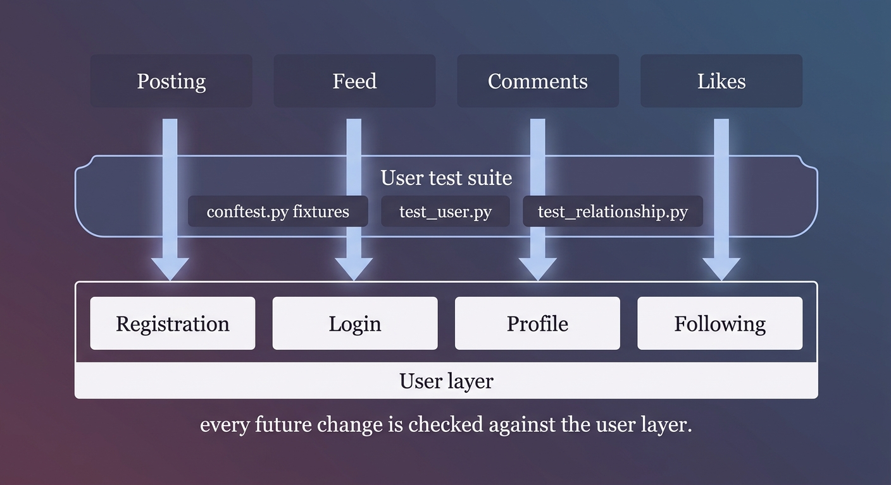

## Posting: Messages, Images, and Permalinks <!-- 5.8 -->

It's time for the content itself. In this lesson we'll build posts: a message, an optional image, and a permanent, shareable address for each one. That address, the permalink, is worth getting right, so we'll design it carefully.

Let's start with the model. We already have a `post` package, holding the placeholder home view we wrote back when we built the login flow. Add a `models.py` next to it:

{lang=python,line-numbers=on}
```
from sqlalchemy import (
    Column,
    DateTime,
    ForeignKey,
    Integer,
    String,
    Table,
    Text,
    func,
)

from db import metadata

post_table = Table(
    "post",
    metadata,
    Column("id", Integer, primary_key=True),
    # Opaque, URL-safe id used in the SEO permalink (/post/<uid>/<slug>).
    Column("uid", String(16), nullable=False, unique=True, index=True),
    Column("user_id", Integer, ForeignKey("user.id"), nullable=False),
    Column("message", Text, nullable=False),
    Column("created", DateTime(timezone=True), server_default=func.now()),
)
```

A post has the usual `id`, a `user_id` foreign key to its author, and the `message` itself. We use `Text` rather than `String` because a post can be long and we don't want a length cap.

Two columns are new in spirit. The `created` column has a `server_default` of `func.now()`, which means Postgres stamps the creation time itself when we insert, so we never have to pass it. And there's a `uid`, a short opaque id we'll use in the post's public URL. We'll come back to why in a moment.

Posts can also carry images, and we want to be ready for more than one someday, so images get their own table. Add it below `post_table`:

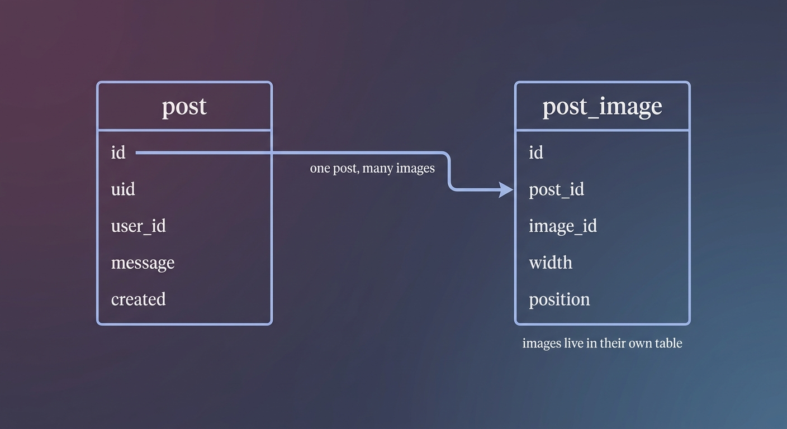

{lang=python,line-numbers=on,starting-line-number=25}
```
post_image_table = Table(
    "post_image",
    metadata,
    Column("id", Integer, primary_key=True),
    Column("post_id", Integer, ForeignKey("post.id"), nullable=False),
    Column("image_id", Integer, nullable=False),
    Column("width", Integer, nullable=False),
    Column("position", Integer, nullable=False),
)
```

Each row is one image belonging to a post, with the same timestamp `image_id` trick we used for avatars, plus its scaled `width` and a `position` so multiple images keep their order. In the interface we'll allow one image per post, but the storage is ready for more.

[Save the file](https://fmze.co/fftq-5.8.1).

Now those two URL pieces, the `uid` and the slug. Both belong in `utils/helpers.py`. The slug is cosmetic, but the `uid` has a real requirement: it has to be unique, every time, for as long as this application runs. Generating a few random characters and hoping the database's UNIQUE index catches a repeat is not a design, because the day it fires someone loses a post to an error they can do nothing about.

This is a solved problem, so we are not going to solve it again. Twitter's answer is called a Snowflake, an id built so that separate processes cannot produce the same one, and there is a small maintained Python package for it. Declare it the same way we declare every package:

{lang=bash,line-numbers=off}
```
$ uv add --no-sync snowflake-id
```

Then rebuild the web image so the package lands inside the container:

{lang=bash,line-numbers=off}
```
$ docker compose build web
```

Now wire it into `utils/helpers.py`. Two new imports at the top, `os` and the generator itself:

{lang=python,line-numbers=on,starting-line-number=1}
```
import os
import re
from functools import wraps
from typing import Any, Callable, Optional

from quart import current_app, redirect, request, session, url_for
from snowflake import SnowflakeGenerator
```

And the two helpers at the bottom of the same file:

{lang=python,line-numbers=on,starting-line-number=42}
```
# Every process minting ids needs its OWN instance number, or two of them
# will eventually agree on a millisecond and a sequence.
_snowflake = SnowflakeGenerator(int(os.environ.get("INSTANCE_ID", "0")))


def generate_uid() -> str:
    """The post's public id: a Snowflake, hex encoded so it fits in a URL."""
    return f"{next(_snowflake):016x}"


def slugify(text: str, max_words: int = 6, max_len: int = 60) -> str:
    """Turn a post message into an SEO-friendly URL slug."""
    words = re.sub(r"[^a-z0-9\s-]", "", (text or "").lower()).split()
    slug = "-".join(words[:max_words])[:max_len].strip("-")
    return slug or "post"
```

The generator is an iterator, so `next()` hands back the next id. Two things matter for us. `INSTANCE_ID` is the one setting you must get right in production, because every process minting ids needs its own. And the hex formatting turns a long number into sixteen URL-friendly characters that happen to sort by age. One caveat worth knowing: a Snowflake is not a secret, so it identifies a public post perfectly well and should never be used where you need a token nobody can guess.

The slug is the easy half. `slugify` lowercases the message, strips the punctuation, and keeps the first few words. Only the `uid` is ever used for lookup, which buys us a trick later: if the slug in the URL is stale or missing, we can redirect to the correct one instead of returning a 404.

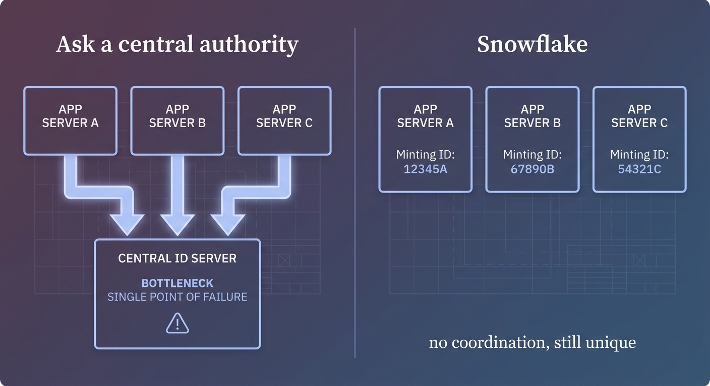

[Save the file](https://fmze.co/fftq-5.8.2).

Post images keep their aspect ratio but are scaled to a fixed height so several could sit side by side neatly. That's a different transform than the square crop we used for avatars, so let's add it to `utils/imaging.py`:

{lang=python,line-numbers=on,starting-line-number=41}
```
def image_height_transform(
    blob: bytes,
    dest_dir: Union[str, Path],
    content_id: Union[str, int],
    height: int = 200,
) -> Tuple[int, int]:
    """Scale ``blob`` to a fixed ``height`` (aspect kept). Returns (image_id, width)."""
    image_id = int(time.time())
    dest = Path(dest_dir)
    dest.mkdir(parents=True, exist_ok=True)
    with Image(blob=blob) as img:
        img.transform(resize=f"x{height}")
        img.format = "png"
        img.save(filename=str(dest / f"{content_id}.{image_id}.xlg.png"))
        return image_id, img.width
```

It's the same Wand pattern as before, but instead of cropping to a square, `transform(resize="x200")` scales the image to two hundred pixels tall and keeps the width proportional. It returns both the image id and the resulting width, which we store so the layout knows how much room to leave.

[Save the file](https://fmze.co/fftq-5.8.3).

Those files land in `static/uploads/posts/`, named `{post_id}.{image_id}.xlg.png`, and the templates are going to need their URL. That's one more helper, at the bottom of `utils/helpers.py`:

{lang=python,line-numbers=on,starting-line-number=59}
```
def post_image_url(post_id: int, image_id: int) -> str:
    """URL for a post image, written by image_height_transform."""
    return f"{current_app.config['IMAGE_URL']}/posts/{post_id}.{image_id}.xlg.png"
```

It's `image_url` for posts: the same `IMAGE_URL` config, a different folder, and no default to fall back on, because a post without an image simply doesn't render one.

[Save the file](https://fmze.co/fftq-5.8.4).

The post form is short. Create `post/forms.py`:

{lang=python,line-numbers=on}
```
from quart_wtf import FileAllowed, FileField, QuartForm
from wtforms import TextAreaField
from wtforms.validators import DataRequired, Length


class PostForm(QuartForm):
    message = TextAreaField(
        "What's on your mind?",
        validators=[DataRequired(), Length(max=500)],
    )
    image = FileField(
        "Photo",
        validators=[FileAllowed(["png", "jpg", "jpeg"], "Images only!")],
    )
```

A required message limited to five hundred characters, and an optional image with the same image-only validation we used for avatars.

Nothing new here, which is the point: once you know quart-wtforms, every form looks like this.

[Save the file](https://fmze.co/fftq-5.8.5).

Now the views. `post/views.py` currently holds nothing but that placeholder home view, so we're going to replace it outright. Start with the imports and the blueprint:

{lang=python,line-numbers=on}
```
from pathlib import Path
from typing import Any, Dict, List, Optional

from quart import (
    Blueprint,
    abort,
    current_app,
    redirect,
    render_template,
    session,
    url_for,
)
from sqlalchemy import insert, select

from post.forms import PostForm
from post.models import post_image_table, post_table
from utils.helpers import generate_uid, login_required, post_image_url, slugify
from utils.imaging import image_height_transform

post_app = Blueprint("post_app", __name__)


def _posts_dir() -> Path:
    return Path(current_app.config["UPLOADS_FOLDER"]) / "posts"
```

Then the rest of the imports: the Quart pieces we need, `insert` and `select` for the queries, the post form, the two post tables, our own helpers, and the fixed-height transform. And finally the blueprint itself, exactly as it was before.

Two small helpers do the groundwork here. The first one points at the folder where a post's uploads were written, so nothing else in the module has to rebuild that path by hand. A post's images live in their own table, so loading them is its own small query. Add both underneath:

{lang=python,line-numbers=on,starting-line-number=27}
```
async def _post_images(conn: Any, post_id: int) -> List[Dict[str, Any]]:
    """Images attached to a post, ordered for side-by-side display."""
    rows = (
        await conn.execute(
            select(post_image_table.c.image_id, post_image_table.c.width)
            .where(post_image_table.c.post_id == post_id)
            .order_by(post_image_table.c.position.asc())
        )
    ).fetchall()
    return [
        {"url": post_image_url(post_id, row.image_id), "width": row.width}
        for row in rows
    ]
```

It hands back a list of ready-to-render dicts, one per image, in `position` order. Both of the pages below use it.

Now the home page, which shows the post form. For now it just lists your own recent posts so we have something to look at; next lesson it becomes the real feed:

{lang=python,line-numbers=on,starting-line-number=42}
```
@post_app.route("/")
async def home():
    if session.get("username") is None:
        return redirect(url_for("user_app.login"))

    form = await PostForm.create_form()
    engine = current_app.dbc  # type: ignore
    async with engine.begin() as conn:
        rows = (
            await conn.execute(
                select(post_table)
                .where(post_table.c.user_id == session["user_id"])
                .order_by(post_table.c.created.desc())
                .limit(10)
            )
        ).fetchall()

        posts = []
        for row in rows:
            posts.append(
                {
                    "message": row.message,
                    "created": row.created,
                    "images": await _post_images(conn, row.id),
                    "permalink": url_for(
                        "post_app.detail", uid=row.uid, slug=slugify(row.message)
                    ),
                }
            )

    return await render_template("post/home.html", posts=posts, form=form)
```

If nobody's logged in we send them to login. Otherwise we build an empty `PostForm` for the "what's on your mind" box and load the current user's ten most recent posts, newest first.

Then, for each row, we assemble exactly what the template needs: the message, the timestamp, the post's images, and its permalink. Notice we build that permalink here, with `url_for` and `slugify`, rather than in the template. The page shouldn't have to know how a permalink is spelled.

Now the view that actually creates a post:

{lang=python,line-numbers=on,starting-line-number=75}
```
@post_app.route("/post", methods=["POST"])
@login_required
async def create_post():
    form = await PostForm.create_form()

    if await form.validate_on_submit():
        engine = current_app.dbc  # type: ignore
        async with engine.begin() as conn:
            result = await conn.execute(
                insert(post_table).values(
                    uid=generate_uid(),
                    user_id=session["user_id"],
                    message=form.message.data,
                )
            )
            post_id = result.inserted_primary_key[0]

            if form.image.data:
                image_id, width = image_height_transform(
                    form.image.data.read(), _posts_dir(), post_id
                )
                await conn.execute(
                    insert(post_image_table).values(
                        post_id=post_id, image_id=image_id, width=width, position=0
                    )
                )

    return redirect(url_for(".home"))
```

We validate the form, then insert the post with a freshly generated `uid`, the author's id, and the message. We grab the new post's id from `inserted_primary_key` because we'll need it if there's an image.

If a photo was uploaded, we run it through `image_height_transform` and record a `post_image` row pointing at the post. Then we redirect home. Simple for now; we'll layer fan-out and live delivery on top of this exact function over the next two lessons.

Finally, the permalink page. This is where that `uid` and slug design pays off:

{lang=python,line-numbers=on,starting-line-number=105}
```
@post_app.route("/post/<uid>/")
@post_app.route("/post/<uid>/<slug>")
@login_required
async def detail(uid: str, slug: Optional[str] = None):
    engine = current_app.dbc  # type: ignore
    async with engine.begin() as conn:
        row = (
            await conn.execute(select(post_table).where(post_table.c.uid == uid))
        ).fetchone()

        if row is None:
            abort(404)

        post = {
            "uid": row.uid,
            "message": row.message,
            "created": row.created,
            "images": await _post_images(conn, row.id),
        }

    canonical_slug = slugify(post["message"])
    if slug != canonical_slug:
        return redirect(
            url_for("post_app.detail", uid=uid, slug=canonical_slug), code=301
        )

    return await render_template("post/detail.html", post=post)
```

Two routes point at the same function, one with a slug and one without, and the slug argument defaults to `None`. We look the post up by its `uid` alone, ignoring the slug entirely, and 404 if there's no such post. Then we compute what the slug should be from the current message. If the URL's slug doesn't match, we issue a `301` redirect to the canonical URL.

That redirect is the trick. It means every post has exactly one correct address that search engines will index, no matter what slug someone typed or linked. A stale slug still finds the post and then bounces to the right URL.

[Save the file](https://fmze.co/fftq-5.8.6).

The blueprint is already registered in `application.py`, from back when the placeholder home page needed it, so there's nothing to do there. Alembic is a different story: it only sees the tables that something imports, so add the two new models to `migrations/env.py`:

{lang=python,line-numbers=on,starting-line-number=18}
```
from post.models import post_table, post_image_table  # noqa: F401
```

[Save the file](https://fmze.co/fftq-5.8.7).

Two templates left, and before we write either one, notice what they have in common. The permalink page shows a post. The home page shows a list of posts. That is the same card twice, and the moment you write it twice you have signed up to change it twice, forget the second one, and ship a feed whose cards drifted away from the permalink's. So we write the card ONCE, in a partial, and both pages include it. Create `templates/post/_post_card.html`:

{lang=html,line-numbers=on}
```
<div class="card mb-3">
    <div class="card-body">
        <p class="mb-1">{{ post.message }}</p>
        
        <div class="d-flex gap-2 mb-2">
            
            
            
        </div>
        
        
        <a href="{{ post.permalink }}" class="small text-muted">
            {{ post.created.strftime('%b %d, %Y %H:%M') }}
        </a>
        
        <span class="small text-muted">{{ post.created.strftime('%b %d, %Y %H:%M') }}</span>
        
    </div>
</div>
```

A partial is just a template with no page around it, meant to be included. The leading underscore is a convention, not a rule: it tells the next person that this file is a fragment and never a page in its own right. It draws the message, then any images at their natural width and a fixed two-hundred-pixel height, then the timestamp. That last `if` is the only thing the two pages disagree about. In a feed the timestamp is the link to the post's permalink, and on the permalink page there is nowhere to go, because you are already there, so it renders as plain text. One card, one place to change it, and the difference is spelled out where you can see it.

[Save the file](https://fmze.co/fftq-5.8.8a).

Now the permalink page itself is almost nothing. Create `templates/post/detail.html`:

{lang=html,line-numbers=on}
```


Post





<div class="row">
    <div class="col-md-6 offset-md-3">

        

        <a href="{{ url_for('post_app.home') }}">&larr; Back home</a>

    </div>
</div>


```

It extends `base.html`, includes the navbar, drops in the card, and offers a way back. It is a real page with a real address that search engines will index, which is why it carries the navbar: someone arriving here from a search result needs somewhere to go next. The card itself it does not own.

[Save the file](https://fmze.co/fftq-5.8.8).

Now the home page. `templates/post/home.html` is still the "the friend feed lands here" placeholder, so replace its inner column with the post form and a card per post:

{lang=html,line-numbers=on}
```


Home





<div class="row">
    <div class="col-md-6 offset-md-3">

        
        <div class="alert alert-success">{{ message }}</div>
        

        

        <div class="card mb-4">
            <div class="card-body">
                <form method="POST" action="{{ url_for('post_app.create_post') }}" enctype="multipart/form-data">
                    {{ render_field(form.message) }}
                    {{ render_field(form.image) }}
                    {{ form.csrf_token }}
                    <button type="submit" class="btn btn-primary">Post</button>
                </form>
            </div>
        </div>

        
        
        
        <p class="text-muted">Nothing here yet &mdash; write your first post.</p>
        

    </div>
</div>


```

The form posts to `create_post` and carries `enctype="multipart/form-data"`, which is what lets a file ride along with the text, and `render_field` is the same macro we've used since the registration form.

Then the loop, and this is the payoff for having written the card once: the body of the loop is a single `include`.

That `else` branch on the `for` loop is a Jinja convenience: it renders when the list is empty, so a brand-new account sees a nudge instead of a blank page.

Each pass sets `post`, the partial renders that post, and because the feed's posts carry a `permalink` their timestamps come out as links.

[Save the file](https://fmze.co/fftq-5.8.9).

Now let's get the database caught up with the models we just wrote. First, rebuild the web image so the container is running our new code.

Then ask Alembic to compare the models against the database and write the migration for us. It finds two tables it has never seen before and generates a revision that creates them.

The upgrade then applies it: the post and post image tables land in Postgres, and the app is ready to take its first post.

{lang=bash,line-numbers=off}
```
$ docker compose build web
$ docker compose run --rm web uv run alembic revision --autogenerate -m "create post and post_image tables"
$ docker compose run --rm web uv run alembic upgrade head
```

Let's watch the whole thing work. Boot the app, register, and log in.

Write a post, attach a photo.

It shows up on your home page with its image scaled to a tidy height, and clicking a timestamp takes you to that post's permalink.

Look at the slug sitting after the post id. A misspelled slug, or no slug at all, still gets a 301 straight back to this canonical URL, which is exactly what we designed for.

We have content. Now let's make it flow between users.

## The Feed: Fan-out on Write <!-- 5.9 -->

Right now your home page shows only your own posts. A social feed shows posts from everyone you follow, newest activity first. In this lesson we'll build that, and the way we build it is the most important architectural idea in the whole chapter, so let's think about it before we code.

There are two ways to build a feed. The obvious one is to query it on read: every time you open your home page, look up everyone you follow, then fetch their recent posts and merge them. That works, but it gets slow as people follow more accounts, because every page load does a big, expensive query.

The approach real feeds use is the opposite: fan-out on write. The moment someone posts, we immediately write one row into a `feed` table for each of their followers. Reading your feed then becomes a simple, fast lookup of your own rows. We do a little more work when someone posts, which is rare, to make reading, which is constant, cheap. That's the trade we want.

So we need a `feed` table. It's a materialized, per-user timeline: each row says "this post belongs in this user's feed". Add it to `post/models.py`, between `post_table` and `post_image_table`:

{lang=python,line-numbers=on,starting-line-number=25}
```
feed_table = Table(
    "feed",
    metadata,
    Column("id", Integer, primary_key=True),
    Column("user_id", Integer, ForeignKey("user.id"), nullable=False),
    Column("post_id", Integer, ForeignKey("post.id"), nullable=False),
    Column("updated", DateTime(timezone=True), server_default=func.now()),
)
```

The key thing to understand is `user_id` here is not the author. It's the feed's owner, the recipient. One post by a popular user creates many feed rows, one per follower, each with that follower as `user_id`. The `updated` column is what we sort a feed by, so the freshest activity floats to the top.

[Save the file](https://fmze.co/fftq-5.9.1)

Now let's write the fan-out logic in its own file, and it belongs right next to the rest of the post code, because fanning out is what happens the moment a post is created. Create `post/feed_ops.py`:

{lang=python,line-numbers=on}
```
from typing import Iterable

from sqlalchemy import insert

from post.models import feed_table


async def add_to_feed(conn, user_id: int, post_id: int) -> None:
    """Insert one feed row for a recipient."""
    await conn.execute(
        insert(feed_table).values(user_id=user_id, post_id=post_id)
    )


async def fan_out_post(conn, post_id: int, recipient_ids: Iterable[int]) -> None:
    """A brand-new post lands directly in the author's and followers' feeds."""
    for user_id in set(recipient_ids):
        await add_to_feed(conn, user_id, post_id)
```

`add_to_feed` writes a single feed row, and `fan_out_post` loops over a set of recipients and writes one for each. We wrap the recipients in `set()` so nobody gets a duplicate row. This is the whole fan-out engine, and we'll extend it in a couple of lessons when comments start bubbling posts around.

[Save the file](https://fmze.co/fftq-5.9.2)

Now wire it into the app. `post/views.py` needs a handful of new names, so let's do the imports first. We need `request` from Quart to read the pagination offset later, so add it to the import list:

{lang=python,line-numbers=on,starting-line-number=10}
```
    request,
```

Then the local imports, which pick up the `feed` table, the `followers` helper, the user table for the join, the fan-out function, and `image_url` for the post author's avatar:

{lang=python,line-numbers=on,starting-line-number=16}
```
from post.feed_ops import fan_out_post
from post.forms import PostForm
from post.models import feed_table, post_image_table, post_table
from relationship.views import followers
from user.models import user_table
from utils.helpers import (
    generate_uid,
    image_url,
    login_required,
    post_image_url,
    slugify,
)
from utils.imaging import image_height_transform
```

With those in place, fan the post out. Inside `create_post`, right after we insert the post and read back its `post_id`:

{lang=python,line-numbers=on,starting-line-number=102}
```
            recipient_ids = set(await followers(conn, session["user_id"]))
            recipient_ids.add(session["user_id"])
            await fan_out_post(conn, post_id, recipient_ids)
```

Remember the `followers` helper we wrote back in the relationship lesson, and said to keep in mind? This is the moment. We fetch everyone who follows the author, add the author themselves so your own posts show in your own feed, and fan the post out to all of them. Every one of those users now has a feed row for this post.

[Save the file](https://fmze.co/fftq-5.9.3)

That's the write side done. Now the read side: the home page has to stop querying your own posts and start reading your feed rows. We'll need that query in two places, the home page and the infinite-scroll endpoint we're about to write, so it goes straight into its own helper. Add `_load_feed` above the `home` view:

{lang=python,line-numbers=on,starting-line-number=52}
```
async def _load_feed(
    conn: Any, user_id: int, offset: int = 0, limit: int = 10
) -> List[Dict[str, Any]]:
    """One page of a user's feed, newest activity first."""
    feed_query = (
        select(
            post_table.c.id.label("post_id"),
            post_table.c.uid,
            post_table.c.message,
            post_table.c.created,
            user_table.c.id.label("author_id"),
            user_table.c.username.label("author_username"),
            user_table.c.image.label("author_image"),
        )
        .select_from(
            feed_table.join(post_table, feed_table.c.post_id == post_table.c.id)
            .join(user_table, post_table.c.user_id == user_table.c.id)
        )
        .where(feed_table.c.user_id == user_id)
        .order_by(feed_table.c.updated.desc())
        .limit(limit)
        .offset(offset)
    )
    rows = (await conn.execute(feed_query)).fetchall()
```

This query walks three tables. We start from `feed_table` and keep only the rows whose owner is us, which is the cheap lookup the whole design was for. Then we join to `post_table` to get each post's text and permalink id, and join again to `user_table` to get the author's name and avatar, because a feed shows other people's posts and every card has to say who wrote it. We order by the feed's `updated` column so the newest activity is on top, and `limit` with `offset` is what lets us hand out the feed one page at a time.

Rows come back flat, so let's shape each one into the dictionary the template wants:

{lang=python,line-numbers=on,starting-line-number=77}
```
    posts = []
    for row in rows:
        posts.append(
            {
                "post_id": row.post_id,
                "message": row.message,
                "created": row.created,
                "author_username": row.author_username,
                "avatar_url": image_url(row.author_id, row.author_image, "sm"),
                "images": await _post_images(conn, row.post_id),
                "permalink": url_for(
                    "post_app.detail", uid=row.uid, slug=slugify(row.message)
                ),
            }
        )

    return posts
```

Two of those keys do real work. `avatar_url` runs the author's stored image through the same `image_url` helper the profile page uses, asking for the small size, and it falls back to the default avatar for anyone who never uploaded one. `images` reuses `_post_images`, the helper we wrote for attachments last lesson, so a photo posted by someone you follow shows up in your feed exactly like it does on their own page.

Now `home` gets much shorter. Replace its whole query with one call:

{lang=python,line-numbers=on,starting-line-number=103}
```
    async with engine.begin() as conn:
        posts = await _load_feed(conn, session["user_id"])
```

[Save the file](https://fmze.co/fftq-5.9.4)

One page of ten posts isn't enough for an active feed, so let's add infinite scroll: when you reach the bottom, load the next page. That means an endpoint that returns just the next batch of post cards, no page furniture around them. Add a `feed` view right below `home`:

{lang=python,line-numbers=on,starting-line-number=109}
```
@post_app.route("/feed")
@login_required
async def feed():
    """One page of feed cards for infinite scroll. Empty when exhausted."""
    try:
        offset = int(request.args.get("offset", 0))
    except (TypeError, ValueError):
        offset = 0

    engine = current_app.dbc  # type: ignore
    async with engine.begin() as conn:
        posts = await _load_feed(conn, session["user_id"], offset=offset)

    return await render_template("post/_feed_items.html", posts=posts)
```

It reads an `offset` off the query string, defaulting to zero and shrugging off anything that isn't a number, calls the same `_load_feed` the home page uses, and renders a partial template instead of a full page. When the offset runs past the end of the feed, `_load_feed` comes back empty and this endpoint returns an empty string, which is how the browser will know to stop asking.

[Save the file](https://fmze.co/fftq-5.9.5)

Both the home page and that endpoint render post cards, and thanks to the partial we wrote back in the posting lesson, neither of them owns that markup. We only have to change it in one place, which is exactly the payoff we set it up for. A feed shows other people's posts, so the card now has to say who wrote each one. Open `templates/post/_post_card.html` and wrap the body in an author row:

{lang=html,line-numbers=on}
```
<div class="card mb-3" data-post-id="{{ post.post_id }}">
    <div class="card-body">
        <div class="d-flex">
            
            <div class="flex-grow-1">
                <a href="{{ url_for('user_app.profile', username=post.author_username) }}"
                    class="fw-bold">@{{ post.author_username }}</a>
                <p class="mb-1">{{ post.message }}</p>
                
                <div class="d-flex gap-2 mb-2">
                    
                    
                    
                </div>
                
                
                <a href="{{ post.permalink }}" class="small text-muted">
                    {{ post.created.strftime('%b %d, %Y %H:%M') }}
                </a>
                
                <span class="small text-muted">{{ post.created.strftime('%b %d, %Y %H:%M') }}</span>
                
            </div>
        </div>
    </div>
</div>
```

The message, the images and the timestamp are untouched: what's new is the avatar and the username in front of them, because on your own page every post was obviously yours and in a feed it never is. One edit, and the permalink page picks up the author line too, without our going near `detail.html`. The `data-post-id` attribute looks decorative, but it's the hook the scroll script will count to work out the next offset.

[Save the file](https://fmze.co/fftq-5.9.6)

The endpoint renders a batch of those cards, so it needs one more partial, a loop with nothing else in it. Create `templates/post/_feed_items.html`:

{lang=html,line-numbers=on}
```

```

One line, and it's deliberately tight: no whitespace and no wrapper, so when the feed is exhausted this renders to an empty string and the browser can test for that.

[Save the file](https://fmze.co/fftq-5.9.7)

Now the home page uses the same partial, wrapped in the container the script needs. In `templates/post/home.html`, replace the card loop:

{lang=html,line-numbers=on,starting-line-number=29}
```
        <div id="feed">
            
            
            
            <p class="text-muted">Nothing in your feed yet &mdash; follow some people or write your first post.</p>
            
        </div>
        <div id="feed-sentinel"></div>
```

The cards now live inside a `#feed` container, which is where new pages get appended, and that empty `#feed-sentinel` underneath is what the browser will watch for: when the sentinel scrolls into view, we're at the bottom. Then load the script, at the end of the file:

{lang=html,line-numbers=on,starting-line-number=43}
```

<script src="{{ url_for('static', filename='js/infinite_scroll.js') }}"></script>

```

[Save the file](https://fmze.co/fftq-5.9.8)

Last piece, the script itself. Create `static/js/infinite_scroll.js`:

{lang=javascript,line-numbers=on}
```
document.addEventListener("DOMContentLoaded", () => {
  const feed = document.getElementById("feed");
  const sentinel = document.getElementById("feed-sentinel");
  if (!feed || !sentinel) return;

  let loading = false;
  let done = false;

  const observer = new IntersectionObserver(async (entries) => {
    if (!entries[0].isIntersecting || loading || done) return;
    loading = true;

    const offset = feed.querySelectorAll("[data-post-id]").length;
    const res = await fetch(`/feed?offset=${offset}`);
    const html = (await res.text()).trim();

    if (!html) {
      done = true;
      observer.disconnect();
    } else {
      feed.insertAdjacentHTML("beforeend", html);
    }

    loading = false;
  }, { rootMargin: "200px" });

  observer.observe(sentinel);
});
```

We use an `IntersectionObserver`, the browser's efficient way to notice when an element scrolls into view, and we point it at the sentinel. The `rootMargin` of two hundred pixels means it fires a little before the sentinel is actually visible, so the next page is usually there by the time you scroll to it. The offset is simply how many cards are on the page already, which is why every card carries `data-post-id`. The `loading` and `done` flags stop us firing a second request while one is in flight, and stop us asking forever once the server answers with nothing.

[Save the file](https://fmze.co/fftq-5.9.9)

Now get the database caught up. Rebuild the web image so the container is running our new code, then ask Alembic to compare the models against the database: it finds the `feed` table it has never seen before, writes the revision, and the upgrade applies it.

{lang=bash,line-numbers=off}
```
$ docker compose build web
$ docker compose run --rm web uv run alembic revision --autogenerate -m "create feed table"
$ docker compose run --rm web uv run alembic upgrade head
```

Restart and log in as an account that already follows two or three other people. The home page is not your own timeline anymore, it's a real feed: their posts and yours interleaved, newest activity first, and every card now carries the name and avatar of whoever wrote it. That's fan-out working, and the important part is what the page did NOT do to build it. It never looked up who you follow and it never went hunting for their posts. Each of those rows was written the moment its post was created, so reading the feed was one cheap lookup of rows that already had your name on them. Keep scrolling and the next ten cards load themselves as you reach the bottom. The one thing still missing is immediacy, because a post that arrives while you're looking at the page won't show until you reload. That's the last big piece of QuartFeed, and it's coming.

## Messages and Feed Tests <!-- 5.10 -->

We just taught the feed how to fan out on write, and that fan-out is exactly the kind of logic that's easy to break and hard to notice, because it happens behind the scenes. A post shows up, or it doesn't, and if it quietly stops reaching followers we might not see it for weeks. So this lesson locks down posting and the feed. We already built the test harness back in the user tests, so the fixtures carry over unchanged; we just add new test files that reuse them.

Before we write a single test, there's a piece of the message rendering we've been putting off. Right now a post's message goes onto the page as plain text, so if somebody types a URL into a post it just sits there, unclickable.

The obvious fix is to find the URLs and wrap them in anchor tags, and that runs straight into the thing quietly keeping our app safe: Jinja escapes everything we render. That is on purpose. Without it, one person posting a `<script>` tag would run their code in every browser that loaded the feed. But escaping is all or nothing per value, so we cannot just mark the message safe and hand it to the template, because that switches escaping off for the whole string, including whatever the user typed around the link.

What we want is narrower. We escape everything ourselves, we build the anchor tags ourselves, and only then do we tell Jinja the result is already safe. Open `utils/helpers.py` and add the import and the pattern near the top.

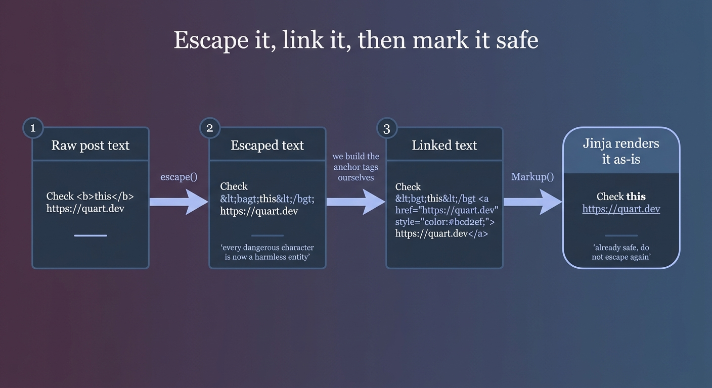

{lang=python,line-numbers=on,starting-line-number=1}
```
import os
import re
from functools import wraps
from typing import Any, Callable, Optional

from markupsafe import Markup, escape
from quart import current_app, redirect, request, session, url_for
from snowflake import SnowflakeGenerator
from sqlalchemy import select
from sqlalchemy.engine import Row

from user.models import user_table

_URL_RE = re.compile(r"(https?://[^\s<]+)")
```

`markupsafe` already ships with Quart, so there's nothing new to install. `escape` turns the dangerous characters into harmless HTML entities, and `Markup` is the wrapper that tells Jinja this string has already been made safe and should be left alone. The pattern captures anything starting with `http://` or `https://` and running until it hits whitespace or a `<`.

Now add the function at the bottom of the same file.

{lang=python,line-numbers=on,starting-line-number=67}
```
def linkify(text: Optional[str], max_len: int = 40) -> Markup:
    """Escape ``text`` and turn bare http(s) URLs into links, truncating long ones."""
    parts = _URL_RE.split(text or "")
    out = []
    for i, part in enumerate(parts):
        if i % 2 == 1:  # a captured URL
            display = part if len(part) <= max_len else part[: max_len - 1] + "…"
            out.append(
                f'<a href="{escape(part)}" target="_blank" '
                f'rel="noopener">{escape(display)}</a>'
            )
        else:
            out.append(str(escape(part)))
    return Markup("".join(out))
```

Because we wrapped the pattern in parentheses, `re.split` hands back the text and the URLs interleaved, and every odd position in that list is a URL it captured. So the loop can treat the two kinds differently: a URL becomes an anchor tag, and everything else gets escaped and passed through. Notice we escape inside the anchor too, both in the `href` and in the visible text, because a URL is still something a stranger typed. The `max_len` is the one cosmetic touch: a very long link is shortened with an ellipsis for display while the `href` keeps the complete address, so the layout stays tidy and the link still works. The `Markup` on the last line is what makes the whole thing safe rather than reckless. We are not turning escaping off, we are taking responsibility for it.

[Save the file](https://fmze.co/fftq-5.10.1).

Register it as a template filter in `application.py`.

{lang=python,line-numbers=on,starting-line-number=1}
```
from quart import Quart

from db import get_engine
from utils.helpers import linkify
```

{lang=python,line-numbers=on,starting-line-number=22}
```
    app.add_template_filter(linkify, "linkify")
```

[Save the file](https://fmze.co/fftq-5.10.1a).

And use it where the message is rendered, in `templates/post/_post_card.html`.

{lang=html,line-numbers=on,starting-line-number=9}
```
                <p class="mb-1">{{ post.message | linkify }}</p>
```

[Save the file](https://fmze.co/fftq-5.10.1b).

Restart the app and log in with your user, and you land back on the feed. Now post a message with a link in it, and paste a stray bold tag right after the link. The link comes back clickable, and the tag shows up as literal text instead of turning the rest of your feed bold.

Now for the tests. There's one small thing to update first. Remember that our `create_db` fixture builds tables with `metadata.create_all`, which only builds the tables whose models have been imported. Back in the user tests we only had `user` and `relationship`; now we have posts and the feed, so open `conftest.py` and add their models to the registration list at the top.

{lang=python,line-numbers=on,starting-line-number=13}
```
# Register the tables we're testing so metadata.create_all builds them.
from user.models import user_table  # noqa: F401
from relationship.models import relationship_table  # noqa: F401
from post.models import post_table, feed_table  # noqa: F401
```

Importing `post.models` registers every table defined there, including `post_image`, so the test database will now build the post, feed, and post-image tables alongside the user ones.

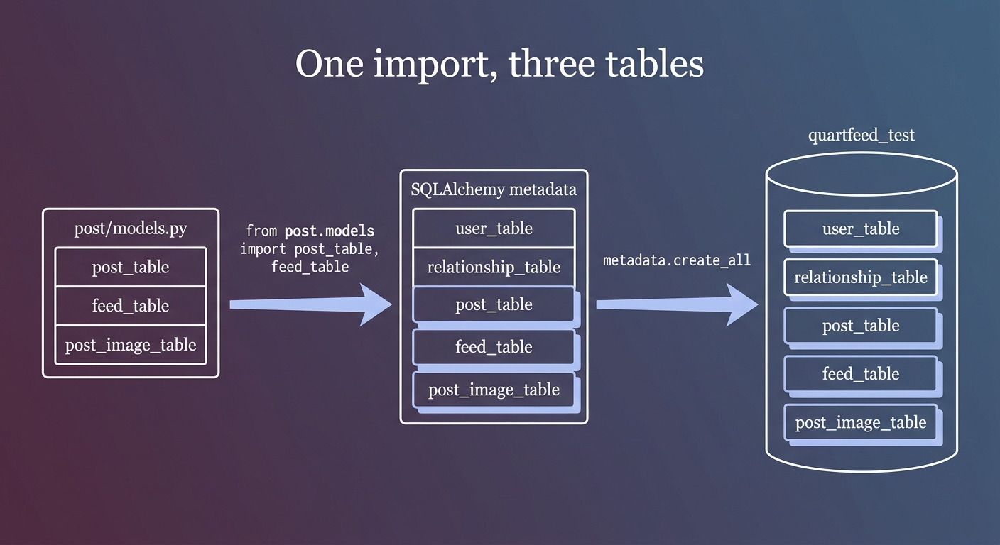

[Save the file](https://fmze.co/fftq-5.10.2).

Now start with `tests/test_post.py`. The first two tests are the heart of the whole app: a post lands in its author's own feed, and a post lands in a follower's feed.

{lang=python,line-numbers=on,starting-line-number=1}
```
import pytest
from quart import current_app
from sqlalchemy import select

from post.models import feed_table, post_table


async def _register_and_login(client, username: str, password: str = "secret123") -> None:
    await client.post("/register", form={"username": username, "password": password})
    await client.post("/login", form={"username": username, "password": password})


@pytest.mark.asyncio
async def test_create_post_appears_in_own_feed(create_test_client, create_test_app):
    await _register_and_login(create_test_client, "alice")

    response = await create_test_client.post("/post", form={"message": "hello world"})
    assert response.status_code == 302

    home_response = await create_test_client.get("/")
    body = await home_response.get_data()
    assert "hello world" in str(body)

    async with create_test_app.app_context():
        async with current_app.dbc.begin() as conn:
            posts = (await conn.execute(select(post_table))).fetchall()
            assert len(posts) == 1
            feed_rows = (await conn.execute(select(feed_table))).fetchall()
            assert len(feed_rows) == 1  # the author's own feed row


@pytest.mark.asyncio
async def test_follower_sees_post_in_feed(create_test_app):
    alice_client = create_test_app.test_client()
    await _register_and_login(alice_client, "alice")

    bob_client = create_test_app.test_client()
    await _register_and_login(bob_client, "bob")

    await bob_client.post("/follow/alice")
    await alice_client.post("/post", form={"message": "hi followers"})

    home_response = await bob_client.get("/")
    body = await home_response.get_data()
    assert "hi followers" in str(body)

    async with create_test_app.app_context():
        async with current_app.dbc.begin() as conn:
            feed_rows = (await conn.execute(select(feed_table))).fetchall()
            # one for the author (alice) + one for the follower (bob)
            assert len(feed_rows) == 2


@pytest.mark.asyncio
async def test_post_requires_login(create_test_client):
    response = await create_test_client.post("/post", form={"message": "hi"})
    assert response.status_code == 302
    assert "/login" in response.headers.get("Location", "")
```

The first test posts as alice and then checks two layers at once. It registers her, logs her in, and posts a message, and the redirect that comes back tells us the route accepted it. Then it checks both layers: the message appears on her home page, and the database holds exactly one post and one feed row, her own.

The second test is the one that really matters, because it proves fan-out end to end. Using the two-client trick from the user tests, bob follows alice, alice posts, and bob sees the message on his home page without doing anything. We then count the feed rows and assert there are two, one for alice and one for bob, which is the invisible half of fan-out that no page would ever show us directly.

And the last test keeps the door locked: posting without logging in redirects to `/login`.

[Save the file](https://fmze.co/fftq-5.10.3).

Posts can carry an image, and testing a file upload is a little different because we have to hand the route a real file. Quart's test client lets us pass a `FileStorage` object in a `files` mapping, so we build a small in-memory PNG with Wand and send it. Create `tests/test_post_image.py`.

{lang=python,line-numbers=on,starting-line-number=1}
```
import io

import pytest
from quart import current_app
from sqlalchemy import select
from wand.color import Color
from wand.image import Image
from werkzeug.datastructures import FileStorage

from post.models import post_image_table


async def _register_and_login(client, username: str, password: str = "secret123") -> None:
    await client.post("/register", form={"username": username, "password": password})
    await client.post("/login", form={"username": username, "password": password})


def _img_blob(width: int, height: int) -> bytes:
    with Image(width=width, height=height, background=Color("green")) as img:
        img.format = "png"
        return img.make_blob()


@pytest.mark.asyncio
async def test_create_post_with_image(create_test_app, tmp_path):
    app = create_test_app
    app.config["UPLOADS_FOLDER"] = str(tmp_path)

    client = app.test_client()
    await _register_and_login(client, "shooter")

    # 400x800 scaled to a fixed height of 200 -> 100x200
    resp = await client.post(
        "/post",
        form={"message": "look at this"},
        files={
            "image": FileStorage(
                stream=io.BytesIO(_img_blob(400, 800)),
                filename="pic.png",
                content_type="image/png",
            )
        },
    )
    assert resp.status_code == 302

    async with app.app_context():
        async with current_app.dbc.begin() as conn:
            rows = (await conn.execute(select(post_image_table))).fetchall()

    assert len(rows) == 1
    row = rows[0]
    saved = tmp_path / "posts" / f"{row.post_id}.{row.image_id}.xlg.png"
    assert saved.exists()
    with Image(filename=str(saved)) as img:
        assert img.height == 200  # fixed height
        assert img.width == row.width == 100  # aspect preserved (400x800 -> 100x200)


@pytest.mark.asyncio
async def test_post_without_image_has_no_post_image_rows(create_test_app, tmp_path):
    app = create_test_app
    app.config["UPLOADS_FOLDER"] = str(tmp_path)

    client = app.test_client()
    await _register_and_login(client, "texter")
    resp = await client.post("/post", form={"message": "just words"})
    assert resp.status_code == 302

    async with app.app_context():
        async with current_app.dbc.begin() as conn:
            rows = (await conn.execute(select(post_image_table))).fetchall()
    assert rows == []
```

We point `UPLOADS_FOLDER` at pytest's `tmp_path` so the test writes into a throwaway directory instead of our real uploads folder, then we post with a 400 by 800 pixel image attached. After the post we check the `post_image` table has a row, that the file actually landed on disk at the expected path, and that our height transform did its job: the saved image is exactly 200 pixels tall with its aspect ratio preserved, so 400 by 800 becomes 100 by 200. The second test is the mirror image, proving a text-only post creates no `post_image` rows at all, so we never write phantom image records.

[Save the file](https://fmze.co/fftq-5.10.4).

Not every test needs the database or the browser. Some of our logic is plain functions, and those are the cheapest and fastest things to test. The `linkify` helper we wrote at the top of this lesson is exactly that shape, and it does two jobs worth pinning down, so let's test it directly. Create `tests/test_helpers.py`.

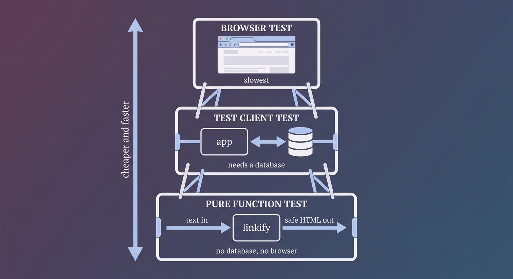

{lang=python,line-numbers=on,starting-line-number=1}
```
from utils.helpers import linkify


def test_linkify_escapes_and_links():
    s = str(linkify("hi <b> http://example.com/x"))
    assert "&lt;b&gt;" in s  # non-URL text escaped
    assert '<a href="http://example.com/x"' in s


def test_linkify_truncates_long_url():
    url = "http://example.com/" + "a" * 100
    s = str(linkify(url))
    assert "…" in s  # display truncated
    assert 'href="' + url + '"' in s  # href keeps the full URL
```

These tests don't need `async`, a client, or a fixture, because `linkify` is a pure function: text in, safe HTML out. The first test proves two jobs at once. The stray `<b>` a user typed comes back escaped as `&lt;b&gt;` so it can't inject markup, while a real URL becomes an anchor tag. The second test checks a nice touch: a very long link is shortened with an ellipsis for display, but the `href` still points at the complete URL, so the page stays tidy without breaking the link.

[Save the file](https://fmze.co/fftq-5.10.5).

Run `pytest` again and everything, users, posts, images, and helpers, should be green. Notice how little setup each new file needed: the fixtures we wrote once in the user tests carried the whole way here. That's the payoff of a good `conftest.py`, and it's what makes adding the next round of tests for comments and likes almost free.

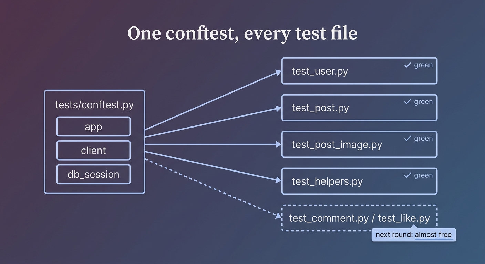

## Going Live: the SSE Broker and EventSource Client <!-- 5.11 -->

This is the lesson the whole chapter has been building toward. We have a feed that fills in when you refresh; now we'll make new posts appear the instant they're written, using the Server Sent Events we introduced at the very start. Time to make that promise real.

There are two halves to this: the server pushing events, and the browser receiving them. But before we type anything, let's get the shape of the whole system in our heads, because it has three moving parts and each one is simple once you see what it's for. First, every open feed page keeps one long-lived HTTP connection to our server, a phone line that never hangs up. Second, on our end of each line sits a queue, a little mailbox where events wait to be delivered. And third, a broker keeps all those mailboxes organized by user id, so when someone writes a post, we find each follower's mailboxes, drop a copy of the event in each one, and every waiting connection wakes up and sends it down the line. That's the entire design. We'll build it from the inside out: first the event, then the broker, then the connection.

Create `utils/sse.py`:

{lang=python,line-numbers=on}
```
import asyncio
from dataclasses import dataclass
from typing import Iterable, Optional


@dataclass
class ServerSentEvent:
    data: str
    event: Optional[str] = None  # "post" | "comment" | "like"
    id: Optional[str] = None
```

Remember from the start of the chapter that a Server Sent Event is not some binary protocol, it is plain text: a `data:` line carrying the payload, an optional `event:` line naming what kind of message this is, an optional `id:`, and a blank line meaning "message over". So our class is just those three fields. `data` will carry JSON describing a post, a comment, or a like. `event` is the name the browser will listen for, and we'll use exactly three: `post`, `comment`, and `like`. The `@dataclass` decorator writes the constructor for us, so this class is pure shape, no behavior yet.

The behavior is one method. Add it to the class:

{lang=python,line-numbers=on,starting-line-number=12}
```
    def encode(self) -> bytes:
        msg = f"data: {self.data}\n"
        if self.event is not None:
            msg = f"event: {self.event}\n{msg}"
        if self.id is not None:
            msg = f"id: {self.id}\n{msg}"
        return (msg + "\n").encode("utf-8")
```

`encode` builds the wire text from the inside out. It starts with the `data:` line, then prepends `event:` if we set one, then `id:`, and finally adds the blank line and converts the whole thing to bytes.

So a new post goes down the wire as an `event: post` line, a `data:` line with the JSON right after it, and then an empty line. That empty line is not decoration, it is the protocol: it's how the browser knows this message is complete and the next one can begin.

Now the broker, the mailroom at the center of the design. It has exactly three jobs: hand a mailbox to every connection that opens, take mail in and deliver it to the right boxes, and throw the mailbox away when the connection closes. Start the class in the same file, and read the docstring as it lands. Each user gets their own set of connection queues, so an event reaches only the users it is addressed to, the same recipients that got a `feed` row. A global broadcast would be the easy thing to write, and it would leak every post to every open page, including users who don't follow the author.

{lang=python,line-numbers=on,starting-line-number=21}
```
class Broker:
    """Routes Server-Sent Events to connected clients, keyed by user id.

    Each user gets their own set of connection queues, so an event reaches
    only the users it is addressed to, the same recipients that got a
    ``feed`` row. A global broadcast would leak every post to every open
    page, including users who don't follow the author.
    """

    def __init__(self) -> None:
        self.connections: dict[int, set[asyncio.Queue]] = {}
```

The whole state is one dictionary: user id to a set of queues. Why a set and not a single queue per user? Because one person can have the feed open in two tabs, or on a laptop and a phone at once. Each open connection gets its own queue, and a delivery to that user drops a copy into every one of them, so every screen updates.

And what's an `asyncio.Queue`? It is a mailbox built for async code. One side puts items in; the other side awaits until something arrives. The waiting is the beautiful part: an async function that is awaiting on an empty queue costs nothing, the event loop simply runs other work until there is mail. We'll see that pay off in a moment.

Delivery first. Add the two publish methods:

{lang=python,line-numbers=on,starting-line-number=33}
```
    async def publish(self, user_id: int, event: ServerSentEvent) -> None:
        """Deliver ``event`` to every open connection for a single user."""
        for q in list(self.connections.get(user_id, ())):
            await q.put(event)
```

`publish` delivers to one user: look up their queues and put a copy of the event in each.

Two small details are doing quiet work here. Looking a user up with an empty tuple as the default means someone with no open pages gets nothing back, so we deliver to no one and raise no error; being offline is not a special case. And we wrap that set in a list before looping, because connections can open or close while we're awaiting inside the loop, and mutating a set mid-iteration is an error in Python.

{lang=python,line-numbers=on,starting-line-number=38}
```
    async def publish_many(
        self, user_ids: Iterable[int], event: ServerSentEvent
    ) -> None:
        """Deliver ``event`` to every open connection for each recipient."""
        for user_id in set(user_ids):
            await self.publish(user_id, event)
```

`publish_many` is the fan-out twin, one event to a whole list of recipients. Wrapping the recipients in a set deduplicates, so nobody gets the same post twice even if they show up twice in the recipient list.

Now the other side of the counter, how a connection gets a mailbox and gives it back:

{lang=python,line-numbers=on,starting-line-number=45}
```
    def subscribe(self, user_id: int) -> asyncio.Queue:
        q: asyncio.Queue = asyncio.Queue()
        self.connections.setdefault(user_id, set()).add(q)
        return q
```

`subscribe` makes a fresh queue, files it under your user id, and hands it back to you. `setdefault` creates your entry in the dictionary the first time you connect and reuses it after that, so the first tab and the third tab take the same code path.

{lang=python,line-numbers=on,starting-line-number=50}
```
    def unsubscribe(self, user_id: int, q: asyncio.Queue) -> None:
        conns = self.connections.get(user_id)
        if conns is not None:
            conns.discard(q)
            if not conns:
                self.connections.pop(user_id, None)
```

`unsubscribe` is the cleanup: take this queue out of the user's set, and if it was their last open connection, remove the whole entry so the dictionary doesn't fill up with empty sets for every user who ever visited.

One line left, at the bottom of the file:

{lang=python,line-numbers=on,starting-line-number=58}
```
broker = Broker()  # module-level singleton (single-process demo)
```

We create one broker at import time, and every part of the app that imports `broker` talks to the same instance. There is one mailroom, shared by the whole process.

The important design decision in this file is that the broker is keyed by user id, not global. We deliver an event only to the specific recipients it's meant for, exactly the same people who got a feed row. If we broadcast every post to everyone, users would briefly see posts from people they don't follow, which would then vanish on refresh. Per-user delivery mirrors the feed, so live and refreshed always agree.

[Save the file](https://fmze.co/fftq-5.11.1).

Now the streaming endpoint, the phone line itself. This is the URL the browser will connect to and never hang up on. Add it to `post/views.py`, and we'll build it in three pieces:

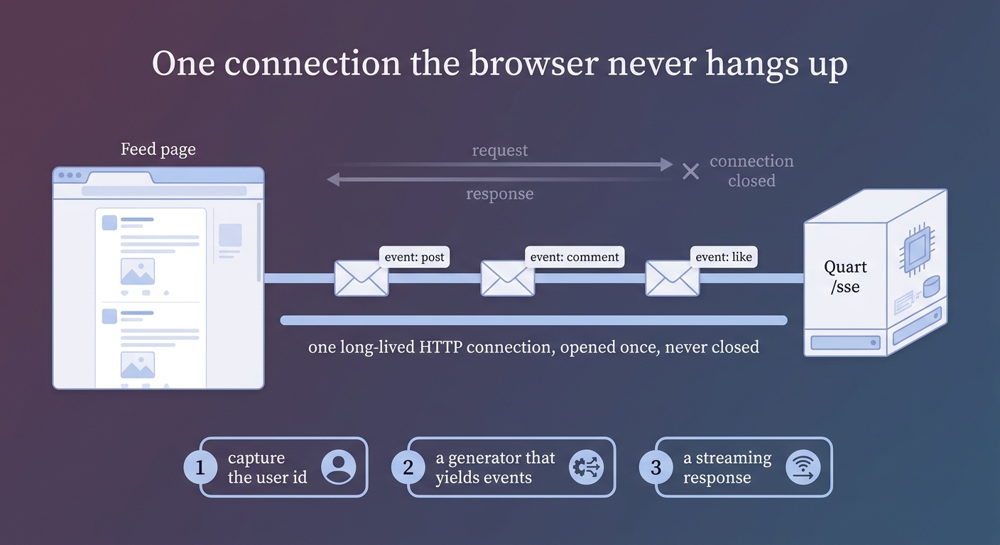

{lang=python,line-numbers=on,starting-line-number=191}
```
@post_app.route("/sse")
@login_required
async def sse():
    # Capture the user id in the request context; the streaming generator
    # below outlives it, so it subscribes to THIS user's channel only.
    user_id = session["user_id"]
```

The route starts like any other, but the first thing we do hints at what's coming: we copy the user's id out of the session into a plain local variable. The function we're about to write will keep running long after this request's setup is finished, so we grab the id now, while the session is right in front of us.

Here is the heart of it, and it deserves a slow read, because this is unlike any route we have written so far:

{lang=python,line-numbers=on,starting-line-number=198}
```
    async def gen():
        q = broker.subscribe(user_id)
        try:
            while True:
                event = await q.get()
                yield event.encode()
        except asyncio.CancelledError:
            broker.unsubscribe(user_id, q)
            raise
```

Every handler we've built until now did its work and returned one finished response. This one can't, because its job is to keep the connection open and keep sending, for as long as the tab stays open. Python has a tool made for exactly that shape, the generator, and this is the first one in the course, so let's take it apart.

The keyword to stare at is `yield`. A normal function returns once and it's finished. A function containing `yield` becomes a generator: calling it doesn't run the body at all, it hands back an object that values can be pulled from one at a time. Each time a value is pulled, the body runs until it reaches a `yield`, hands that value out, and then freezes right where it is, local variables and all. When the next value is asked for, it wakes up on the very next line and keeps going. Return says "here's my answer, I'm done". Yield says "here's one item, ask me again".

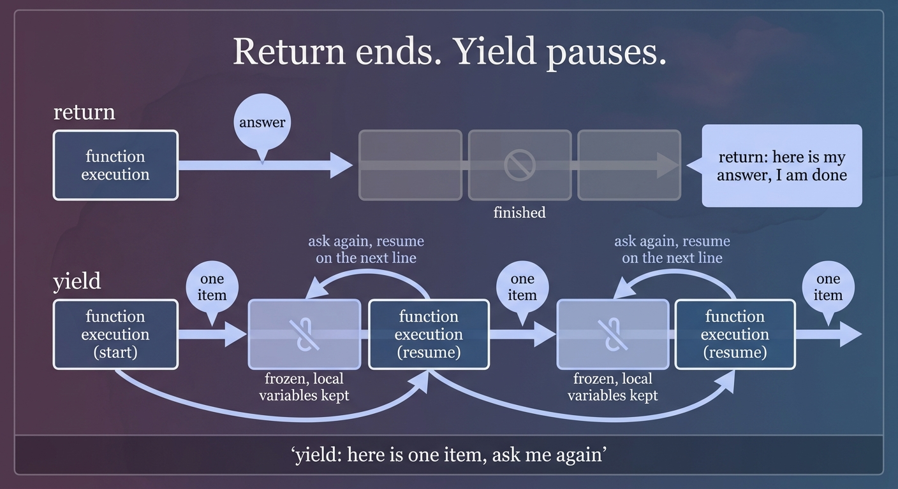

Now follow our generator around its loop. `subscribe` gives this connection its own mailbox. `await q.get()` puts the function to sleep until an event lands in it, and remember, that sleep is free: Quart serves every other request while we wait. When a post arrives, `get` returns it, `yield` hands the encoded bytes out to be sent, and the loop comes back around to wait for the next event. The `while True` is not an accident to be nervous about, it is the point. This function is meant to run forever.

Forever, that is, until the reader closes the tab. When that happens, Quart cancels the generator, and the cancellation surfaces inside it as an `asyncio.CancelledError`. We catch it, unsubscribe our queue so the broker stops delivering mail to a mailbox nobody will ever empty again, and re-raise so the shutdown completes normally. That try and except is the difference between a broker that stays tidy and one that leaks a queue for every visitor who ever left.

Last piece, turning the generator into a response:

{lang=python,line-numbers=on,starting-line-number=208}
```
    response = await make_response(
        gen(),
        {
            "Content-Type": "text/event-stream",
            "Cache-Control": "no-cache",
            "Transfer-Encoding": "chunked",
        },
    )
    response.timeout = None  # IMPORTANT: disable the default response timeout for streaming
    return response
```

This is where Quart earns its keep. Hand `make_response` a string and you get a normal response. Hand it a generator, and Quart streams: every chunk the generator yields goes down the wire the moment it appears, and the connection stays open in between. That is the whole trick, and we wrote no networking code to get it.

The headers are the browser's half of the contract. `text/event-stream` is the content type the browser's `EventSource` object looks for, `no-cache` stops anything along the way from holding our events back, and `chunked` says the response body arrives in pieces with no known end. And the last line matters most: a normal response that took this long would be timed out and killed. Setting `timeout` to `None` tells Quart this response is supposed to last forever. Add `make_response` and `asyncio` to the imports, along with `from utils.sse import broker`.

[Save the file](https://fmze.co/fftq-5.11.1a).

Now, back in `create_post`, right after the fan-out, we'll publish the event to those same recipients. That needs two imports, and `json` is the first:

{lang=python,line-numbers=on,starting-line-number=2}
```
import json
```

and widen the `utils.sse` import you added a moment ago so it brings in the event class too:

{lang=python,line-numbers=on,starting-line-number=23}
```
from utils.sse import ServerSentEvent, broker
```

What should the payload carry? Everything the browser needs to draw a post card, and we already know exactly what that is, because our feed template draws one on every page load: the author's name and avatar, the message, any images, the timestamp, and the permalink. So let's gather precisely that, starting with the images. The image branch already stores each upload; have it also remember what it stored. Declare an empty list just above the branch, and append the image's URL and width after the insert:

{lang=python,line-numbers=on,starting-line-number=150}
```
            images: List[Dict[str, Any]] = []
            if form.image.data:
                image_id, width = image_height_transform(
                    form.image.data.read(), _posts_dir(), post_id
                )
                await conn.execute(
                    insert(post_image_table).values(
                        post_id=post_id, image_id=image_id, width=width, position=0
                    )
                )
                images.append(
                    {"url": post_image_url(post_id, image_id), "width": width}
                )
```

Next, the author and the post as the database knows them. The form gave us the message, but the database knows things the form never saw: the timestamp it stamped on the row, the uid it stored, and the author's avatar image. Still inside the transaction, fetch both rows:

{lang=python,line-numbers=on,starting-line-number=164}
```
            author = (
                await conn.execute(
                    select(user_table).where(user_table.c.id == session["user_id"])
                )
            ).fetchone()
            post_row = (
                await conn.execute(select(post_table).where(post_table.c.id == post_id))
            ).fetchone()
```

Now the payload itself, after the transaction closes:

{lang=python,line-numbers=on,starting-line-number=173}
```
        payload = {
            "post_id": post_id,
            "uid": post_row.uid,
            "message": post_row.message,
            "created": post_row.created.isoformat(),
            "author_id": author.id,
            "author_username": author.username,
            "avatar_url": image_url(author.id, author.image, "sm"),
            "permalink": url_for(
                "post_app.detail", uid=post_row.uid, slug=slugify(post_row.message)
            ),
            "images": images,
        }
        # Push live ONLY to the same recipients that got a feed row (the
        # author's followers + the author). A global broadcast would leak the
        # post to every open page, including users who don't follow the author.
        await broker.publish_many(
            recipient_ids, ServerSentEvent(event="post", data=json.dumps(payload))
        )
```

It reads like the dictionaries our feed loader builds, and that is the point: this is the same card, delivered over a different wire. The timestamp goes out as ISO text, because JSON has no date type, and the browser will parse it back into one. Then we `publish_many` to `recipient_ids`, the exact same set we just fanned the post out to, so the live push and the stored feed always reach the same people. Note we pass `event="post"`, which the browser will listen for by name.

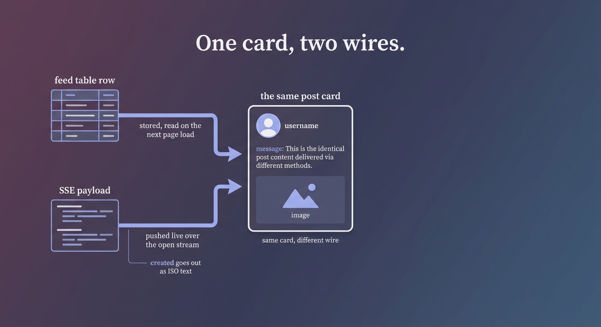

[Save the file](https://fmze.co/fftq-5.11.2).

Now the browser side. We connect to `/sse` with the built-in `EventSource` object and render incoming posts, and we'll build the file the way we read it: a piece at a time. Create `static/js/broadcast.js`:

{lang=javascript,line-numbers=on}
```
document.addEventListener("DOMContentLoaded", () => {
  const feed = document.getElementById("feed");
  if (!feed) return;

  const es = new EventSource("/sse");
```

Once the page is loaded, we look for the feed container, and if this page doesn't have one we do nothing. Then we open an `EventSource` pointed at `/sse`. That one line does all the connection work: it opens the stream, keeps it alive, and even reconnects automatically if the network drops.

Next, two small helpers. First, safety:

{lang=javascript,line-numbers=on,starting-line-number=7}
```
  const escapeHtml = (str) =>
    String(str).replace(/[&<>"']/g, (c) => ({
      "&": "&amp;", "<": "&lt;", ">": "&gt;", '"': "&quot;", "'": "&#39;",
    }[c]));
```

`escapeHtml` swaps the dangerous characters for their HTML entities, so anything a user typed is neutralised before it ever reaches the page.

{lang=javascript,line-numbers=on,starting-line-number=12}
```
  const formatWhen = (iso) => {
    const d = new Date(iso);
    const month = d.toLocaleString("en-US", { month: "short" });
    const pad = (n) => String(n).padStart(2, "0");
    return `${month} ${pad(d.getDate())}, ${d.getFullYear()} ${pad(d.getHours())}:${pad(d.getMinutes())}`;
  };
```

And `formatWhen` prints a timestamp as an abbreviated month, a day, a year, and the time, which is exactly how our feed template prints its own. That is not a coincidence, it is the job: if two cards in the same column ever spell the same moment differently, the live one gives itself away.

Now we listen for our named `post` event:

{lang=javascript,line-numbers=on,starting-line-number=19}
```
  es.addEventListener("post", (e) => {
    const post = JSON.parse(e.data);
    if (feed.querySelector(`[data-post-id="${post.post_id}"]`)) return;

    const card = document.createElement("div");
    card.className = "card mb-3";
    card.setAttribute("data-post-id", post.post_id);
```

When a post event arrives, we parse the JSON out of it. If a card for that post is already sitting on the page we return early, which guards against duplicates. Otherwise we create the card element, give it Bootstrap's card classes, and stamp the post id on it.

Now the markup, assembled with a template literal, the JavaScript string with backticks and dollar-brace placeholders:

{lang=javascript,line-numbers=on,starting-line-number=26}
```
    card.innerHTML = `
      <div class="card-body">
        <div class="d-flex">
          
          <div class="flex-grow-1">
            <a href="/user/${encodeURIComponent(post.author_username)}" class="fw-bold">@${escapeHtml(post.author_username)}</a>
            <p class="mb-1">${escapeHtml(post.message)}</p>
            ${(post.images && post.images.length)
              ? `<div class="d-flex gap-2 mb-2">${post.images
                  .map((im) => ``)
                  .join("")}</div>`
              : ""}
            <a href="${post.permalink}" class="small text-muted">${formatWhen(post.created)}</a>
          </div>
        </div>
      </div>`;
```

Here discipline matters more than cleverness: this card is a twin of the one the feed template renders, because the reader will see the two stacked in the same column. The avatar at forty pixels, the author's handle linking to their profile, the message, any images at their fixed two-hundred-pixel height, and the timestamp linking to the post's permalink. Same structure, same classes, same order.

{lang=javascript,line-numbers=on,starting-line-number=42}
```
    feed.prepend(card);
  });
});
```

Every piece of user text runs through `escapeHtml` on the way in, so a post can't inject HTML into somebody else's feed. Then we `prepend` the card, so the newest post lands at the top of the feed: no framework, just a string and one insert.

[Save the file](https://fmze.co/fftq-5.11.3).

One wire is still loose: nothing loads that script yet. Open `templates/post/home.html` and add it to the `scripts` block, above the infinite scroll script:

{lang=html,line-numbers=on,starting-line-number=43}
```

<script src="{{ url_for('static', filename='js/broadcast.js') }}"></script>
<script src="{{ url_for('static', filename='js/infinite_scroll.js') }}"></script>

```

[Save the file](https://fmze.co/fftq-5.11.3a).

Now the moment of truth. Here's the finished app, with the feed we've been building all chapter. Write a post and send it, and our create post view writes a feed row for every recipient and publishes that same post to every open connection they have. Every follower watching gets the new card at the top of their feed on its own, with no refresh and no polling. Try it yourself in a second browser, logged in as someone who follows you. That's Server Sent Events doing exactly what we promised at the start of the chapter. From here it's all engagement: comments and likes.

## Comments and Feed Bubbling <!-- 5.12 -->

Now let's let people reply. Comments are straightforward on their own, but they give us a chance to build one of FriendFeed's signature behaviors, and the reason it felt so alive: when someone you follow comments on a post, that post surfaces in your feed even if you don't follow the original author. We'll call that bubbling, and it's the interesting part of this lesson.

First the comment itself. Create a `comment` folder with an empty `__init__.py` and a `models.py`:

{lang=python,line-numbers=on}
```
from sqlalchemy import Column, DateTime, ForeignKey, Integer, Table, Text, func

from db import metadata

comment_table = Table(
    "comment",
    metadata,
    Column("id", Integer, primary_key=True),
    Column("post_id", Integer, ForeignKey("post.id"), nullable=False),
    Column("user_id", Integer, ForeignKey("user.id"), nullable=False),
    Column("comment", Text, nullable=False),
    Column("created", DateTime(timezone=True), server_default=func.now()),
)
```

Nothing surprising: a comment belongs to a post and an author, holds some text, and stamps its own creation time.

[Save the file](https://fmze.co/fftq-5.12.1).

The form is just as small. Create `comment/forms.py`:

{lang=python,line-numbers=on}
```
from quart_wtf import QuartForm
from wtforms import TextAreaField
from wtforms.validators import DataRequired, Length


class CommentForm(QuartForm):
    comment = TextAreaField(
        "Add a comment",
        validators=[DataRequired(), Length(max=500)],
    )
```

One required text field with a sane length cap, exactly like our post form.

[Save the file](https://fmze.co/fftq-5.12.1.1).

Now for bubbling, and this is where the feed table needs two new columns. When a post appears in your feed because a friend commented on it, we want to show why, with the card saying who commented on it. So the feed row needs to record the reason. Update `feed_table` in `post/models.py`, adding three lines at the bottom of the table, right above its closing parenthesis. The highlighted lines are the new ones:

{lang=python,line-numbers=on,starting-line-number=26}
```
feed_table = Table(
    "feed",
    metadata,
    Column("id", Integer, primary_key=True),
    Column("user_id", Integer, ForeignKey("user.id"), nullable=False),
    Column("post_id", Integer, ForeignKey("post.id"), nullable=False),
    Column("updated", DateTime(timezone=True), server_default=func.now()),
# markua-start-insert
    Column("reason_user_id", Integer, ForeignKey("user.id"), nullable=True),
    Column("reason_type", String(16), nullable=True),  # e.g. "comment"
    UniqueConstraint("user_id", "post_id", name="uq_feed_user_post"),
# markua-end-insert
)
```

We add `reason_user_id`, who caused the post to bubble, and `reason_type`, what they did, like "comment". Both are nullable, because a post that's in your feed from a plain follow has no special reason.

The other addition is the `UniqueConstraint` on `user_id` and `post_id` together. This says a post can appear at most once in any given feed. That matters now, because a post could reach your feed two ways at once: you follow the author, and a friend also comments on it. Without the constraint we'd get a duplicate row. Add `UniqueConstraint` to the imports.

[Save the file](https://fmze.co/fftq-5.12.2).

Before we migrate, one small but easy-to-forget step. Alembic only knows about the tables whose models `migrations/env.py` imports, and our brand-new `comment` table isn't among them yet. Add it right under the other model imports:

{lang=python,line-numbers=on,starting-line-number=16}
```
from user.models import user_table  # noqa: F401
from relationship.models import relationship_table  # noqa: F401
from post.models import post_table, post_image_table  # noqa: F401
from comment.models import comment_table  # noqa: F401
```

[Save the file](https://fmze.co/fftq-5.12.3). Alembic runs inside the container, so we rebuild the web image first.

Now let Alembic compare our models against the database and write the revision for us. One revision picks up everything at once: the new `comment` table, the two reason columns, and the unique constraint.

Then we apply it. That one upgrade brings the database in line with our models, and every change lands together:

{lang=bash,line-numbers=off}
```
$ docker compose build web
$ docker compose run --rm web uv run alembic revision --autogenerate -m "comments and feed bubbling"
$ docker compose run --rm web uv run alembic upgrade head
```

Now that a post can arrive by two routes, our simple "insert a feed row" isn't safe anymore. We need it to insert if the row is new, but just refresh the timestamp if it already exists. Postgres has exactly that: an upsert. Open `post/feed_ops.py`. Three things happen here, and they're the highlighted regions: the imports change, `add_to_feed` learns the two reason columns and becomes an upsert, and a new `bubble_post` joins at the bottom. `fan_out_post` stays exactly as it is:

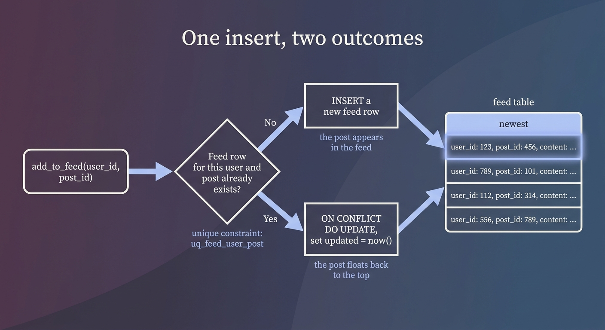

{lang=python,line-numbers=on}
```
# markua-start-delete
from typing import Iterable

from sqlalchemy import insert
# markua-end-delete
# markua-start-insert
from typing import Iterable, Optional

from sqlalchemy import func
from sqlalchemy.dialects.postgresql import insert as pg_insert
# markua-end-insert

from post.models import feed_table


# markua-start-insert
async def add_to_feed(
    conn,
    user_id: int,
    post_id: int,
    reason_user_id: Optional[int] = None,
    reason_type: Optional[str] = None,
) -> None:
    """Insert one feed row for a recipient, or bump it if it already exists."""
    stmt = pg_insert(feed_table).values(
        user_id=user_id,
        post_id=post_id,
        reason_user_id=reason_user_id,
        reason_type=reason_type,
    )
    stmt = stmt.on_conflict_do_update(
        constraint="uq_feed_user_post",
        set_={"updated": func.now()},
    )
    await conn.execute(stmt)
# markua-end-insert


async def fan_out_post(conn, post_id: int, recipient_ids: Iterable[int]) -> None:
    """A brand-new post lands directly in the author's and followers' feeds."""
    for user_id in set(recipient_ids):
        await add_to_feed(conn, user_id, post_id)


# markua-start-insert
async def bubble_post(
    conn,
    post_id: int,
    recipient_ids: Iterable[int],
    reason_user_id: int,
    reason_type: str,
) -> None:
    """Surface an existing post into more feeds because someone engaged with it."""
    for user_id in set(recipient_ids):
        await add_to_feed(conn, user_id, post_id, reason_user_id, reason_type)
# markua-end-insert
```

The new `add_to_feed` does the whole job in one shape: it accepts the two optional reason arguments, and it builds the row with Postgres's own `insert` so we can chain `on_conflict_do_update`. If a feed row for this user and post already exists, instead of failing on the unique constraint we just bump its `updated` timestamp, which floats the post back to the top. Fresh activity, no duplicates.

`fan_out_post` is untouched, and the new `bubble_post` is its sibling: it pushes a post into feeds the same way, and it records who caused it and why. However a post reaches a feed from now on, it lands through this one safe upsert.

[Save the file](https://fmze.co/fftq-5.12.4).

Bubbling has a live half too. When a post bubbles into your feed, we don't want to wait for a refresh: the card should arrive over SSE, exactly like a brand-new post does, carrying its "commented on this" attribution. That means we need to build the same post payload our create post view sends, from anywhere. Open `post/views.py` and add a reusable builder right under `_post_images`:

{lang=python,line-numbers=on,starting-line-number=56}
```
async def build_post_payload(
    conn: Any,
    post_id: int,
    reason_type: Optional[str] = None,
    reason_username: Optional[str] = None,
) -> Dict[str, Any]:
    """SSE 'post' payload for a post — shared by create_post and live bubbling."""
    row = (
        await conn.execute(
            select(
                post_table.c.id.label("post_id"),
                post_table.c.uid,
                post_table.c.message,
                post_table.c.created,
                user_table.c.id.label("author_id"),
                user_table.c.username.label("author_username"),
                user_table.c.image.label("author_image"),
            )
            .select_from(
                post_table.join(user_table, post_table.c.user_id == user_table.c.id)
            )
            .where(post_table.c.id == post_id)
        )
    ).fetchone()
    return {
        "post_id": row.post_id,
        "uid": row.uid,
        "message": row.message,
        "created": row.created.isoformat(),
        "author_id": row.author_id,
        "author_username": row.author_username,
        "avatar_url": image_url(row.author_id, row.author_image, "sm"),
        "permalink": url_for(
            "post_app.detail", uid=row.uid, slug=slugify(row.message)
        ),
        "images": await _post_images(conn, post_id),
        "reason_type": reason_type,
        "reason_username": reason_username,
    }
```

The signature takes the connection and a post id, plus two optional reason arguments, and both of those default to nothing.

The body joins the post to its author in a single query, so one round trip gives us the message, when it was created, and the username and avatar image of whoever wrote it. We only need the one row.

Then we shape the same dictionary the browser already knows how to render, with the permalink, the avatar URL, the attached images, and the two reason fields at the end. A brand-new post leaves those empty, while a bubbled post arrives tagged with who commented.

[Save the file](https://fmze.co/fftq-5.12.5).

The feed itself needs to learn two things: load each post's comments, and resolve the reason attribution into a username. First the comments. Add the `comment_table` import at the top of `post/views.py`:

{lang=python,line-numbers=on,starting-line-number=19}
```
from comment.models import comment_table
```

Then a helper that gathers everything a card shows beyond the post itself. Add it right after `build_post_payload`:

{lang=python,line-numbers=on,starting-line-number=98}
```
async def _post_extras(conn: Any, post_id: int, user_id: int) -> Dict[str, Any]:
    """Comments and images for a single post, from the ``user_id`` viewer's POV."""
    comment_rows = (
        await conn.execute(
            select(
                comment_table.c.id,
                comment_table.c.comment,
                comment_table.c.created,
                user_table.c.username.label("author_username"),
            )
            .select_from(
                comment_table.join(user_table, comment_table.c.user_id == user_table.c.id)
            )
            .where(comment_table.c.post_id == post_id)
            .order_by(comment_table.c.created.asc())
        )
    ).fetchall()

    return {
        "comments": comment_rows,
        "images": await _post_images(conn, post_id),
    }
```

Each comment comes back joined to its author's username, oldest first, the order a conversation reads in. The viewer's `user_id` isn't used yet; it earns its keep next lesson, when what the card shows starts depending on who's looking.

Now rewrite `_load_feed` so every feed row carries its reason and its comments:

{lang=python,line-numbers=on,starting-line-number=122}
```
async def _load_feed(
    conn: Any, user_id: int, offset: int = 0, limit: int = 10
) -> List[Dict[str, Any]]:
    """A page of feed rows for ``user_id``, each with its comments preloaded."""
    reason_user = user_table.alias("reason_user")
    feed_query = (
        select(
            feed_table.c.updated,
            post_table.c.id.label("post_id"),
            post_table.c.uid,
            post_table.c.message,
            post_table.c.created,
            user_table.c.id.label("author_id"),
            user_table.c.username.label("author_username"),
            user_table.c.image.label("author_image"),
            feed_table.c.reason_type,
            reason_user.c.username.label("reason_username"),
        )
        .select_from(
            feed_table.join(post_table, feed_table.c.post_id == post_table.c.id)
            .join(user_table, post_table.c.user_id == user_table.c.id)
            .outerjoin(reason_user, feed_table.c.reason_user_id == reason_user.c.id)
        )
        .where(feed_table.c.user_id == user_id)
        .order_by(feed_table.c.updated.desc())
        .limit(limit)
        .offset(offset)
    )
    feed_rows = (await conn.execute(feed_query)).fetchall()

    posts = []
    for row in feed_rows:
        extras = await _post_extras(conn, row.post_id, user_id)
        posts.append(
            {
                "post_id": row.post_id,
                "uid": row.uid,
                "message": row.message,
                "created": row.created,
                "author_id": row.author_id,
                "author_username": row.author_username,
                "avatar_url": image_url(row.author_id, row.author_image, "sm"),
                # Why this post is in the feed (None for a direct follow).
                "reason_type": row.reason_type,
                "reason_username": row.reason_username,
                **extras,
            }
        )

    return posts
```

Two changes carry the lesson. The `reason_user` alias joins the user table a second time, because one query now needs two different users: the post's author, and whoever caused the bubble. And it's an `outerjoin`, because most feed rows have no reason at all, and an inner join would silently drop every directly-followed post. Then each post spreads in its `_post_extras`, so the card gets its comments without the template running a single query.

One thing quietly disappeared: the permalink. `url_for` only works inside a request, and we want `_load_feed` callable from tests, where there is no request at all. So the loader stays pure data, and the template will build the permalink itself through a small global we'll register along with the blueprint.

[Save the file](https://fmze.co/fftq-5.12.6).

Two routes need small updates to match. The `feed` route now builds a form, because the comment box on every card needs a CSRF token to submit. And the permalink page should show a post's comments too, so it loads through the same machinery. Update both, and add the single-post loader they share:

{lang=python,line-numbers=on,starting-line-number=174}
```
async def _load_single_post_by_uid(
    conn: Any, uid: str, viewer_user_id: int
) -> Optional[Dict[str, Any]]:
    """Load one post by permalink uid, in the same dict shape as ``_load_feed``'s."""
    row = (
        await conn.execute(
            select(
                post_table.c.id.label("post_id"),
                post_table.c.uid,
                post_table.c.message,
                post_table.c.created,
                user_table.c.id.label("author_id"),
                user_table.c.username.label("author_username"),
                user_table.c.image.label("author_image"),
            )
            .select_from(
                post_table.join(user_table, post_table.c.user_id == user_table.c.id)
            )
            .where(post_table.c.uid == uid)
        )
    ).fetchone()

    if row is None:
        return None

    extras = await _post_extras(conn, row.post_id, viewer_user_id)
    return {
        "post_id": row.post_id,
        "uid": row.uid,
        "message": row.message,
        "created": row.created,
        "author_id": row.author_id,
        "author_username": row.author_username,
        "avatar_url": image_url(row.author_id, row.author_image),
        **extras,
    }
```

Then replace the `feed` and `detail` routes:

{lang=python,line-numbers=on,starting-line-number=225}
```
@post_app.route("/feed")
@login_required
async def feed():
    """Return one page of feed cards (for infinite scroll). Empty when exhausted."""
    try:
        offset = int(request.args.get("offset", 0))
    except (TypeError, ValueError):
        offset = 0

    form = await PostForm.create_form()
    engine = current_app.dbc  # type: ignore
    async with engine.begin() as conn:
        posts = await _load_feed(conn, session["user_id"], offset=offset, limit=10)

    return await render_template("post/_feed_items.html", posts=posts, form=form)


@post_app.route("/post/<uid>/")
@post_app.route("/post/<uid>/<slug>")
@login_required
async def detail(uid: str, slug: Optional[str] = None):
    """SEO permalink page; a missing or stale slug 301-redirects to the canonical URL."""
    form = await PostForm.create_form()
    engine = current_app.dbc  # type: ignore
    async with engine.begin() as conn:
        post = await _load_single_post_by_uid(conn, uid, session["user_id"])

    if post is None:
        abort(404)

    canonical_slug = slugify(post["message"])
    if slug != canonical_slug:
        return redirect(
            url_for("post_app.detail", uid=uid, slug=canonical_slug), code=301
        )

    return await render_template("post/detail.html", post=post, form=form)
```

The old `detail` route built its little dictionary by hand and knew nothing about comments. Now it loads through `_load_single_post_by_uid`, gets the exact shape the card partial expects, and passes the form so the comment box works on permalink pages too.

[Save the file](https://fmze.co/fftq-5.12.7).

Now the comment view ties it all together. Create `comment/views.py`:

{lang=python,line-numbers=on}
```
import json

from quart import Blueprint, current_app, redirect, session, url_for
from sqlalchemy import insert, select

from comment.forms import CommentForm
from comment.models import comment_table
from post.feed_ops import bubble_post
from post.models import feed_table
from post.views import build_post_payload
from utils.helpers import login_required
from relationship.views import followers
from utils.sse import ServerSentEvent, broker
from user.models import user_table

comment_app = Blueprint("comment_app", __name__)


@comment_app.route("/comment/<int:post_id>", methods=["POST"])
@login_required
async def create_comment(post_id: int):
    form = await CommentForm.create_form()

    if await form.validate_on_submit():
        engine = current_app.dbc  # type: ignore
        async with engine.begin() as conn:
            result = await conn.execute(
                insert(comment_table).values(
                    post_id=post_id,
                    user_id=session["user_id"],
                    comment=form.comment.data,
                )
            )
            comment_id = result.inserted_primary_key[0]

            comment_row = (
                await conn.execute(
                    select(comment_table).where(comment_table.c.id == comment_id)
                )
            ).fetchone()
            author = (
                await conn.execute(
                    select(user_table).where(user_table.c.id == session["user_id"])
                )
            ).fetchone()

            # Bubble into my followers' feeds (and mine): "<me> commented on this".
            follower_ids = await followers(conn, session["user_id"])
            bubble_recipients = set(follower_ids)
            bubble_recipients.add(session["user_id"])
            await bubble_post(
                conn, post_id, bubble_recipients, session["user_id"], "comment"
            )
```

We insert the comment, read it back along with its author, then bubble the post to our followers plus ourselves, tagging the reason as "comment". Thanks to the upsert, followers who already had the post just see it move up; those who didn't get it now.

Now the live half, still inside the same `with` block and then just after it:

{lang=python,line-numbers=on,starting-line-number=55}
```
            # Everyone with this post in their feed gets the live comment.
            recipient_ids = [
                r.user_id
                for r in (
                    await conn.execute(
                        select(feed_table.c.user_id).where(
                            feed_table.c.post_id == post_id
                        )
                    )
                ).fetchall()
            ]

            # The bubbled post's payload, tagged with who commented and why.
            bubble_payload = await build_post_payload(
                conn, post_id, "comment", author.username
            )

        # Push the post to followers first, then the comment to everyone holding it.
        if follower_ids:
            await broker.publish_many(
                follower_ids,
                ServerSentEvent(event="post", data=json.dumps(bubble_payload)),
            )

        payload = {
            "post_id": post_id,
            "comment_id": comment_id,
            "comment": comment_row.comment,
            "created": comment_row.created.isoformat(),
            "author_username": author.username,
        }
        await broker.publish_many(
            recipient_ids, ServerSentEvent(event="comment", data=json.dumps(payload))
        )

    return redirect(url_for("post_app.home"))
```

The ordering here is the whole design. First we push the post itself, with its attribution, to our followers: for anyone who didn't have the card, it appears live, already tagged. Then we push the comment to everyone whose feed holds this post, which by now includes the people we just bubbled it to. Two events, and every open browser converges on the same picture the database has.

[Save the file](https://fmze.co/fftq-5.12.8).

The blueprint exists but the app doesn't know it yet. Register it in `application.py`, next to the others, and while we're here, add the little permalink helper the templates need now that `_load_feed` no longer builds URLs. Add `url_for` to the quart import and `slugify` next to `linkify`:

{lang=python,line-numbers=on,starting-line-number=1}
```
from quart import Quart, url_for

from db import get_engine
from utils.helpers import linkify, slugify
```

Then the registration and the global:

{lang=python,line-numbers=on,starting-line-number=14}
```
    from user.views import user_app
    from relationship.views import relationship_app
    from post.views import post_app
    from comment.views import comment_app

    app.register_blueprint(user_app)
    app.register_blueprint(relationship_app)
    app.register_blueprint(post_app)
    app.register_blueprint(comment_app)

    @app.template_global()
    def post_url(uid: str, message: str) -> str:
        """Canonical SEO permalink for a post: /post/<uid>/<slug>."""
        return url_for("post_app.detail", uid=uid, slug=slugify(message))
```

`template_global` makes `post_url` callable from any template, so the card can build a post's canonical address from data alone.

[Save the file](https://fmze.co/fftq-5.12.9).

Now let's show all of it. The post card gets three additions: the attribution line when a post bubbled in, the list of comments, and a small form to add one. Replace `templates/post/_post_card.html`:

{lang=html,line-numbers=on}
```

<div class="comment small"><span class="comment-bubble">💬</span>
    {{ c.comment | linkify }}
    - <a href="{{ url_for('user_app.profile', username=c.author_username) }}" class="comment-author">@{{ c.author_username }}</a></div>


<div class="card mb-3" data-post-id="{{ post.post_id }}">
    <div class="card-body">
        <div class="d-flex">
            
            <div class="flex-grow-1">
                <a href="{{ url_for('user_app.profile', username=post.author_username) }}"
                    class="fw-bold">@{{ post.author_username }}</a>
                
                <span class="text-muted small ms-1">(<a href="{{ url_for('user_app.profile', username=post.reason_username) }}">{{ post.reason_username }}</a> commented on this)</span>
                
                <p class="mb-1">{{ post.message | linkify }}</p>
                
                <div class="d-flex gap-2 mb-2">
                    
                    
                    
                </div>
                
                <a href="{{ post_url(post.uid, post.message) }}" class="small text-muted">
                    {{ post.created.strftime('%b %d, %Y %H:%M') }}
                </a>
                <div class="comments mt-2">
                    {{ comment_row(c) }}
                </div>
                <form method="POST" action="{{ url_for('comment_app.create_comment', post_id=post.post_id) }}" class="comment-form mt-2 d-flex">
                    {{ form.csrf_token }}
                    <input type="text" name="comment" class="form-control form-control-sm me-2" placeholder="Add a comment...">
                    <button type="submit" class="btn btn-sm btn-outline-secondary">Send</button>
                </form>
            </div>
        </div>
    </div>
</div>
```

The `comment_row` macro keeps each comment's markup in one place, because the card renders it and, in a moment, our JavaScript will build the same shape. The attribution span only appears when the row has a reason, so directly-followed posts look exactly as they always did.

[Save the file](https://fmze.co/fftq-5.12.10).

Finally, the browser side. `broadcast.js` needs to learn three things: the cards it builds live need the same comment form, a bubbled post's card should carry its attribution, and a `comment` event should append to the right card. First, grab a CSRF token near the top, right after the `EventSource` line, by borrowing the one already rendered on the page:

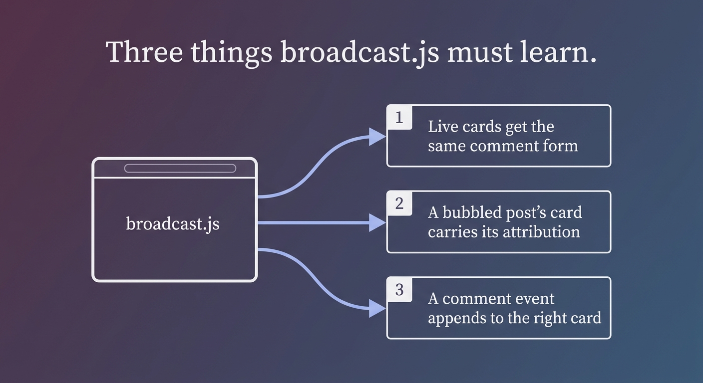

{lang=js,line-numbers=on,starting-line-number=7}
```
  // Reuse the page's rendered CSRF token so SSE-built comment forms can submit.
  const csrfInput = document.querySelector('#post-form input[name="csrf_token"]');
  const csrfToken = csrfInput ? csrfInput.value : "";
```

For that selector to find anything, the post form needs the id. In `templates/post/home.html`, add `id="post-form"` to the post form tag:

{lang=html,line-numbers=off}
```
<form method="POST" action="{{ url_for('post_app.create_post') }}" id="post-form" enctype="multipart/form-data">
```

Back in `broadcast.js`, update the card template inside the `post` listener: the attribution span after the author link, and the comments container plus the form after the timestamp line:

{lang=js,line-numbers=on,starting-line-number=35}
```
            <a href="/user/${encodeURIComponent(post.author_username)}" class="fw-bold">@${escapeHtml(post.author_username)}</a>
            ${(post.reason_type === "comment" && post.reason_username)
              ? ` <span class="text-muted small ms-1">(<a href="/user/${encodeURIComponent(post.reason_username)}">${escapeHtml(post.reason_username)}</a> commented on this)</span>`
              : ""}
            <p class="mb-1">${escapeHtml(post.message)}</p>
            ${(post.images && post.images.length)
              ? `<div class="d-flex gap-2 mb-2">${post.images
                  .map((im) => ``)
                  .join("")}</div>`
              : ""}
            <a href="${post.permalink}" class="small text-muted">${formatWhen(post.created)}</a>
            <div class="comments mt-2"></div>
            <form method="POST" action="/comment/${post.post_id}" class="comment-form mt-2 d-flex">
              <input type="hidden" name="csrf_token" value="${csrfToken}">
              <input type="text" name="comment" class="form-control form-control-sm me-2" placeholder="Add a comment...">
              <button type="submit" class="btn btn-sm btn-outline-secondary">Send</button>
            </form>
```

And add the `comment` listener after the `post` one: find the card by its post id, and append the comment in the same shape the template macro renders:

{lang=js,line-numbers=on,starting-line-number=58}
```
  es.addEventListener("comment", (e) => {
    const comment = JSON.parse(e.data);
    const card = feed.querySelector(`[data-post-id="${comment.post_id}"]`);
    if (!card) return;

    const commentsDiv = card.querySelector(".comments");
    const commentEl = document.createElement("div");
    commentEl.className = "comment small";
    commentEl.innerHTML = `<span class="comment-bubble">💬</span> ${escapeHtml(comment.comment)} - <a href="/user/${encodeURIComponent(comment.author_username)}" class="comment-author">@${escapeHtml(comment.author_username)}</a>`;
    commentsDiv.appendChild(commentEl);
  });
```

[Save the file](https://fmze.co/fftq-5.12.11).

Let's watch it work. Restart the app, open two browser windows side by side, and log in as jorge on the left and marta on the right.

From jorge's window, type a comment on the top post and send it. Marta already has that post in her feed.

The comment appears under it in her window right away, with no refresh. Now comment on a post she doesn't have at all.

The whole card slides into her feed first, tagged with who commented on it, live.

### Testing comments and bubbling <!--  -->

Comments do more than attach text to a post. Commenting bubbles that post into the feeds of the people who follow you, even if they don't follow the original author. That bubbling is subtle logic, so it's worth testing carefully. Three quick tests cover the basics, then four more prove the bubbling actually works.

First, the now-familiar one-line update to `conftest.py`: we just added the `comment` table, so register its model so the test database builds it.

{lang=python,line-numbers=on,starting-line-number=13}
```
# Register the tables we're testing so metadata.create_all builds them.
from user.models import user_table  # noqa: F401
from relationship.models import relationship_table  # noqa: F401
from post.models import post_table, feed_table  # noqa: F401
from comment.models import comment_table  # noqa: F401
```

[Save the file](https://fmze.co/fftq-5.12.12).

Now start with the basics in `tests/test_comment.py`.

{lang=python,line-numbers=on,starting-line-number=1}
```
import pytest
from quart import current_app
from sqlalchemy import select

from comment.models import comment_table
from post.models import post_table


async def _register_and_login(client, username: str, password: str = "secret123") -> None:
    await client.post("/register", form={"username": username, "password": password})
    await client.post("/login", form={"username": username, "password": password})


async def _make_post(client, app, message: str = "hello world") -> int:
    await client.post("/post", form={"message": message})
    async with app.app_context():
        async with current_app.dbc.begin() as conn:
            row = (await conn.execute(select(post_table))).fetchone()
    return row.id


@pytest.mark.asyncio
async def test_create_comment(create_test_client, create_test_app):
    await _register_and_login(create_test_client, "alice")
    post_id = await _make_post(create_test_client, create_test_app)

    response = await create_test_client.post(
        f"/comment/{post_id}", form={"comment": "nice post!"}
    )
    assert response.status_code == 302

    async with create_test_app.app_context():
        async with current_app.dbc.begin() as conn:
            comments = (await conn.execute(select(comment_table))).fetchall()
    assert len(comments) == 1
    assert comments[0].comment == "nice post!"


@pytest.mark.asyncio
async def test_empty_comment_is_rejected(create_test_client, create_test_app):
    await _register_and_login(create_test_client, "alice")
    post_id = await _make_post(create_test_client, create_test_app)

    # An empty comment fails validation, so no row is written.
    await create_test_client.post(f"/comment/{post_id}", form={"comment": ""})

    async with create_test_app.app_context():
        async with current_app.dbc.begin() as conn:
            comments = (await conn.execute(select(comment_table))).fetchall()
    assert comments == []


@pytest.mark.asyncio
async def test_comment_requires_login(create_test_client):
    response = await create_test_client.post("/comment/1", form={"comment": "hi"})
    assert response.status_code == 302
    assert "/login" in response.headers.get("Location", "")
```

The `_make_post` helper posts a message and reads back its id, which we need because every comment targets a specific post. The first test confirms a comment lands in the `comment` table with the right text; the second proves an empty comment is rejected by the form validator so we never store blank rows; and the third keeps the route behind a login. Notice how much these read like the tests we've already written, because our fixtures and helpers do the heavy lifting.

[Save the file](https://fmze.co/fftq-5.12.13).

Now the interesting part. Bubbling means a post can reach your feed through someone you follow commenting on it. To test that we need three people: an author nobody follows, a commenter, and a viewer who follows only the commenter. Create `tests/test_feed.py`.

{lang=python,line-numbers=on,starting-line-number=1}
```
import json

import pytest
from quart import current_app
from sqlalchemy import select

from post.models import feed_table, post_table
from post.views import _load_feed
from user.models import user_table
from utils.sse import broker


async def _register_and_login(client, username: str, password: str = "secret123") -> None:
    await client.post("/register", form={"username": username, "password": password})
    await client.post("/login", form={"username": username, "password": password})


async def _user_id(app, username: str) -> int:
    async with app.app_context():
        async with current_app.dbc.begin() as conn:
            row = (
                await conn.execute(
                    select(user_table.c.id).where(user_table.c.username == username)
                )
            ).fetchone()
    return row.id


async def _only_post_id(app) -> int:
    async with app.app_context():
        async with current_app.dbc.begin() as conn:
            row = (await conn.execute(select(post_table.c.id))).fetchone()
    return row.id


async def _feed_rows(app, user_id: int):
    async with app.app_context():
        async with current_app.dbc.begin() as conn:
            return (
                await conn.execute(
                    select(feed_table).where(feed_table.c.user_id == user_id)
                )
            ).fetchall()


@pytest.mark.asyncio
async def test_comment_bubbles_post_to_commenters_followers(create_test_app):
    """A followee commenting surfaces a post you don't otherwise follow, attributed."""
    app = create_test_app
    author = app.test_client()
    await _register_and_login(author, "author")
    commenter = app.test_client()
    await _register_and_login(commenter, "commenter")
    viewer = app.test_client()
    await _register_and_login(viewer, "viewer")

    # viewer follows the commenter, but NOT the author
    await viewer.post("/follow/commenter")

    await author.post("/post", form={"message": "friend of a friend post"})
    viewer_id = await _user_id(app, "viewer")
    assert await _feed_rows(app, viewer_id) == []  # author isn't followed → not yet here

    # commenter (whom viewer follows) comments → the post bubbles into viewer's feed
    post_id = await _only_post_id(app)
    await commenter.post(f"/comment/{post_id}", form={"comment": "interesting"})

    rows = await _feed_rows(app, viewer_id)
    assert len(rows) == 1
    assert rows[0].post_id == post_id
    assert rows[0].reason_user_id == await _user_id(app, "commenter")
    assert rows[0].reason_type == "comment"

    # attribution resolves through _load_feed
    async with app.app_context():
        async with current_app.dbc.begin() as conn:
            feed = await _load_feed(conn, viewer_id)
    assert len(feed) == 1
    assert feed[0]["reason_username"] == "commenter"
    assert feed[0]["reason_type"] == "comment"


@pytest.mark.asyncio
async def test_comment_does_not_bubble_to_unrelated_user(create_test_app):
    """Someone who follows neither the author nor the commenter gets nothing."""
    app = create_test_app
    author = app.test_client()
    await _register_and_login(author, "author")
    commenter = app.test_client()
    await _register_and_login(commenter, "commenter")
    stranger = app.test_client()
    await _register_and_login(stranger, "stranger")

    await author.post("/post", form={"message": "hello"})
    post_id = await _only_post_id(app)
    await commenter.post(f"/comment/{post_id}", form={"comment": "hi"})

    stranger_id = await _user_id(app, "stranger")
    assert await _feed_rows(app, stranger_id) == []


@pytest.mark.asyncio
async def test_bubble_dedups_against_direct_follow(create_test_app):
    """Following the author AND the commenter yields ONE feed row (direct wins)."""
    app = create_test_app
    author = app.test_client()
    await _register_and_login(author, "author")
    commenter = app.test_client()
    await _register_and_login(commenter, "commenter")
    viewer = app.test_client()
    await _register_and_login(viewer, "viewer")

    await viewer.post("/follow/author")
    await viewer.post("/follow/commenter")

    await author.post("/post", form={"message": "dedup me"})
    viewer_id = await _user_id(app, "viewer")
    rows = await _feed_rows(app, viewer_id)
    assert len(rows) == 1 and rows[0].reason_user_id is None  # direct follow, no reason

    post_id = await _only_post_id(app)
    await commenter.post(f"/comment/{post_id}", form={"comment": "hi"})

    rows = await _feed_rows(app, viewer_id)
    assert len(rows) == 1  # still one row, not duplicated
    assert rows[0].reason_user_id is None  # direct-follow row keeps its NULL reason
```

The first test tells the whole bubbling story. The viewer follows the commenter but not the author, so when the author posts, the viewer's feed is empty, and we assert exactly that. Then the commenter comments, and now the post appears in the viewer's feed with a `reason_type` of "comment" and a `reason_user_id` pointing at the commenter. We even run it through `_load_feed` to confirm the attribution resolves to the friendly "commenter commented on this" form the template will show. The second test proves the flip side: a stranger who follows neither the author nor the commenter gets nothing, so a comment only bubbles to the commenter's own followers. And the third test guards a nasty edge: if you already follow the author directly, a later comment must not create a second copy of the post in your feed. We assert the row count stays at one and that the original direct-follow row keeps its empty reason, so a real follow always wins over a bubble.

[Save the file](https://fmze.co/fftq-5.12.14).

Bubbling isn't only about the database; it also pushes live. When someone you follow comments on a post you've never seen, that post should slide into your open feed over SSE without a refresh. Add this test to `test_feed.py`. It uses the broker directly to capture what a viewer's live connection would receive.

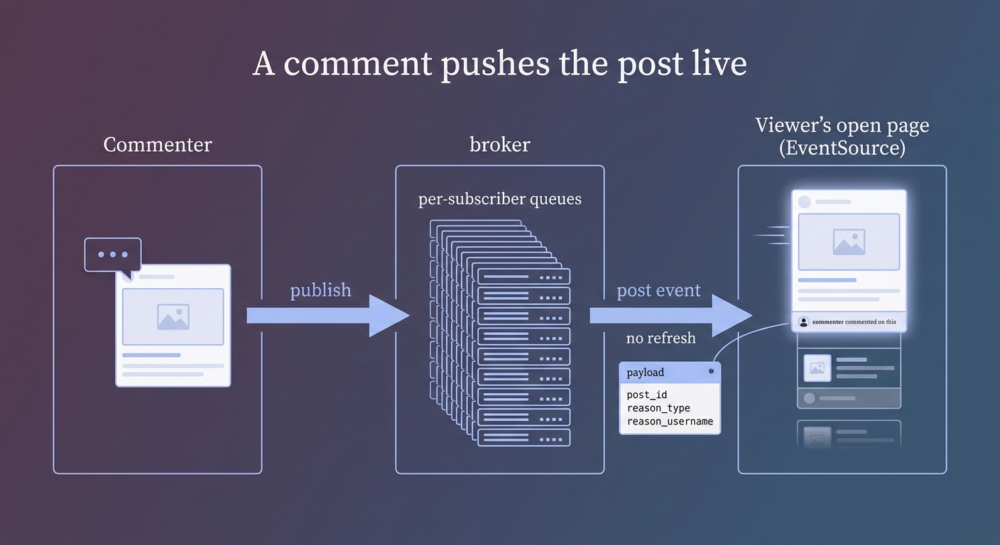

{lang=python,line-numbers=on,starting-line-number=129}
```
@pytest.mark.asyncio
async def test_comment_live_bubbles_post_over_sse(create_test_app):
    """Commenting pushes the post live (SSE 'post' event) to the commenter's followers."""
    app = create_test_app
    author = app.test_client()
    await _register_and_login(author, "author")
    commenter = app.test_client()
    await _register_and_login(commenter, "commenter")
    viewer = app.test_client()
    await _register_and_login(viewer, "viewer")

    await viewer.post("/follow/commenter")  # follows the commenter, not the author

    await author.post("/post", form={"message": "bubble me"})
    post_id = await _only_post_id(app)
    viewer_id = await _user_id(app, "viewer")

    q = broker.subscribe(viewer_id)
    try:
        await commenter.post(f"/comment/{post_id}", form={"comment": "nice"})
        events = []
        while not q.empty():
            events.append(q.get_nowait())
    finally:
        broker.unsubscribe(viewer_id, q)

    post_events = [e for e in events if e.event == "post"]
    assert post_events, "follower should receive a live 'post' event"
    data = json.loads(post_events[0].data)
    assert data["post_id"] == post_id
    assert data["reason_type"] == "comment"
    assert data["reason_username"] == "commenter"
```

Here we subscribe to the broker as the viewer, exactly like a real browser opening its `EventSource` connection, then have the commenter comment. We drain the queue and look for a "post" event, because the whole point is that the post itself arrives live so the card can appear on the viewer's page. We check its payload carries the post id and the "commenter commented on this" attribution. The `try/finally` matters: we always unsubscribe so a leftover queue can't bleed into another test.

Run `pytest` inside the container. Give it a moment while everything spins up and the suite works its way through every feed test we have written so far. There it is: comments, bubbling, and the live push over SSE, all passing in one run.

[Save the file](https://fmze.co/fftq-5.12.15).

## Likes and Live Reactions <!-- 5.13 -->

The last piece of engagement is the like, and it teaches one more idea: making an action idempotent, so clicking Like and Unlike can be the same button toggling on and off, with the database keeping things consistent.

Once likes are in, the feed finally has everything FriendFeed had, and that is a good moment to stop and make it look like FriendFeed too. So this lesson has two halves. First we build the like, from the table up to the live event. Then we give the feed the skin it deserves: the blue title bar, the action row under each post, relative timestamps, and the collapsing "who liked this" line that made the original site so readable.

The model uses a unique constraint to enforce one like per person per post. Create a `like` folder with an empty `__init__.py` and `models.py`:

{lang=python,line-numbers=on}
```
from sqlalchemy import Column, ForeignKey, Integer, Table, UniqueConstraint

from db import metadata

like_table = Table(
    "like",
    metadata,
    Column("id", Integer, primary_key=True),
    Column("post_id", Integer, ForeignKey("post.id"), nullable=False),
    Column("user_id", Integer, ForeignKey("user.id"), nullable=False),
    UniqueConstraint("post_id", "user_id", name="uq_like_post_user"),
)
```

The unique constraint on `post_id` and `user_id` guarantees one like per person per post. You can't accidentally like the same post twice, and that makes a like a clean on-off toggle rather than a counter we have to babysit.

[Save the file](https://fmze.co/fftq-5.13.1).

Same easy-to-forget step as last time: Alembic only knows about the tables whose models `migrations/env.py` imports, so add the new one under the others.

{lang=python,line-numbers=on,starting-line-number=16}
```
from user.models import user_table  # noqa: F401
from relationship.models import relationship_table  # noqa: F401
from post.models import post_table, post_image_table  # noqa: F401
from comment.models import comment_table  # noqa: F401
# markua-start-insert
from like.models import like_table  # noqa: F401
# markua-end-insert
```

[Save the file](https://fmze.co/fftq-5.13.2). Then rebuild the web image and let Alembic write and apply the revision:

{lang=bash,line-numbers=off}
```
$ docker compose build web
$ docker compose run --rm web uv run alembic revision --autogenerate -m "create like table"
$ docker compose run --rm web uv run alembic upgrade head
```

Now the toggle view. Create `like/views.py`:

{lang=python,line-numbers=on}
```
import json

from quart import Blueprint, current_app, redirect, session, url_for
from quart_wtf import QuartForm
from sqlalchemy import delete, func, insert, select

from utils.helpers import login_required
from like.models import like_table
from post.models import feed_table
from user.models import user_table
from utils.sse import ServerSentEvent, broker

like_app = Blueprint("like_app", __name__)


class LikeForm(QuartForm):
    """CSRF-only form used for the like/unlike toggle POST (no visible fields)."""


@like_app.route("/like/<int:post_id>", methods=["POST"])
@login_required
async def toggle_like(post_id: int):
    form = await LikeForm.create_form()

    if await form.validate_on_submit():
        engine = current_app.dbc  # type: ignore
        async with engine.begin() as conn:
            existing = (
                await conn.execute(
                    select(like_table).where(
                        (like_table.c.post_id == post_id)
                        & (like_table.c.user_id == session["user_id"])
                    )
                )
            ).fetchone()

            if existing is not None:
                await conn.execute(delete(like_table).where(like_table.c.id == existing.id))
            else:
                await conn.execute(
                    insert(like_table).values(post_id=post_id, user_id=session["user_id"])
                )
```

That is the whole idea of the lesson in nine lines. We look for an existing like from this user on this post. If there is one we delete it, and if there isn't we insert one. The same button, the same route, both directions. Nothing anywhere has to know whether it is "liking" or "unliking", and clicking twice quickly can't leave a mess behind, because the unique constraint means there was never more than one row to begin with.

Now the second half of the view, still inside that `async with` block. Having toggled, we need to tell the page what the likes look like now:

{lang=python,line-numbers=on,starting-line-number=44}
```
            like_count = (
                await conn.execute(
                    select(func.count())
                    .select_from(like_table)
                    .where(like_table.c.post_id == post_id)
                )
            ).scalar_one()

            # Names of everyone who likes the post now, so the "A, B and N
            # other people liked this" line can re-render live.
            likers = [
                r.username
                for r in (
                    await conn.execute(
                        select(user_table.c.username)
                        .select_from(
                            like_table.join(
                                user_table, like_table.c.user_id == user_table.c.id
                            )
                        )
                        .where(like_table.c.post_id == post_id)
                        .order_by(like_table.c.id.asc())
                    )
                ).fetchall()
            ]

            # Deliver the updated count only to pages that have this post
            # (i.e. the users whose feed contains it), not every open page.
            recipient_ids = [
                r.user_id
                for r in (
                    await conn.execute(
                        select(feed_table.c.user_id).where(
                            feed_table.c.post_id == post_id
                        )
                    )
                ).fetchall()
            ]

        await broker.publish_many(
            recipient_ids,
            ServerSentEvent(
                event="like",
                data=json.dumps(
                    {"post_id": post_id, "like_count": like_count, "likers": likers}
                ),
            ),
        )

    return redirect(url_for("post_app.home"))
```

We count the likes, then gather the likers' names in the order they liked, joining `like` to `user` to turn ids into usernames. The `recipient_ids` query is the same targeted delivery we built for comments: we ask the `feed` table who actually has this post, and we push the event only to them. A like is not news to someone who can't see the post.

[Save the file](https://fmze.co/fftq-5.13.3).

Like every blueprint before it, this one has to be registered, and while we are in `application.py` there are two more small things to add. Start at the top. The templates are about to want `likes_line`, and we need `random` for a cache buster in a moment:

{lang=python,line-numbers=on,starting-line-number=1}
```
# markua-start-insert
import random

# markua-end-insert
from quart import Quart, url_for

from db import get_engine
# markua-start-insert
from utils.helpers import likes_line, linkify, slugify
# markua-end-insert
```

Then the blueprint itself, alongside the others:

{lang=python,line-numbers=on,starting-line-number=16}
```
    from user.views import user_app
    from relationship.views import relationship_app
    from post.views import post_app
    from comment.views import comment_app
# markua-start-insert
    from like.views import like_app
# markua-end-insert

    app.register_blueprint(user_app)
    app.register_blueprint(relationship_app)
    app.register_blueprint(post_app)
    app.register_blueprint(comment_app)
# markua-start-insert
    app.register_blueprint(like_app)
# markua-end-insert
```

Now that cache buster. We are about to write a stylesheet and two JavaScript files, and browsers cache those aggressively, which makes editing them maddening. A context processor hands every template a fresh random number on every request:

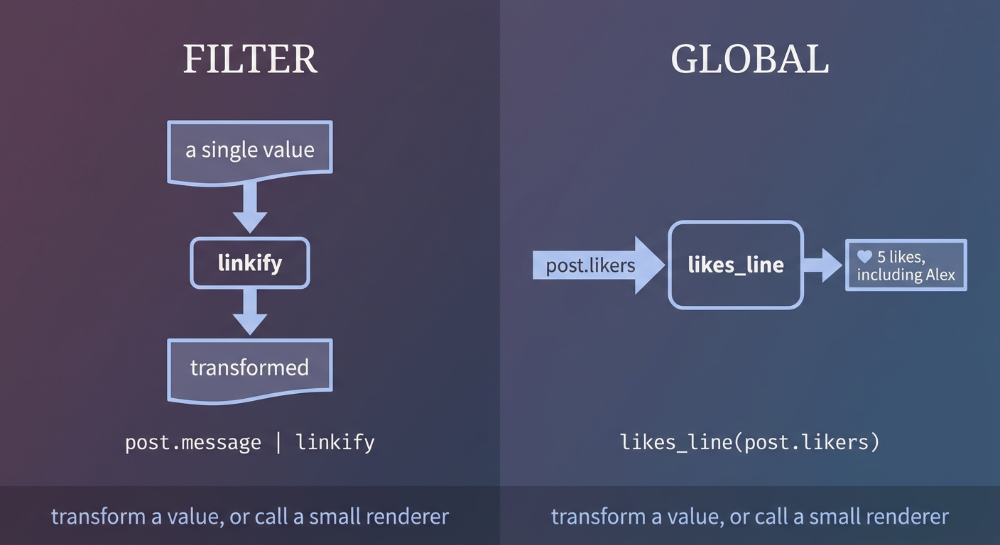

{lang=python,line-numbers=on,starting-line-number=28}
```
    @app.context_processor
    def inject_cache_buster():
        # A fresh value every request. Appended to static asset URLs as
        # ?cb=<n> so reloading the page always re-fetches the current JS/CSS
        # instead of a stale browser-cached copy.
        return {"cb": random.randint(0, 2**31 - 1)}
```

We'll append `?cb={{ cb }}` to our own script and stylesheet tags shortly, so a reload always fetches what is actually on disk.

Last, hand `likes_line` to the templates, next to the `linkify` filter:

{lang=python,line-numbers=on,starting-line-number=40}
```
# markua-start-insert
    app.add_template_global(likes_line, "likes_line")
# markua-end-insert
    app.add_template_filter(linkify, "linkify")
```

A filter and a global are two ways of exposing the same kind of function to Jinja. A filter reads well when it transforms one value, as in `post.message | linkify`. A global reads better when the function is really a small renderer we call by name, as in `likes_line(post.likers)`, so that is the shape we use here.

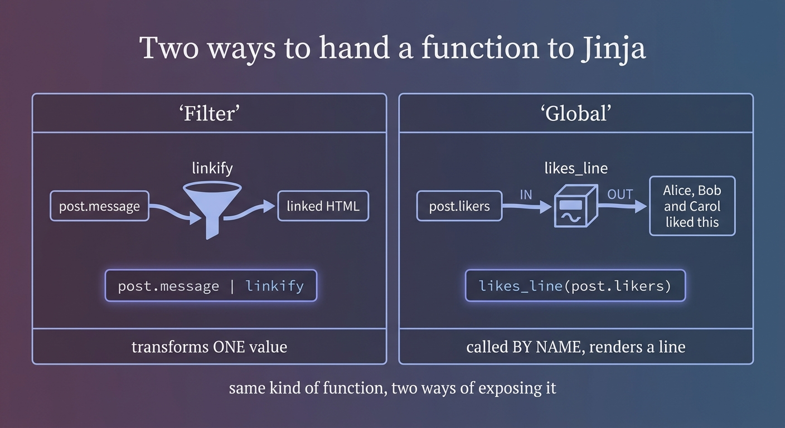

[Save the file](https://fmze.co/fftq-5.13.4).

Now the line itself. FriendFeed had a nice touch: instead of a bare count it wrote out "Alice, Bob and Carol liked this", and collapsed the list once it got long. Open `utils/helpers.py`. We need two more imports, a `List` for the signature and `quote` to build safe profile URLs:

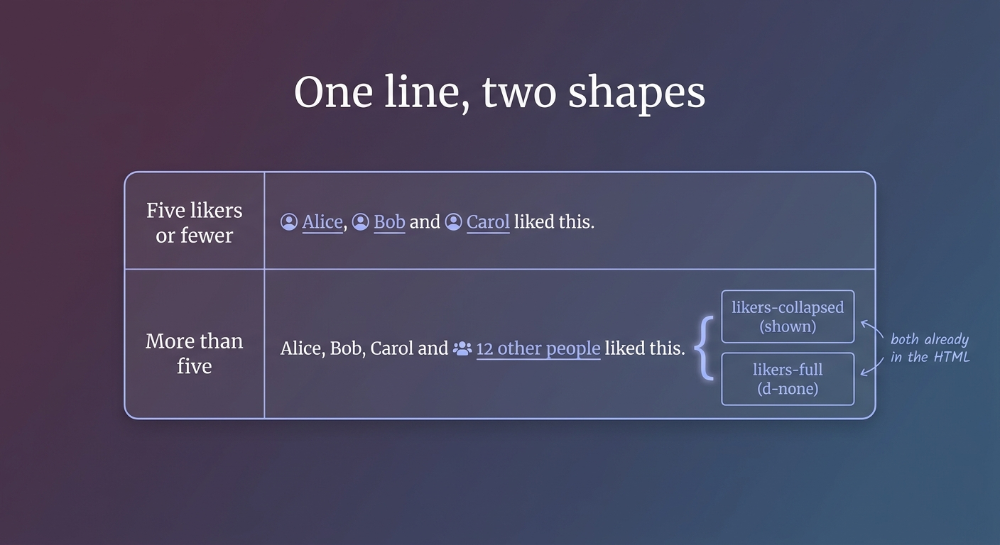

{lang=python,line-numbers=on,starting-line-number=1}
```
import os
import re
from functools import wraps
# markua-start-insert
from typing import Any, Callable, List, Optional
from urllib.parse import quote
# markua-end-insert
```

Then add the helper below `post_image_url`:

{lang=python,line-numbers=on,starting-line-number=68}
```
def _profile_link(name: str) -> str:
    """A profile link for a username: <a href="/user/name">name</a>."""
    return f'<a href="/user/{quote(str(name), safe="")}">{escape(name)}</a>'


def likes_line(likers: List[str], head: int = 3, collapse_over: int = 5) -> Markup:
    """FriendFeed-style "A, B and C liked this" line, names linked to profiles.

    Up to ``collapse_over`` names are listed in full; beyond that the first
    ``head`` are shown followed by an expandable "N other people" link.
    """
    names = [_profile_link(name) for name in likers]
    n = len(names)
    if n == 0:
        return Markup("")

    emoji = '<span class="likes-emoji">\U0001f642</span> '
    if n <= collapse_over:
        if n == 1:
            body = f"{names[0]} liked this"
        else:
            body = ", ".join(names[:-1]) + f" and {names[-1]} liked this"
        return Markup(emoji + body)

    shown = ", ".join(names[:head])
    others = n - head
    full = ", ".join(names)
    collapsed = (
        f'<span class="likers-collapsed">{shown} and '
        f'<a href="#" class="likers-more">{others} other people</a> liked this</span>'
    )
    expanded = f'<span class="likers-full d-none">{full} liked this</span>'
    return Markup(emoji + collapsed + expanded)
```

Read it from the top. Every name becomes a profile link first, and `escape(name)` inside `_profile_link` is what lets us return `Markup` at the end without opening an injection hole: the only unescaped HTML in the result is HTML we wrote ourselves. If nobody liked the post we return an empty `Markup`, so the line renders as nothing at all rather than an empty bullet.

Up to five names we list them all, with a natural "and" before the last one. Past five we build two spans instead of one: a `likers-collapsed` span showing the first three plus an "N other people" link, and a `likers-full` span carrying every name, hidden with Bootstrap's `d-none`. Both are in the HTML from the start, so revealing the full list later is a class change in the browser and not another request.

[Save the file](https://fmze.co/fftq-5.13.5).

The template can call `likes_line`, but nothing is loading the likers yet. Open `post/views.py` and import the new model:

{lang=python,line-numbers=on,starting-line-number=19}
```
from comment.models import comment_table
# markua-start-insert
from like.models import like_table
# markua-end-insert
```

Then teach `_post_extras` about likes. It already gathers a post's comments and images for one viewer, which is exactly the right place: the likers list, and whether this particular viewer has liked it, are per-post-per-viewer facts too.

{lang=python,line-numbers=on,starting-line-number=117}
```
# markua-start-insert
    # Usernames of everyone who liked, oldest-first, drives the FriendFeed
    # "alice, bob and N other people liked this" line.
    liker_rows = (
        await conn.execute(
            select(user_table.c.username)
            .select_from(
                like_table.join(user_table, like_table.c.user_id == user_table.c.id)
            )
            .where(like_table.c.post_id == post_id)
            .order_by(like_table.c.id.asc())
        )
    ).fetchall()
    likers = [row.username for row in liker_rows]

    liked_by_me = (
        await conn.execute(
            select(like_table).where(
                (like_table.c.post_id == post_id) & (like_table.c.user_id == user_id)
            )
        )
    ).fetchone() is not None

# markua-end-insert
    return {
        "comments": comment_rows,
        "images": await _post_images(conn, post_id),
# markua-start-insert
        "likers": likers,
        "like_count": len(likers),
        "liked_by_me": liked_by_me,
# markua-end-insert
    }
```

The first query is the same join the view used, so the server-rendered line and the live one agree by construction. `liked_by_me` is the one that makes the button honest: it is a single lookup for this viewer's own row, and it decides whether the button says Like or Unlike. Without it, someone who has already liked a post would still be invited to like it again.

[Save the file](https://fmze.co/fftq-5.13.6).

That is the like feature, end to end on the server. Now the look.

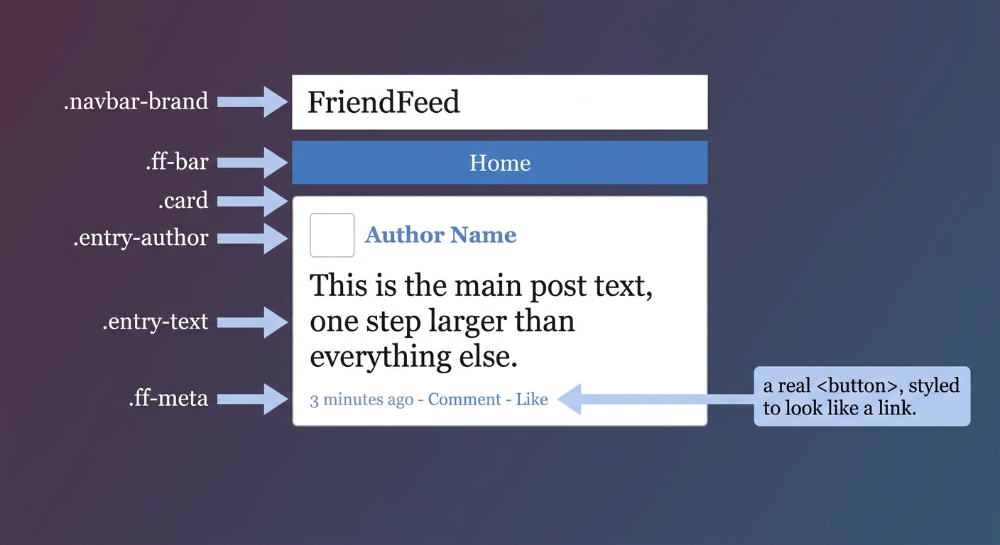

Everything we have built renders through Bootstrap's defaults, which is fine but generic. FriendFeed had a specific, recognizable style: a soft blue-grey page, white entries with thin borders, a blue title bar over the column, and a row of small text links under each post reading "time - Comment - Like". Almost none of that needs new markup. It needs a stylesheet.

This is not a CSS course, so we are not going to walk through it rule by rule. Create `static/css/friendfeed.css` with the styles below, which give us the FriendFeed skin and the Like control:

{lang=css,line-numbers=on}
```
/* FriendFeed-flavored skin for QuartFeed (circa 2009 look). */
:root {
    --ff-blue: #2b5ba8;
    --ff-blue-light: #3f6cbf;
    --ff-border: #d3dae6;
    --ff-muted: #8a94a6;
    --ff-page: #e9eef5;
}

body {
    background: var(--ff-page);
    color: #1a1a1a;
}

/* Top bar with the wordmark */
.navbar {
    background: #fff !important;
    border-bottom: 1px solid var(--ff-border);
}
.navbar-brand {
    color: var(--ff-blue) !important;
    font-weight: 800;
    font-size: 1.7rem;
    letter-spacing: -0.5px;
}

/* Blue "Home" title bar over the feed column */
.ff-bar {
    background: linear-gradient(var(--ff-blue-light), var(--ff-blue));
    color: #fff;
    font-weight: 700;
    padding: 7px 14px;
    border-radius: 6px 6px 0 0;
    font-size: 0.95rem;
}

/* Entries: white cards with thin borders, no heavy shadow */
.card {
    border: 1px solid var(--ff-border);
    box-shadow: none;
}

/* Font hierarchy: the author + post text read larger than the meta/likes/
   comments below them. */
.entry-author {
    font-size: 1.02rem;
}
.entry-text {
    font-size: 1.08rem;
    line-height: 1.35;
}
.card a.fw-bold {
    color: var(--ff-blue);
    text-decoration: none;
}
.card a.fw-bold:hover {
    text-decoration: underline;
}

a {
    color: var(--ff-blue);
}

/* Likes + comments */
.likes-emoji {
    font-size: 0.95rem;
}
.comment-bubble {
    color: #9aa7bd;
}
.comment {
    margin-bottom: 2px;
}
.likers-more,
.comments-more {
    color: var(--ff-blue);
    cursor: pointer;
    text-decoration: none;
}
.likers-more:hover,
.comments-more:hover {
    text-decoration: underline;
}

time.timeago {
    color: var(--ff-muted);
}

/* FriendFeed action row: "time - Comment - Like - Hide" as text links */
.ff-meta a,
.ff-action-link {
    color: var(--ff-blue);
    text-decoration: none;
}
.ff-meta a:hover,
.ff-action-link:hover {
    text-decoration: underline;
}
.ff-meta .ff-meta-time,
.ff-meta .ff-meta-time time {
    color: var(--ff-muted);
}
/* Submit button styled as a plain inline text link */
.ff-action-link {
    background: none;
    border: none;
    padding: 0;
    font: inherit;
    cursor: pointer;
    vertical-align: baseline;
}
```

One rule in there is worth a second look, though, because it is not really about looks. Liking is a state change, so it has to be a form POST carrying a CSRF token, which means the control has to be a real `<button>` and not a link. But visually it belongs in a row of text links. So `.ff-action-link` strips the button back to nothing: no background, no border, no padding, inherit the font, sit on the text baseline like its neighbours. That is how you get correct, secure HTML that still looks like the design, instead of a link pretending to be a button and losing CSRF protection on the way.

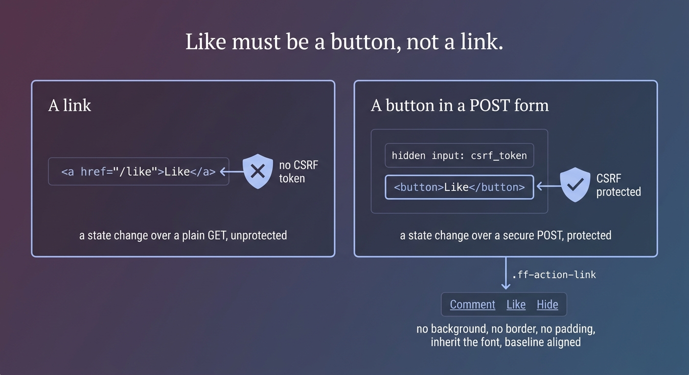

[Save the file](https://fmze.co/fftq-5.13.7).

Two pieces of behaviour are still missing, and they have something in common. The likes line collapses past five names, so something has to expand it. And when a like arrives over SSE, the browser has to rebuild that line itself, in exactly the shape `likes_line` produces on the server. Create `static/js/interactions.js`:

{lang=js,line-numbers=on}
```
// FriendFeed-style feed interactions: expandable likes/comments, URL
// linkifying, and relative timestamps. Exposes window.linkify /
// window.renderLikesLine / window.formatTimeago so the SSE client
// (broadcast.js) renders dynamically-inserted cards identically to the server.
(function () {
  "use strict";

  function esc(str) {
    return String(str).replace(/[&<>"']/g, function (c) {
      return {
        "&": "&amp;",
        "<": "&lt;",
        ">": "&gt;",
        '"': "&quot;",
        "'": "&#39;",
      }[c];
    });
  }

  // Escape text and turn bare http(s) URLs into truncated links.
  function linkify(text, maxLen) {
    maxLen = maxLen || 40;
    var re = /(https?:\/\/[^\s<]+)/g;
    var out = "";
    var last = 0;
    var m;
    while ((m = re.exec(text)) !== null) {
      out += esc(text.slice(last, m.index));
      var url = m[0];
      var display = url.length <= maxLen ? url : url.slice(0, maxLen - 1) + "…";
      out +=
        '<a href="' + esc(url) + '" target="_blank" rel="noopener">' +
        esc(display) +
        "</a>";
      last = m.index + url.length;
    }
    out += esc(text.slice(last));
    return out;
  }
```

This is a deliberate port of the `linkify` we wrote in Python, and the porting is the point. A post that arrives over SSE is built by this file, and a post that arrives with the rest of the page is built by Jinja. If the two disagree about how a URL is rendered, the same post ends up with two different appearances depending on which path delivered it, and neither one is wrong enough to notice quickly. Same rule, both sides.

Now the likes line, which is the same argument again, plus the timestamps:

{lang=js,line-numbers=on,starting-line-number=41}
```
  // Build the "A, B and C liked this" line (mirrors helpers.likes_line).
  function renderLikesLine(likers, head, collapseOver) {
    head = head || 3;
    collapseOver = collapseOver || 5;
    if (!likers || !likers.length) return "";
    var names = likers.map(function (name) {
      return (
        '<a href="/user/' + encodeURIComponent(name) + '">' + esc(name) + "</a>"
      );
    });
    var emoji = '<span class="likes-emoji">🙂</span> ';
    if (names.length <= collapseOver) {
      var body =
        names.length === 1
          ? names[0] + " liked this"
          : names.slice(0, -1).join(", ") +
            " and " +
            names[names.length - 1] +
            " liked this";
      return emoji + body;
    }
    var shown = names.slice(0, head).join(", ");
    var others = names.length - head;
    var full = names.join(", ");
    return (
      emoji +
      '<span class="likers-collapsed">' + shown + " and " +
      '<a href="#" class="likers-more">' + others + " other people</a> liked this</span>" +
      '<span class="likers-full d-none">' + full + " liked this</span>"
    );
  }

  // Relative timestamps, via the timeago.js library loaded in base.html.
  // It keeps re-rendering on its own, so each node is registered once.
  function formatTimeago(root) {
    timeago.render((root || document).querySelectorAll("time.timeago"));
  }

  window.linkify = linkify;
  window.renderLikesLine = renderLikesLine;
  window.formatTimeago = formatTimeago;
```

Read `renderLikesLine` side by side with the Python `likes_line` and it is the same function twice: same defaults of three and five, same "and" before the last name, same two spans past the threshold. Keeping a pair like this in step is a real maintenance cost, and it is worth paying only where the two renderers genuinely have to produce identical output. This is one of those places, because a like can update a card that Jinja drew or a card that JavaScript drew, and it must not matter which.

`formatTimeago` is the small one, and it is small on purpose. Every post currently shows an absolute date, which is precise and unhelpful: in a feed you want "2 minutes ago". Writing that yourself means a units table, rounding rules and a refresh timer, which is a lot of date arithmetic for a course about Quart. So we hand it to `timeago.js`, a two-kilobyte library that does exactly this one job, and our whole contribution is passing it the nodes to look after. It re-renders them on its own from then on, so "just now" turns into "a minute ago" without us running a timer.

Finally, one click handler for the whole page, and the first pass over the timestamps:

{lang=js,line-numbers=on,starting-line-number=83}
```
  document.addEventListener("click", function (e) {
    // "Comment" action -> reveal + focus the comment box.
    var commentLink = e.target.closest(".ff-comment");
    if (commentLink) {
      e.preventDefault();
      var ccard = commentLink.closest(".card");
      var cform = ccard && ccard.querySelector(".comment-form");
      if (cform) {
        cform.classList.remove("d-none");
        var input = cform.querySelector('input[name="comment"]');
        if (input) input.focus();
      }
      return;
    }

    // "Add photos" -> reveal the file input and hide the link.
    var addPhotos = e.target.closest(".add-photos");
    if (addPhotos) {
      e.preventDefault();
      var pform = addPhotos.closest("form");
      var row = pform && pform.querySelector(".add-photos-row");
      if (row) row.classList.remove("d-none");
      addPhotos.classList.add("d-none");
      return;
    }

    // Expanders: "N other people" (likes) and "N more comments" (comments).
    var more = e.target.closest(".likers-more");
    if (more) {
      e.preventDefault();
      var likes = more.closest(".likes");
      likes.querySelector(".likers-collapsed").classList.add("d-none");
      likes.querySelector(".likers-full").classList.remove("d-none");
      return;
    }
    var cmore = e.target.closest(".comments-more");
    if (cmore) {
      e.preventDefault();
      var comments = cmore.closest(".comments");
      var hidden = comments.querySelector(".comments-hidden");
      if (hidden) hidden.classList.remove("d-none");
      cmore.closest(".comments-more-wrap").classList.add("d-none");
    }
  });

  document.addEventListener("DOMContentLoaded", function () {
    formatTimeago(document);
  });
})();
```

One listener on `document` handles all four interactions, and that is not laziness. Cards arrive from three directions now: rendered by Jinja on load, appended by infinite scroll, and prepended by SSE. If we attached handlers to each button we would have to re-attach them every time a card appeared, and forgetting once means a dead link with no error. Listening on `document` and asking `e.target.closest(...)` which control was clicked means a card works the moment it exists, no matter who created it.

Expanding the likes is then just swapping which of the two spans carries `d-none`, exactly as `likes_line` set them up.

[Save the file](https://fmze.co/fftq-5.13.8).

Nothing loads any of this yet. Open `templates/base.html` and add the stylesheet after Bootstrap's, so ours wins:

{lang=html,line-numbers=on,starting-line-number=12}
```
    <link rel="stylesheet" href="{{ url_for('static', filename='css/friendfeed.css') }}?cb={{ cb }}">
```

And at the bottom, the `timeago.js` library from a CDN followed by our own script, both after Bootstrap's bundle so the navbar dropdown still works:

{lang=html,line-numbers=on,starting-line-number=26}
```
    <script src="https://cdn.jsdelivr.net/npm/timeago.js@4.0.2/dist/timeago.min.js"></script>
    <script src="{{ url_for('static', filename='js/interactions.js') }}?cb={{ cb }}"></script>
```

The library has to come first, because `interactions.js` calls `timeago.render` as soon as the page is ready. There is our `?cb={{ cb }}` from the context processor on our own file, and deliberately not on the CDN one: the whole point of a versioned CDN URL is that it is safe to cache forever.

[Save the file](https://fmze.co/fftq-5.13.9).

The navbar is doing very little for us: a dead wordmark and two flat links. Let's make the wordmark go home, collapse the nav properly on a phone, and gather the account links into a dropdown under the username. Replace `templates/navbar.html`:

{lang=html,line-numbers=on}
```
<nav class="navbar navbar-expand-lg navbar-light bg-light mb-3">
    <div class="container-fluid">
<!-- markua-start-insert -->
        <a class="navbar-brand" href="{{ url_for('post_app.home') }}">QuartFeed</a>
        <button class="navbar-toggler" type="button" data-bs-toggle="collapse" data-bs-target="#navbarNav"
            aria-controls="navbarNav" aria-expanded="false" aria-label="Toggle navigation">
            <span class="navbar-toggler-icon"></span>
        </button>
        <div class="collapse navbar-collapse" id="navbarNav">
            <div class="navbar-nav ms-auto">
                
                <li class="nav-item dropdown list-unstyled">
                    <a class="nav-link dropdown-toggle" href="#" id="userDropdown" role="button"
                        data-bs-toggle="dropdown" aria-expanded="false">
                        @{{ session.username }}
                    </a>
                    <ul class="dropdown-menu dropdown-menu-end" aria-labelledby="userDropdown">
                        <li><a class="dropdown-item" href="{{ url_for('user_app.profile', username=session.username) }}">Profile</a></li>
                        <li><a class="dropdown-item" href="{{ url_for('user_app.profile_edit') }}">Edit profile</a></li>
                        <li><hr class="dropdown-divider"></li>
                        <li><a class="dropdown-item" href="{{ url_for('user_app.logout') }}">Logout</a></li>
                    </ul>
                </li>
                
                <a class="nav-link" href="{{ url_for('user_app.login') }}">Login</a>
                <a class="nav-link" href="{{ url_for('user_app.register') }}">Register</a>
                
            </div>
<!-- markua-end-insert -->
        </div>
    </div>
</nav>
```

The `navbar-toggler` and the `collapse` wrapper are the Bootstrap pattern for a nav that turns into a hamburger on a narrow screen, and the dropdown is what stops the bar filling up as we add pages. Notice the brand now links to `post_app.home`, so the wordmark behaves the way every wordmark on the web behaves.

[Save the file](https://fmze.co/fftq-5.13.10).

The home page needs the blue title bar, a wider column now that entries carry more, and a composer that matches the rest. Open `templates/post/home.html`. First the column and the bar:

{lang=html,line-numbers=on,starting-line-number=10}
```
    <div class="col-md-8 offset-md-2">

        <div class="ff-bar mb-3">Home</div>
```

The composer stops using the form-field helper, so its import goes:

{lang=html,line-numbers=off}
```
<!-- markua-start-delete -->
        
<!-- markua-end-delete -->
```

Then the composer itself. FriendFeed put the photo control behind a small "Add photos" link rather than showing a file input to everyone, so replace the form's body:

{lang=html,line-numbers=on,starting-line-number=18}
```
        <div class="card mb-4">
            <div class="card-body">
                <form method="POST" action="{{ url_for('post_app.create_post') }}" id="post-form"
                    enctype="multipart/form-data">
<!-- markua-start-insert -->
                    <textarea name="message" class="form-control mb-2" rows="2"
                        placeholder="What's on your mind?">{{ form.message.data or '' }}</textarea>
                    <div class="add-photos-row d-none mb-2">
                        {{ form.image(class="form-control form-control-sm", accept="image/*") }}
                    </div>
                    <div class="d-flex align-items-center">
                        <a href="#" class="add-photos me-3">Add photos</a>
                        {{ form.csrf_token }}
                        <button type="submit" class="btn btn-primary">Post</button>
                    </div>
<!-- markua-end-insert -->
                </form>
            </div>
        </div>
```

The file input is still there, still the same `form.image` field, just wrapped in a `d-none` div that the `add-photos` handler in `interactions.js` reveals. We dropped `render_field` for the message in favour of a plain `textarea`, because a two-row box with a placeholder reads like a composer while a labelled form field reads like paperwork. The `{{ form.message.data or '' }}` keeps what you typed if validation sends the page back.

Finally, add the cache buster to the two script tags at the bottom:

{lang=html,line-numbers=on,starting-line-number=51}
```
<script src="{{ url_for('static', filename='js/broadcast.js') }}?cb={{ cb }}"></script>
<script src="{{ url_for('static', filename='js/infinite_scroll.js') }}?cb={{ cb }}"></script>
```

[Save the file](https://fmze.co/fftq-5.13.11).

Now the card itself, which is where all of this comes together. Open `templates/post/_post_card.html`. The author line and the post text pick up the two type classes, and every avatar gets a fallback for a broken image:

{lang=html,line-numbers=on,starting-line-number=8}
```
        <div class="d-flex">
<!-- markua-start-insert -->
            
<!-- markua-end-insert -->
            <div class="flex-grow-1">
<!-- markua-start-insert -->
                <a href="{{ url_for('user_app.profile', username=post.author_username) }}" class="fw-bold entry-author">@{{ post.author_username }}</a>
<!-- markua-end-insert -->
```

That `onerror` sets itself to `null` first, which matters: if the fallback image were also missing, the handler would fire again on its own replacement and loop forever.

Next, the action row replacing the bare timestamp link, and the likes line under it:

{lang=html,line-numbers=on,starting-line-number=24}
```
                <div class="ff-meta small text-muted mt-1">
                    <a href="{{ post_url(post.uid, post.message) }}" class="ff-meta-time">
                        <time class="timeago" datetime="{{ post.created.isoformat() }}">{{ post.created.strftime('%b %d, %Y %H:%M') }}</time>
                    </a>
                    - <a href="#" class="ff-comment">Comment</a>
                    -
                    <form method="POST" action="{{ url_for('like_app.toggle_like', post_id=post.post_id) }}" class="d-inline">
                        {{ form.csrf_token }}
                        <button type="submit" class="ff-action-link">{{ 'Unlike' if post.liked_by_me else 'Like' }}</button>
                    </form>
                </div>

                <div class="likes small text-muted mt-1">{{ likes_line(post.likers) }}</div>
```

There is the whole feature on screen. The `<time>` tag carries the machine-readable `isoformat()` in `datetime` and a human date as its text, so `timeago.js` has something exact to work from and a reader without JavaScript still sees a date.

The like form is inline, carries its CSRF token, and its button label flips on `post.liked_by_me`, which is why we loaded that flag. And `likes_line(post.likers)` is the template global we registered, rendering the line we wrote.

The empty-looking `.likes` div is important even when there are no likers: `likes_line` returns an empty string then, but the div still exists, which gives the SSE handler somewhere to write when the first like arrives.

{lang=html,line-numbers=on,starting-line-number=38}
```
                <div class="comments mt-2">
<!-- markua-start-insert -->
                    
                    
                    
                        {{ comment_row(c) }}
                        <div class="comments-hidden d-none">{{ comment_row(c) }}</div>
                        <div class="comments-more-wrap"><a href="#" class="comments-more small">{{ n - 4 }} more comments</a></div>
                        {{ comment_row(c) }}
                    
                        {{ comment_row(c) }}
                    
<!-- markua-end-insert -->
                </div>
```

While we're here, the comments deserve the same treatment the likes just got. A post with forty comments should not print forty comments:

Past five comments we show the first two, hide the middle, and show the last two, with the count of what is hidden in between. That shape is deliberate: you get the start of the conversation and its most recent state, which is what you actually want when you glance at a thread.

{lang=html,line-numbers=on,starting-line-number=51}
```
                <form method="POST" action="{{ url_for('comment_app.create_comment', post_id=post.post_id) }}" class="comment-form mt-2 d-flex d-none">
```

Last, the comment form starts hidden, since the "Comment" link in the action row is now what reveals it:

[Save the file](https://fmze.co/fftq-5.13.12).

The permalink page shares the card, so it inherits all of that for free. It just needs the wider column and its flash messages, and a slightly friendlier way back. The old link goes:

{lang=html,line-numbers=off}
```
<!-- markua-start-delete -->
        <a href="{{ url_for('post_app.home') }}">&larr; Back home</a>
<!-- markua-end-delete -->
```

And the region becomes, in `templates/post/detail.html`:

{lang=html,line-numbers=on,starting-line-number=9}
```
<div class="row">
<!-- markua-start-insert -->
    <div class="col-md-8 offset-md-2">

        
        <div class="alert alert-success">{{ message }}</div>
        

        <a href="{{ url_for('post_app.home') }}" class="d-inline-block mb-3">&larr; Back to feed</a>
<!-- markua-end-insert -->

        

    </div>
</div>
```

[Save the file](https://fmze.co/fftq-5.13.13).

Restart and look at the feed. It is FriendFeed. The blue bar, the white entries, the action row under each post, relative times that update themselves. Like one of your own posts and the page reloads with your name on the likes line and the button reading Unlike.

Two things are still not right, though, and both involve cards that JavaScript built rather than Jinja. Infinite scroll appends cards, and those cards keep their absolute timestamps, because `timeago.js` ran before they existed. Let's fix that and tighten the loader while we are in it. Replace `static/js/infinite_scroll.js`:

{lang=js,line-numbers=on}
```
// markua-start-insert
// Infinite-scroll pagination for the QuartFeed home page.
// Watches #feed-sentinel; when it scrolls into view, fetches the next page of
// feed cards from /feed?offset=N and appends them to #feed. Vanilla JS.
document.addEventListener("DOMContentLoaded", function () {
  var feed = document.getElementById("feed");
  var sentinel = document.getElementById("feed-sentinel");
  // Only run on pages that have both (i.e. the home feed).
// markua-end-insert
  if (!feed || !sentinel) return;

// markua-start-insert
  var loading = false;
  var exhausted = false;
// markua-end-insert

// markua-start-insert
  function currentCount() {
    return feed.querySelectorAll(":scope > [data-post-id]").length;
  }

  function appendCards(html) {
    var temp = document.createElement("div");
    temp.innerHTML = html;

    var added = document.createDocumentFragment();
    var anyAdded = false;
    var cards = temp.querySelectorAll("[data-post-id]");
    for (var i = 0; i < cards.length; i++) {
      var card = cards[i];
      var id = card.getAttribute("data-post-id");
      // Dedupe: skip any card already present in the feed.
      if (feed.querySelector('[data-post-id="' + id + '"]')) continue;
      added.appendChild(card);
      anyAdded = true;
    }

    if (anyAdded) {
      feed.appendChild(added);
      if (window.formatTimeago) window.formatTimeago(feed);
    }
  }
// markua-end-insert
```

Three real improvements hide in `appendCards`. We parse the HTML into a detached div first, then move only the cards we actually want into a document fragment, and append that fragment once, so the browser does a single layout pass instead of one per card. The dedupe check matters more than it looks: SSE can prepend a post while you are scrolling, which shifts every offset by one, and without this you would see the same post twice. And the `formatTimeago(feed)` call is the fix we came for, formatting the newly-arrived times.

`currentCount` uses `:scope >` so it counts only the feed's own direct children, not any nested element that happens to carry a post id.

Now the loader and the observer:

{lang=js,line-numbers=on,starting-line-number=39}
```
// markua-start-insert
  function loadMore() {
    if (loading || exhausted) return;
// markua-end-insert
    loading = true;

// markua-start-insert
    var offset = currentCount();
    fetch("/feed?offset=" + offset, { headers: { "X-Requested-With": "fetch" } })
      .then(function (resp) {
        return resp.text();
      })
      .then(function (html) {
        if (!html || html.trim() === "") {
          exhausted = true;
          observer.disconnect();
          return;
        }
        appendCards(html);
      })
      .catch(function () {
        // Network hiccup: allow a later retry rather than getting stuck.
      })
      .finally(function () {
        loading = false;
      });
  }
// markua-end-insert

// markua-start-insert
  var observer = new IntersectionObserver(
    function (entries) {
      for (var i = 0; i < entries.length; i++) {
        if (entries[i].isIntersecting) {
          loadMore();
        }
      }
    },
    { rootMargin: "200px" }
  );
// markua-end-insert

  observer.observe(sentinel);
});
```

The `loading` guard stops the observer firing three requests while one is in flight, and `exhausted` disconnects the observer for good once the server returns nothing, so we stop asking. The `.catch` with a `.finally` is the important pairing: on a network blip we swallow the error but still clear `loading`, so scrolling again retries instead of the page deciding it has reached the end forever.

[Save the file](https://fmze.co/fftq-5.13.14).

The other JavaScript-built card is the live one, and it has more to learn. Open `static/js/broadcast.js`. It handles three event types now rather than two, so give it a header that says so:

{lang=js,line-numbers=on,starting-line-number=1}
```
// Vanilla JS SSE client for the QuartFeed home page.
// Listens for "post" / "comment" / "like" events and renders them into the
// #feed container using template literals (no framework).
```

Every card `broadcast.js` prepends has to match what `_post_card.html` renders, so it needs the action row, the likes div, and the hidden comment form:

{lang=js,line-numbers=on,starting-line-number=35}
```
// markua-start-insert
            <p class="mb-1 entry-text">${window.linkify ? window.linkify(post.message) : escapeHtml(post.message)}</p>
// markua-end-insert
            ${(post.images && post.images.length)
// markua-start-insert
              ? `<div class="d-flex gap-2 mb-2" style="overflow-x: auto;">${post.images
// markua-end-insert
                  .map((im) => ``)
                  .join("")}</div>`
              : ""}
// markua-start-insert
            <div class="ff-meta small text-muted mt-1">
              <a href="${post.permalink}" class="ff-meta-time"><time class="timeago" datetime="${post.created}">${new Date(post.created).toLocaleString()}</time></a>
              - <a href="#" class="ff-comment">Comment</a>
              - <form method="POST" action="/like/${post.post_id}" class="d-inline"><input type="hidden" name="csrf_token" value="${csrfToken}"><button type="submit" class="ff-action-link">Like</button></form>
            </div>
            <div class="likes small text-muted mt-1"></div>
// markua-end-insert
            <div class="comments mt-2"></div>
// markua-start-insert
            <form method="POST" action="/comment/${post.post_id}" class="comment-form mt-2 d-flex d-none">
// markua-end-insert
```

`window.linkify ? window.linkify(...) : escapeHtml(...)` is a small piece of defensive wiring. If `interactions.js` failed to load, we fall back to plain escaping rather than throwing and losing the card entirely. The likes div is empty because a brand-new post has no likes yet, and the button always says "Like" for the same reason.

That old `formatWhen` helper we wrote for absolute dates is now dead weight: the `<time class="timeago">` tag plus `timeago.js` does the job, and does it better because it keeps updating. Delete the whole helper:

{lang=js,line-numbers=off}
```
// markua-start-delete
  const formatWhen = (iso) => {
    const d = new Date(iso);
    const month = d.toLocaleString("en-US", { month: "short" });
    const pad = (n) => String(n).padStart(2, "0");
    return `${month} ${pad(d.getDate())}, ${d.getFullYear()} ${pad(d.getHours())}:${pad(d.getMinutes())}`;
  };
// markua-end-delete
```

Then call `formatTimeago` on the new card right after prepending it, so its timestamp is relative like every other:

{lang=js,line-numbers=on,starting-line-number=56}
```
    feed.prepend(card);
// markua-start-insert
    if (window.formatTimeago) window.formatTimeago(card);
// markua-end-insert
```

Give the comment listener the same `linkify` treatment, so a link in a live comment behaves like a link anywhere else:

{lang=js,line-numbers=on,starting-line-number=68}
```
    commentEl.innerHTML = `<span class="comment-bubble">💬</span> ${window.linkify ? window.linkify(comment.comment) : escapeHtml(comment.comment)} - <a href="/user/${encodeURIComponent(comment.author_username)}" class="comment-author">@${escapeHtml(comment.author_username)}</a>`;
```

And finally the listener this whole lesson was heading towards. Add it after the `comment` one:

{lang=js,line-numbers=on,starting-line-number=72}
```
// markua-start-insert
  es.addEventListener("like", (e) => {
    const like = JSON.parse(e.data);
    const card = feed.querySelector(`[data-post-id="${like.post_id}"]`);
    if (!card) return;

    const likesDiv = card.querySelector(".likes");
    if (likesDiv && window.renderLikesLine)
      likesDiv.innerHTML = window.renderLikesLine(like.likers || []);
// markua-end-insert
  });
```

Nine lines, because all the work was done elsewhere. Find the card the event is about, find its likes div, and rewrite it with the browser twin of `likes_line`, fed the list of names the server just sent. The server decided who should receive this event, `renderLikesLine` decides how it reads, and this listener only has to put the one in the other.

[Save the file](https://fmze.co/fftq-5.13.15).

Now try it properly. Restart, open two browsers side by side, and log in as two users who follow each other. Post something from the left. It appears on the right instantly, in the new skin, with a relative timestamp. Click Like on the right and the left says "marta liked this" without a refresh. Click Like again and it disappears. That is the toggle, the unique constraint, the targeted delivery, and the two matching renderers, all doing their jobs at once.

QuartFeed is now a complete, real-time social feed. All that's left is to make sure it stays that way.

### Testing likes <!--  -->

A like is a toggle: click once to like, click again to remove it. That toggle plus the little "who liked this" line under a post are the two things worth testing here.

One last time, register the new table in `conftest.py` so the test database builds it. With `like` added, the import list now matches every model in the app.

{lang=python,line-numbers=on,starting-line-number=13}
```
# Register the tables we're testing so metadata.create_all builds them.
from user.models import user_table  # noqa: F401
from relationship.models import relationship_table  # noqa: F401
from post.models import post_table, feed_table  # noqa: F401
from comment.models import comment_table  # noqa: F401
# markua-start-insert
from like.models import like_table  # noqa: F401
# markua-end-insert
```

[Save the file](https://fmze.co/fftq-5.13.16).

Now create `tests/test_like.py`.

{lang=python,line-numbers=on,starting-line-number=1}
```
import pytest
from quart import current_app
from sqlalchemy import select

from like.models import like_table
from post.models import post_table


async def _register_and_login(client, username: str, password: str = "secret123") -> None:
    await client.post("/register", form={"username": username, "password": password})
    await client.post("/login", form={"username": username, "password": password})


async def _make_post(client, app, message: str = "hello world") -> int:
    await client.post("/post", form={"message": message})
    async with app.app_context():
        async with current_app.dbc.begin() as conn:
            row = (await conn.execute(select(post_table))).fetchone()
    return row.id


@pytest.mark.asyncio
async def test_like_adds_row(create_test_client, create_test_app):
    await _register_and_login(create_test_client, "alice")
    post_id = await _make_post(create_test_client, create_test_app)

    response = await create_test_client.post(f"/like/{post_id}")
    assert response.status_code == 302

    async with create_test_app.app_context():
        async with current_app.dbc.begin() as conn:
            likes = (await conn.execute(select(like_table))).fetchall()
    assert len(likes) == 1


@pytest.mark.asyncio
async def test_like_toggles_off(create_test_client, create_test_app):
    await _register_and_login(create_test_client, "alice")
    post_id = await _make_post(create_test_client, create_test_app)

    await create_test_client.post(f"/like/{post_id}")  # like
    await create_test_client.post(f"/like/{post_id}")  # unlike

    async with create_test_app.app_context():
        async with current_app.dbc.begin() as conn:
            likes = (await conn.execute(select(like_table))).fetchall()
    assert len(likes) == 0


@pytest.mark.asyncio
async def test_like_requires_login(create_test_client):
    response = await create_test_client.post("/like/1")
    assert response.status_code == 302
    assert "/login" in response.headers.get("Location", "")
```

The first test likes a post and checks a row appears in the `like` table. The second clicks the same button twice and confirms the row is gone, which is the whole toggle behavior in two lines. The third keeps the route behind a login. Because our `like` table has a unique constraint on the post and user pair, these tests also quietly prove we can't double-like a post, since a second like removes the first instead of stacking.

[Save the file](https://fmze.co/fftq-5.13.17).

The "A and B liked this" line has its own small helper, `likes_line`, that collapses long lists so a wildly popular post doesn't print a hundred names. It's a pure function, so we test it directly. Add these to the `tests/test_helpers.py` we started when testing messages.

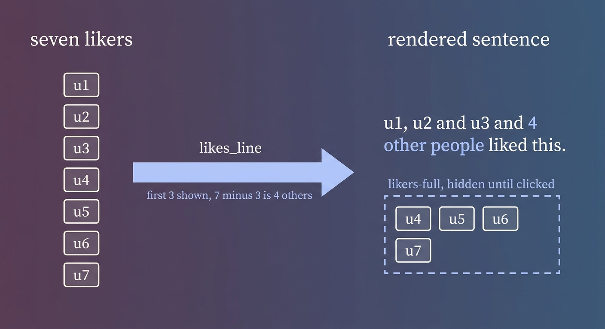

{lang=python,line-numbers=on,starting-line-number=17}
```
from utils.helpers import likes_line


def test_likes_line_empty():
    assert str(likes_line([])) == ""


def test_likes_line_one():
    s = str(likes_line(["alice"]))
    assert '<a href="/user/alice">alice</a> liked this' in s


def test_likes_line_few():
    s = str(likes_line(["a", "b", "c"]))
    assert " and " in s and "liked this" in s
    for u in ("a", "b", "c"):
        assert "/user/%s" % u in s  # each name is a profile link


def test_likes_line_collapses_over_five():
    s = str(likes_line(["u1", "u2", "u3", "u4", "u5", "u6", "u7"]))  # 7 > 5
    assert "4 other people" in s  # 7 - 3 shown
    assert "likers-more" in s and "likers-full" in s
    assert "/user/u1" in s and "/user/u7" in s  # first shown + present in full list
```

Four tests walk the helper from nothing to a crowd. With no likers it prints an empty string, so an unliked post shows nothing at all. With one name it links that name and adds "liked this". With a few it joins them with "and", each name a link to that person's profile. And once we pass five, it collapses to "first few names and 4 other people", tucking the rest into a hidden `likers-full` list that the page can reveal on click. That last test is the one that protects us, because the collapsing math is exactly the kind of off-by-one that slips through by eye.

[Save the file](https://fmze.co/fftq-5.13.18).

## Testing the Live Feed <!-- 5.14 -->

We've tested every feature on its own: users, posts and the feed, comments and bubbling, and likes. The one piece left to pin down is the layer that ties them together, the SSE broker that pushes events to open pages in real time. It's also the piece that's easiest to get subtly wrong, because a broker that delivers to the wrong people looks like it's working right up until someone sees a post they shouldn't. So this final lesson tests the live layer directly.

The broker is a plain in-memory object: users subscribe with a queue, and we publish events to specific user ids. That means we can test it without a browser at all, just by subscribing and reading what lands in the queue. Create `tests/test_sse.py`, starting with the broker in isolation.

{lang=python,line-numbers=on,starting-line-number=1}
```
import pytest
from quart import current_app
from sqlalchemy import select

from utils.sse import ServerSentEvent, broker
from user.models import user_table


async def _register_and_login(client, username: str, password: str = "secret123") -> None:
    await client.post("/register", form={"username": username, "password": password})
    await client.post("/login", form={"username": username, "password": password})


async def _user_id(app, username: str) -> int:
    async with app.app_context():
        async with current_app.dbc.begin() as conn:
            row = (
                await conn.execute(
                    select(user_table.c.id).where(user_table.c.username == username)
                )
            ).fetchone()
    return row.id


@pytest.mark.asyncio
async def test_broker_delivers_only_to_addressed_user():
    """Unit: publish(user_id) reaches only that user's queues, not everyone's."""
    q_one = broker.subscribe(1)
    q_two = broker.subscribe(2)
    try:
        await broker.publish(1, ServerSentEvent(event="post", data="{}"))
        assert q_one.qsize() == 1
        assert q_two.qsize() == 0
    finally:
        broker.unsubscribe(1, q_one)
        broker.unsubscribe(2, q_two)
```

Two users subscribe, we publish a single event addressed to user one, and we assert user one's queue got exactly one event while user two's stayed empty. That one assertion is the broker's entire contract: an event goes only to the person it's addressed to. Testing the broker on its own like this, with plain integer ids and no database, is the fastest possible way to prove that routing is correct.

[Save the file](https://fmze.co/fftq-5.14.1).

The unit test proves the broker routes correctly, but the real question is whether our routes ask it to. Posting must push live to followers and to no one else. This is a regression test, and the comment on it tells the story: we once had a single global broadcast that pushed every post to every open feed, so strangers briefly saw posts that then vanished on refresh. Add the two tests that lock that door.

{lang=python,line-numbers=on,starting-line-number=46}
```
@pytest.mark.asyncio
async def test_sse_post_not_delivered_to_non_follower(create_test_app):
    """A post must NOT be pushed live to a user who does not follow the author.

    Regression for the leak where a single global broadcast pushed every post
    to every open feed. Non-followers briefly saw posts that then disappeared
    on refresh, because the persisted ``feed`` fan-out is follower-scoped.
    """
    carol_client = create_test_app.test_client()
    await _register_and_login(carol_client, "carol")

    jorge_client = create_test_app.test_client()
    await _register_and_login(jorge_client, "jorge")

    carol_id = await _user_id(create_test_app, "carol")
    jorge_id = await _user_id(create_test_app, "jorge")

    # jorge does NOT follow carol. Both have a live SSE connection open.
    q_carol = broker.subscribe(carol_id)
    q_jorge = broker.subscribe(jorge_id)
    try:
        await carol_client.post(
            "/post", form={"message": "I need to go to the supermarket"}
        )
        # carol sees her own post live; jorge (a non-follower) must not.
        assert q_carol.qsize() == 1
        assert q_jorge.qsize() == 0
    finally:
        broker.unsubscribe(carol_id, q_carol)
        broker.unsubscribe(jorge_id, q_jorge)


@pytest.mark.asyncio
async def test_sse_post_delivered_to_follower(create_test_app):
    """A follower DOES receive the author's post live over SSE."""
    carol_client = create_test_app.test_client()
    await _register_and_login(carol_client, "carol")

    dave_client = create_test_app.test_client()
    await _register_and_login(dave_client, "dave")

    await dave_client.post("/follow/carol")

    carol_id = await _user_id(create_test_app, "carol")
    dave_id = await _user_id(create_test_app, "dave")

    q_dave = broker.subscribe(dave_id)
    try:
        await carol_client.post("/post", form={"message": "hello followers"})
        assert q_dave.qsize() == 1
    finally:
        broker.unsubscribe(dave_id, q_dave)
```

The two tests are mirror images, and together they define correct live delivery. In the first, jorge doesn't follow carol, so when carol posts, her own queue gets the event and jorge's stays empty. In the second, dave follows carol, so his queue does receive it. We subscribe to the broker exactly the way each user's browser would, then check the queue sizes after the post. Read side by side, they say the live push follows the same follower rule as the saved feed, which is exactly the bug we needed to prevent.

[Save the file](https://fmze.co/fftq-5.14.2).

Run the whole suite one last time with `pytest`. Users, posts, images, helpers, comments, bubbling, likes, and now the live broker all pass together. We built a real social application in this chapter, and we finish it the way any application worth keeping should be finished: with a test suite that will tell us the moment any of it breaks.

## Followers and Following Pages <!-- 5.15 -->

QuartFeed works end to end, and we have a test suite that proves it. That is exactly the moment to keep building, because now every feature we add can be locked down the instant we write it. Let's start with something the interface hints at but doesn't deliver: a profile shows a follower count, but clicking it goes nowhere. We'll give those counts real pages that list a user's followers and who they follow, and, since we know how to test now, we'll prove it works the moment it's built.

Both pages are the same shape, a grid of user cards, so they share one template. Add two routes to `user/views.py`.

{lang=python,line-numbers=on,starting-line-number=91}
```
@user_app.route("/user/<username>/followers", endpoint="followers")
async def followers_list(username: str) -> str:
    engine = current_app.dbc  # type: ignore
    async with engine.begin() as conn:
        profile_user = await get_user_by_username(conn, username)
        if profile_user is None:
            abort(404)

        result = await conn.execute(
            select(user_table)
            .select_from(
                user_table.join(
                    relationship_table,
                    relationship_table.c.fm_user_id == user_table.c.id,
                )
            )
            .where(relationship_table.c.to_user_id == profile_user.id)
            .order_by(user_table.c.username)
        )
        rows = result.fetchall()

    users = [
        {"id": row.id, "username": row.username, "avatar_url": image_url(row.id, row.image)}
        for row in rows
    ]

    return await render_template(
        "user/user_list.html",
        title="Followers",
        profile_user=profile_user,
        users=users,
        empty_message="No followers yet.",
    )


@user_app.route("/user/<username>/following", endpoint="following")
async def following_list(username: str) -> str:
    engine = current_app.dbc  # type: ignore
    async with engine.begin() as conn:
        profile_user = await get_user_by_username(conn, username)
        if profile_user is None:
            abort(404)

        result = await conn.execute(
            select(user_table)
            .select_from(
                user_table.join(
                    relationship_table,
                    relationship_table.c.to_user_id == user_table.c.id,
                )
            )
            .where(relationship_table.c.fm_user_id == profile_user.id)
            .order_by(user_table.c.username)
        )
        rows = result.fetchall()

    users = [
        {"id": row.id, "username": row.username, "avatar_url": image_url(row.id, row.image)}
        for row in rows
    ]

    return await render_template(
        "user/user_list.html",
        title="Following",
        profile_user=profile_user,
        users=users,
        empty_message="Not following anyone yet.",
    )
```

The two routes are near mirror images. The followers page joins the `relationship` table to `user` on `fm_user_id`, the person doing the following, and filters to rows pointing *at* this profile, which gives us everyone who follows them. The following page flips the join to `to_user_id` to get everyone this user follows. We set a `title` and an `empty_message` per page and hand both to the same template, so one file renders both.

[Save the file](https://fmze.co/fftq-5.15.1).

Now that shared template. Create `templates/user/user_list.html`.

{lang=html,line-numbers=on,starting-line-number=1}
```


{{ title }} - @{{ profile_user.username }}





<div class="row">
    <div class="col-md-8 offset-md-2">

        <h3 class="mb-3">{{ title }} for @{{ profile_user.username }}</h3>

        
        <div class="row row-cols-2 row-cols-md-4 g-3">
            
            <div class="col">
                <div class="card text-center p-2">
                    <a href="{{ url_for('user_app.profile', username=u.username) }}" class="text-decoration-underline">
                        
                        <div>@{{ u.username }}</div>
                    </a>
                </div>
            </div>
            
        </div>
        
        <p class="text-muted">{{ empty_message }}</p>
        

    </div>
</div>


```

The template is deliberately simple: if there are users, lay them out as a grid of cards, each linking to that person's profile; if not, show the friendly empty message we passed in. That `` branch is the one worth noticing, because an empty list is a classic place for a page to break, and here it just prints "No followers yet."

[Save the file](https://fmze.co/fftq-5.15.2).

Finally, point the profile's counts at the new pages by wrapping them in links, in `templates/user/profile.html`.

{lang=html,line-numbers=on,starting-line-number=22}
```
<a href="{{ url_for('user_app.followers', username=profile_user.username) }}" class="text-decoration-underline">{{ follower_count }} followers</a>
&middot;
<a href="{{ url_for('user_app.following', username=profile_user.username) }}" class="text-decoration-underline">{{ following_count }} following</a>
```

[Save the file](https://fmze.co/fftq-5.15.3).

With the feature built, we test it. Open `tests/test_relationship.py` and add two tests: one that a follower shows up on the followers page with an avatar, and one that both lists show their empty-state copy when nobody's there.

{lang=python,line-numbers=on,starting-line-number=64}
```
@pytest.mark.asyncio
async def test_followers_list(create_test_app):
    alice_client = create_test_app.test_client()
    await _register_and_login(alice_client, "alice")

    bob_client = create_test_app.test_client()
    await _register_and_login(bob_client, "bob")

    await alice_client.post("/follow/bob")

    response = await bob_client.get("/user/bob/followers")
    body = str(await response.get_data())
    assert "alice" in body
    assert "

Two small gaps remain on the profile-editing page, and both are the kind of thing users notice: you can upload an avatar but not remove it, and you can rename yourself to a name someone else already has. Let's close both, testing each as we go.

### Removing an avatar <!-- 5.16.1 -->

If you can upload a profile picture, you should be able to take it back down. Add a `delete_image` route to `user/views.py`. It clears the avatar files from disk and resets the `image` column to `None`. We support a background request from the edit page, so it answers a `204` to an XHR call and otherwise redirects.

{lang=python,line-numbers=on,starting-line-number=200}
```
@user_app.route("/profile/delete-image", methods=["POST"])
@login_required
async def delete_image() -> Union[Response, tuple]:
    form = await EmptyForm.create_form()
    engine = current_app.dbc  # type: ignore
    is_xhr = request.headers.get("X-Requested-With") == "XMLHttpRequest"

    if await form.validate_on_submit():
        async with engine.begin() as conn:
            current_user = await get_user_by_id(conn, session["user_id"])

            if current_user is not None and current_user.image is not None:
                for size, _ in AVATAR_SIZES:
                    avatar_path = (
                        _avatars_dir()
                        / f"{session['user_id']}.{current_user.image}.{size}.png"
                    )
                    try:
                        if avatar_path.exists():
                            avatar_path.unlink()
                    except OSError:
                        # Best-effort: a missing/locked file must not block the
                        # database reset below.
                        pass

                await conn.execute(
                    update(user_table)
                    .where(user_table.c.id == session["user_id"])
                    .values(image=None)
                )

        if is_xhr:
            return ("", 204)

        await flash("Profile image removed")

    if is_xhr:
        # CSRF/validation failed for an XHR request.
        return ("", 400)

    return redirect(url_for(".profile_edit"))
```

We look up the current user, and if they have a custom avatar we delete each sized PNG, wrapping the unlink in a `try/except` so a missing file can never stop us from clearing the database. Then we set `image` to `None`, which makes the profile fall back to the default picture. The `is_xhr` checks let the same route serve both a plain form submit and a background fetch from the edit page.

[Save the file](https://fmze.co/fftq-5.16.1).

Add the button and the small script that calls it to `templates/user/profile_edit.html`. The button only appears when there's actually a custom image to remove.

{lang=html,line-numbers=on,starting-line-number=31}
```

<div>
    <input type="hidden" id="delete-csrf" value="{{ delete_form.csrf_token._value() }}">
    <button type="button" id="delete-image-btn" class="btn btn-link link-primary text-decoration-underline p-0" style="cursor: pointer;">Delete image</button>
</div>

```

And the script, in the page's `scripts` block:

{lang=html,line-numbers=on,starting-line-number=62}
```
    var deleteBtn = document.getElementById('delete-image-btn');
    if (deleteBtn) {
        deleteBtn.addEventListener('click', function () {
            fetch("{{ url_for('user_app.delete_image') }}", {
                method: "POST",
                headers: { "X-Requested-With": "XMLHttpRequest" },
                body: new URLSearchParams({
                    csrf_token: document.getElementById('delete-csrf').value
                })
            }).then(function (res) {
                if (res.ok) {
                    document.getElementById('avatar-preview').src = "/static/default_profile.png";
                    deleteBtn.style.display = "none";
                }
            });
        });
    }
```

The script sends the CSRF token in a background `fetch`, and on success it swaps the preview back to the default image and hides the button, so the picture disappears without a page reload.

[Save the file](https://fmze.co/fftq-5.16.2).

Now the test, in `tests/test_relationship.py`. It seeds an avatar directly in the database, deletes it through the route, and checks both the column and the profile fallback. This test needs `update` and the `user` model, so widen the imports at the top of the file to `from sqlalchemy import select, update` and add `from user.models import user_table`.

{lang=python,line-numbers=on,starting-line-number=99}
```
@pytest.mark.asyncio
async def test_delete_image(create_test_app):
    client = create_test_app.test_client()
    await _register_and_login(client, "dave")

    # Give dave a custom avatar (non-null image timestamp) directly in the DB.
    async with create_test_app.app_context():
        async with current_app.dbc.begin() as conn:
            await conn.execute(
                update(user_table)
                .where(user_table.c.username == "dave")
                .values(image=1783000000)
            )

    response = await client.post("/profile/delete-image")
    assert response.status_code == 302

    async with create_test_app.app_context():
        async with current_app.dbc.begin() as conn:
            row = (
                await conn.execute(
                    select(user_table).where(user_table.c.username == "dave")
                )
            ).fetchone()
            assert row.image is None

    response = await client.get("/user/dave")
    body = str(await response.get_data())
    assert "/static/default_profile.png" in body
```

We post to the route without the XHR header, so we exercise the plain-redirect path and get a `302`. Then we read the row back to confirm `image` is `None`, and load the profile to confirm it now shows the default picture. Seeding the avatar straight into the database keeps the test from having to perform a real file upload.

[Save the file](https://fmze.co/fftq-5.16.3).

### Guarding against duplicate usernames <!-- 5.16.2 -->

The other gap: on the edit page a user can rename themselves, but nothing stops them from picking a name someone else already has, which would collide at the database level. Add a check inside `profile_edit` in `user/views.py`, right where we handle the rename.

{lang=python,line-numbers=on,starting-line-number=252}
```
        async with engine.begin() as conn:
            if new_username != current_user.username:
                existing = await get_user_by_username(conn, new_username)
                if existing is not None and existing.id != session["user_id"]:
                    error = "Username already exists"

            if not error:
                values = {"username": new_username}
                if ts is not None:
                    values["image"] = ts
                await conn.execute(
                    update(user_table)
                    .where(user_table.c.id == session["user_id"])
                    .values(**values)
                )
```

We only check when the name actually changes, and we ignore a match against yourself, so re-saving your own name is fine. If someone else already holds it, we set an `error` and skip the update, and the edit page shows "Username already exists" instead of crashing on a constraint violation.

[Save the file](https://fmze.co/fftq-5.16.4).

The test goes in `tests/test_user.py`. Register two users, log in as one, try to rename to the other's name, and confirm it's rejected and nothing changed.

{lang=python,line-numbers=on,starting-line-number=182}
```
@pytest.mark.asyncio
async def test_profile_edit_duplicate_username(create_test_client, create_test_app):
    await create_test_client.post(
        "/register", form={"username": "gina", "password": "secret123"}
    )
    await create_test_client.post(
        "/register", form={"username": "harry", "password": "secret123"}
    )
    await create_test_client.post(
        "/login", form={"username": "harry", "password": "secret123"}
    )

    response = await create_test_client.post(
        "/profile/edit", form={"username": "gina"}
    )
    body = await response.get_data()
    assert "Username already exists" in str(body)

    async with create_test_app.app_context():
        async with current_app.dbc.begin() as conn:
            row = (
                await conn.execute(
                    select(user_table).where(user_table.c.username == "harry")
                )
            ).fetchone()
            assert row is not None
```

We assert the page comes back with "Username already exists" and that harry's row is still intact, so a rejected rename leaves the account exactly as it was. Run the whole suite one final time. Every feature we've built is covered, and the tests we wrote at the start still stand guard over everything beneath them. That's the real lesson of this chapter: an application is never truly finished, but with a test suite behind you, it's always safe to keep improving.

[Save the file](https://fmze.co/fftq-5.16.5).
